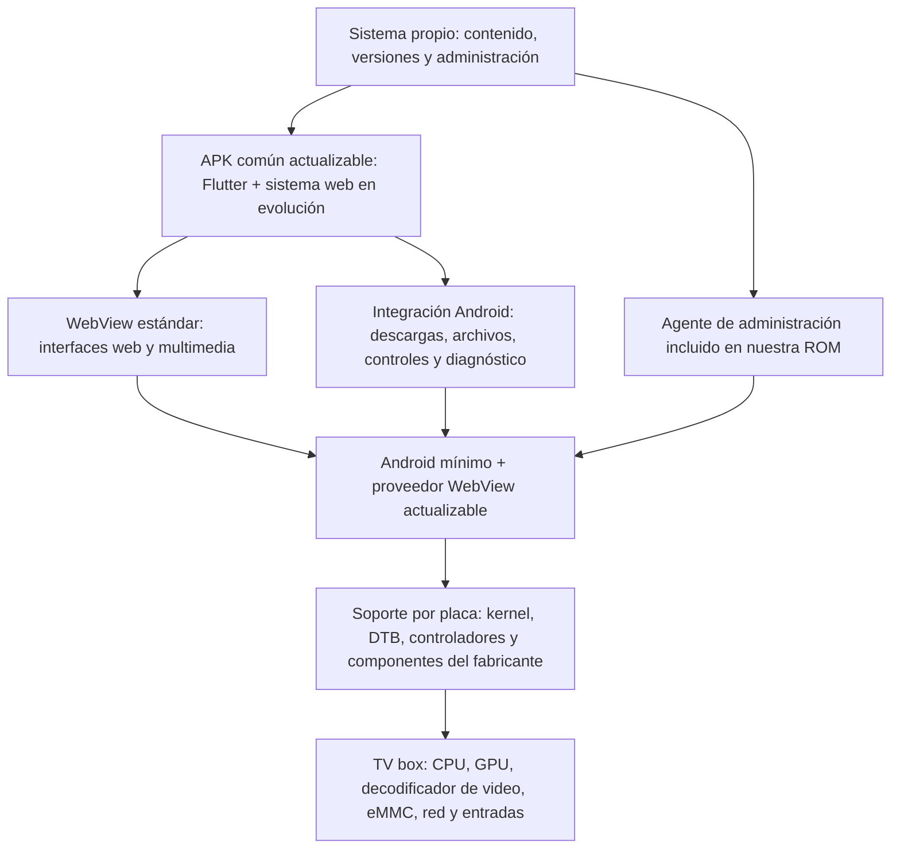

# Plataforma Android para TV boxes

Diseño de producto actualizado el 6/9/2026. Los requisitos y criterios trazables están en [ESPECIFICACION](docs/ESPECIFICACION.md); el resultado de las operaciones y el entregable actual, en [ESTADO](docs/ESTADO.md). Android9/Chrome138 es la primera base experimental construida, no una decisión de mantener esa versión indefinidamente. Este documento desarrolla los fundamentos de la arquitectura.

## 1. Objetivo confirmado

Instalar Android mínimo en la memoria interna de cada TV box, reemplazando el sistema original. Conservar sus recursos de red, almacenamiento, imagen, audio y controles; eliminar las aplicaciones, cuentas y servicios del integrador que no se necesitan. Google Play y los servicios de Google no son requisitos del producto.

Una misma aplicación distribuida como APK debe funcionar en estos equipos y en Android TV. La aplicación usará Flutter como contenedor e integración con Android y conservará el sistema web existente dentro de WebView. Debe descargar, reproducir y eliminar videos locales, recibir actualizaciones y permitir administración desde un sistema propio.

El producto web y su APK siguen en desarrollo. La plataforma debe admitir su evolución con la mayor compatibilidad posible dentro de las capacidades del equipo. La selección y preparación de Android no dependen de recibir una APK terminada. La composición actual sirve como referencia adicional de rendimiento y no define un límite de funciones, formatos o número de capas.

La reproducción y composición de video son el criterio principal de selección de una base. Un segundo WebView para automatizaciones es una función secundaria. No se investigará la causa de la actualización que afectó al WiFi del equipo experimental.

## 2. Referencia funcional disponible

El usuario informa que el WebView actual del TV box reproduce correctamente su aplicación con tres capas: dos videos superpuestos, uno transparente, y un canvas con objetos. Usan VP9 como base de eficiencia y describen los videos como «1280». Esto constituye una referencia funcional observada por el usuario, todavía sin mediciones incorporadas al proyecto. Cuando esos archivos estén disponibles se agregarán a las pruebas generales; no son un requisito para empezar a desarrollar la plataforma.

La respuesta anterior de «un video hasta 1080p, sin DRM» se interpreta junto con esa aclaración: conservar la composición real de dos videos es obligatorio; probar un video hasta 1080p es otro caso. No se ha confirmado que ambos videos deban ser 1080p simultáneamente. Tampoco se infieren la altura, los FPS, el bitrate ni el perfil de VP9 a partir de «1280».

| Caso | Condición | Estado |
| --- | --- | --- |
| Referencia principal | Dos videos VP9, uno transparente, más canvas; mismos archivos y página actuales | Funciona según el usuario |
| Reproducción ampliada | Un video hasta 1920 × 1080, sin DRM | Objetivo solicitado; pendiente medir |
| Operación sin red | Misma composición con videos guardados en la memoria interna | Requisito; pendiente registrar una prueba |
| Automatizaciones | Segundo WebView mientras sigue la composición principal | Secundario; pendiente evaluar |

No se reemplazará preventivamente esta composición por un reproductor nativo. Media3/ExoPlayer queda como alternativa para una necesidad concreta demostrada por mediciones. Una reproducción nativa convencional no debe suponerse equivalente a la mezcla actual de transparencia y canvas; además, sus formatos dependen de los decodificadores del dispositivo. [Formatos de Media3](https://developer.android.com/media/media3/exoplayer/supported-formats).

## 3. Arquitectura recomendada

Recomendación: Android nativo como sistema anfitrión. Permite mantener la APK y aprovechar la integración multimedia de Android que ya dio un resultado funcional en el equipo. Linux con un contenedor Android añadiría otra integración gráfica y de video que también habría que validar; no ofrece una ventaja demostrada para este caso. Waydroid, por ejemplo, ejecuta Android mediante un contenedor sobre Linux. [Arquitectura de Waydroid](https://docs.waydro.id/).

La APK y los servicios propios serán comunes. La imagen del sistema tendrá un perfil por placa o familia realmente compatible. Detectar controladores ayuda a identificar el soporte necesario, pero no convierte una ROM en universal: kernel, DTB, firmware, componentes de fabricante y las interfaces de Android deben funcionar juntos. La compatibilidad entre las partes de sistema y fabricante tiene contratos explícitos en Android. No se presupone que esta unidad admita una GSI por mostrar Android 9. [VINTF](https://source.android.com/docs/core/architecture/vintf).

### Contenido de la base

- Android y sus servicios necesarios para aplicaciones, medios, red, archivos, entrada, pantalla y administración.
- Ajustes utilizables con control remoto: Ethernet, WiFi cuando el hardware funcione, pantalla, audio, fecha y almacenamiento.
- Inicio sencillo orientado a la aplicación, sin cuentas del operador, tiendas ni servicios promocionales.
- Proveedor WebView mantenido, agente propio y mecanismo de recuperación de la aplicación.
- Perfil de hardware con versiones y configuración reproducibles. La primera limpieza conserva las bibliotecas y servicios multimedia hasta comprobar sus dependencias.

No se fija todavía una versión de Android para la placa p291. La elección será la versión más reciente que podamos sostener con su soporte de hardware y que supere la composición real. Android 10 es hoy el mínimo publicado para Chrome actual, no una garantía de compatibilidad de una ROM con este equipo ni una recomendación de quedarse indefinidamente en esa versión. [Requisitos de Chrome](https://support.google.com/chrome/answer/95346?co=GENIE.Platform%3DAndroid&hl=es).

### Compatibilidad para futuras versiones de la aplicación

El criterio de diseño es conservar un entorno Android y WebView estándar, mantenible y sin dependencias de una versión concreta del producto. La limpieza eliminará aplicaciones y servicios prescindibles del integrador; no suprimirá APIs, formatos o funciones del framework únicamente porque la aplicación actual no los utilice.

La compatibilidad de Android tiene requisitos y pruebas propios, definidos por CDD y CTS para cada versión. Se usarán como referencia al adaptar y recortar la base; ejecutar unas pruebas funcionales aisladas no equivale a acreditar compatibilidad completa. Esto es independiente del interés comercial en instalar Play Store. [Programa de compatibilidad de Android](https://source.android.com/docs/compatibility/overview).

Se propone registrar y probar, por imagen y versión de WebView, este conjunto inicial de capacidades. La tabla es el alcance de validación, no una lista de resultados ya obtenidos:

| Área | Cobertura de plataforma |
| --- | --- |
| Aplicaciones Android | Instalación y actualización de APK, permisos, ciclo de vida y bibliotecas nativas de las arquitecturas admitidas |
| Web | HTML, CSS, JavaScript, acceso HTTPS, peticiones de red, WebSocket y persistencia web |
| Gráficos | Canvas 2D, WebGL cuando esté disponible, transparencias, animación y composición de capas |
| Medios | Formatos expuestos por la base y el motor, reproducción local y por red, audio, búsqueda y reproducción simultánea dentro de los límites medidos |
| Integración | Archivos persistentes, descargas, espacio libre, borrado selectivo, controles y detección de capacidades |
| Evolución | Actualizaciones independientes de APK, WebView y sistema; conservación de datos y compatibilidad de la interfaz de administración |

Las integraciones propias usarán una interfaz versionada y estable para archivos, diagnóstico y administración. Una actualización de la lógica de negocio no deberá exigir reconstruir la ROM. Si una función futura necesita una nueva operación nativa, se actualizará el componente correspondiente manteniendo compatibilidad con las operaciones anteriores.

Cada equipo informará la versión de Android, arquitectura de aplicaciones, proveedor WebView y capacidades comprobadas. Los paquetes de actualización declararán sus requisitos; el distribuidor no enviará a una unidad una versión que requiera APIs o arquitecturas que no pueda ejecutar. La mayor compatibilidad posible no garantiza ejecutar futuras cargas que excedan la RAM, CPU, gráficos o decodificadores del equipo. Actualizar WebView tampoco incorpora por sí solo una API nueva del sistema Android.

## 4. Navegador y WebView actualizables

Chrome como aplicación de navegación y el proveedor WebView utilizado por las APK son piezas diferentes. Instalar o actualizar un navegador no garantiza actualizar el motor de la aplicación. Para nuestra ROM se propone un WebView independiente basado en Chromium, con paquete y firma propios, autorizado por el framework. Chromium permite actualizarlo como APK mediante un distribuidor propio, sin Play Store. Debe usarse una versión estable compatible y mantenida; el precompilado incluido en AOSP puede estar atrasado. Si se requiere también Google Chrome como navegador, su distribución y actualización serán una pieza adicional; un build de Chromium no es Google Chrome. [Integración de WebView en AOSP](https://chromium.googlesource.com/chromium/src/+/HEAD/android_webview/docs/aosp-system-integration.md).

Cada actualización del motor se probará primero con las capacidades generales, reproducción y almacenamiento local. La composición de referencia se sumará cuando esté disponible. Se registrará el paquete WebView realmente utilizado, no solamente el nombre o versión del navegador instalado.

Al actualizar el proveedor, Android termina los procesos de aplicación que ya lo cargaron. El actualizador debe vivir fuera de esos procesos, persistir su estado y coordinar una ventana de mantenimiento con el relanzamiento de la APK. [API de WebView](https://developer.android.com/reference/android/webkit/WebView#getCurrentWebViewPackage()).

## 5. VP9, transparencia y rendimiento

Conservar VP9 como formato prioritario de prueba, porque es el formato que ya funciona, manteniendo también los otros formatos que ofrezca la base compatible. Distinguir eficiencia de compresión, costo de decodificación y costo de composición: un archivo pequeño no demuestra por sí mismo menor consumo de CPU.

La GPU que dibuja la interfaz y el bloque que decodifica video cumplen funciones distintas. El soporte declarado para VP9 no prueba que se aceleren todas sus variantes o el canal transparente. Chromium contiene una ruta con libvpx que procesa también el plano alfa. Esto demuestra que existe una ruta por software; no identifica cuál utiliza el WebView de esta unidad. Hay que medir ambos videos por separado y juntos. [Implementación VPx de Chromium](https://chromium.googlesource.com/chromium/src/+/HEAD/media/filters/vpx_video_decoder.cc).

La hipótesis de mejora es razonable: menos procesos innecesarios pueden dejar más CPU y RAM disponibles. Un WebView más reciente también cambia su consumo y su interacción con controladores antiguos. La aceptación exige conservar o mejorar el resultado medido; el número de versión no es una medida de rendimiento.

Por ese motivo, no se reducirá la memoria reservada al video como primer ajuste. La doble reproducción y la composición necesitan sus buffers. Se cambiará una variable por vez: base, motor o ajuste de recursos, registrando cuál produjo la diferencia.

Para Flutter se validará el backend gráfico del equipo. La falta de Vulkan no basta para descartar una unidad: Flutter documenta la alternativa OpenGL en dispositivos Android que no pueden usar Impeller. [Impeller en Android](https://docs.flutter.dev/perf/impeller).

## 6. Videos y almacenamiento local

Propuesta: la capa Android de la APK administra un catálogo de videos en almacenamiento persistente de la memoria interna; el contenido web solicita operaciones mediante una interfaz acotada. Los archivos propios pueden leerse y escribirse sin permiso general de almacenamiento. Desinstalar la aplicación elimina sus archivos privados: se usará actualización del paquete, no desinstalación y reinstalación. [Archivos propios de una aplicación](https://developer.android.com/training/data-storage/app-specific).

La integración debe incluir descarga reanudable, validación del archivo, publicación solo al completarse, consulta de espacio libre y eliminación por identificador. Evitar cargar videos completos en JavaScript o pasarlos como base64. No borrar un archivo que se esté reproduciendo.

Para los elementos de video del WebView se definirá un origen local controlado con soporte real de lectura parcial y búsqueda dentro del video. WebViewAssetLoader es una herramienta para servir contenido local, pero no se asumirá que por sí solo resuelva los rangos HTTP de cualquier implementación. Probar adelantar, repetir y reabrir los mismos WebM sin internet. Mantener coherentes origen, CORS y acceso al canvas. [Contenido local en WebView](https://developer.android.com/develop/ui/views/layout/webapps/load-local-content).

Las acciones remotas distinguirán borrar videos, caché web, cookies/sesión y restablecer la aplicación. No son operaciones equivalentes. Las credenciales del dispositivo y el estado del actualizador se conservarán fuera de una limpieza de contenido. Para compartir archivos entre APK se agregará acceso explícito mediante las interfaces de Android.

## 7. Actualización y administración propias

| Componente | Mecanismo propuesto | Validación antes de extenderlo |
| --- | --- | --- |
| Aplicación | APK firmada, mismo identificador y continuidad de firma | Inicio, composición y persistencia de videos |
| WebView | Proveedor firmado admitido por nuestra ROM | VP9, alfa, canvas, memoria y archivos locales |
| Sistema | Actualización específica del perfil de placa | Arranque, decodificadores, red, audio y control remoto |
| Contenido | Catálogo con versiones y archivos verificados | Reproducción completa y sin conexión |

Un agente preinstalado con permisos adecuados recibirá órdenes autenticadas de nuestro servidor para instalar versiones autorizadas, consultar el estado y gestionar el equipo. No se necesita entregar root a la aplicación web. Android dispone de mecanismos de instalación administrada; una APK ordinaria no obtiene instalación silenciosa de cualquier paquete por el mero hecho de descargárselo. [PackageInstaller](https://developer.android.com/reference/android/content/pm/PackageInstaller).

El diseño incluirá versiones por modelo, un grupo inicial de prueba, registro de resultado, reintentos y recuperación ante fallos. Las actualizaciones completas con A/B dependen de las particiones y del arranque del dispositivo; todavía no están confirmadas para esta placa. Si no existen, se necesita diseñar y probar otra recuperación. Tampoco se presupone que Android acepte instalar una APK con un número de versión inferior como vuelta atrás. [Actualizaciones A/B](https://source.android.com/docs/core/ota/ab).

La misma APK podrá reproducir contenido y administrar sus propios archivos en Android TV comercial. Reemplazar su WebView de sistema o su firmware dependerá de las facultades concedidas por ese dispositivo; las capacidades adicionales del agente de nuestra ROM se detectarán en ejecución.

## 8. Controles y automatizaciones

La APK deberá funcionar sin pantalla táctil, con foco visible, flechas, aceptar, atrás y reproducción. Se configurará su aparición en el inicio de TV y se probará el recorrido completo con el control. [Aplicaciones para TV](https://developer.android.com/training/tv/get-started/create).

Por placa se identificará el receptor y la ruta de entrada: infrarrojo, USB, Bluetooth o HDMI-CEC. Android traduce códigos de entrada mediante mapas de teclas; detectar eventos permite construir perfiles, pero no garantiza identificar automáticamente el modelo físico de un control infrarrojo. Encendido y despertar también pueden depender del arranque y los controladores. [Mapas de teclas de Android](https://source.android.com/docs/core/interaction/input/key-layout-files).

El segundo WebView será opcional y subordinado a la reproducción principal. Debe tolerar cierre y reconstrucción bajo presión de memoria. Las tareas que solo descarguen archivos o consulten APIs irán en la capa nativa; se reservará un navegador adicional para automatizaciones que necesiten realmente ejecutar una página. Android puede terminar procesos de renderizado incluso con su prioridad habitual. [Prioridad del renderizador](https://developer.android.com/reference/android/webkit/WebView#RENDERER_PRIORITY_IMPORTANT).

## 9. Secuencia de avance y criterios de salida

1. **Definir pruebas de plataforma independientes de la aplicación.** Cubrir APIs Android, funciones web, gráficos, medios, red, almacenamiento, entrada y actualizaciones. Usar muestras controladas. Incorporar después la APK o página real y sus videos como prueba adicional cuando estén disponibles, registrando sus versiones y parámetros. El desarrollo del producto puede continuar en paralelo.
2. **Identificar una base Android para la placa.** Confirmar hardware, arranque, mapa de particiones y soporte multimedia de la unidad. Buscar una base mantenible que conserve sus interfaces de video. Si hacen falta componentes del fabricante, obtenerlos como insumo de compatibilidad; ese trabajo no tiene por objetivo explicar la falla del WiFi.
3. **Preparar una imagen interna recuperable.** Documentar el método de instalación, destino exacto y recuperación. Un arranque externo puede servir de herramienta temporal. Que una imagen Linux arranque no demuestra que sirva como base de video Android.
4. **Validar sin recortes agresivos.** Arrancar Android y ejecutar las pruebas generales y muestras multimedia antes de quitar servicios o alterar reservas de memoria. Repetir también la referencia real cuando esté disponible.
5. **Actualizar WebView y adelgazar por etapas.** Comparar la misma carga después de cada cambio. Seleccionar la combinación con funcionamiento correcto, estabilidad y soporte mantenible.
6. **Agregar la operación del producto.** Descargas locales, borrado selectivo, control remoto, actualizador y reanudación después de reiniciar.
7. **Extender a otras placas.** Incorporar perfiles con evidencia de reproducción, manteniendo la misma APK y el mismo protocolo de administración.

La batería inicial propuesta incluye 30 minutos de composición repetida para comparar cambios y una sesión de varias horas para la candidata final. Medir fotogramas descartados cuando la API esté disponible, bloqueos, tiempos de inicio y de cambio de contenido, memoria y temperatura cuando el equipo la exponga. Verificar visualmente transparencia, orden de capas, canvas y sincronía; los contadores por sí solos no prueban todo eso. Registrar la ruta de decodificación cuando las herramientas del sistema lo permitan, sin confundir soporte anunciado con decodificador realmente elegido.

La aceptación también requiere reproducir sin red tras reiniciar, recuperar la conexión, actualizar una APK de prueba conservando los videos y volver a iniciar tras actualizar WebView. No se fija un umbral inventado de FPS o RAM hasta disponer de muestras controladas y mediciones iniciales. Ninguna prueba limita el contenido o el diseño futuro de la aplicación: documenta qué puede sostener cada equipo.

## 10. Estado de la unidad y de los archivos

- El dossier informa Android 9 de 32 bits, 1 GB de RAM, identificador DT `gxlx2_p291_1g` y SoC inferido como S905L2. Son antecedentes de trabajo; el nombre comercial y el DT por sí solos no certifican compatibilidad de una imagen.
- El usuario confirma que falla WiFi y que la composición funciona en el WebView actual. No se da por probada la hipótesis antigua de eMMC dañada.
- Se descargó y verificó una imagen Armbian para pruebas. Es Linux; no es la ROM Android final ni acredita compatibilidad de video con esta unidad.
- La cuarta grabación con Imager 2.0.11.1 terminó correctamente el 5/9/2026 a las 00:11:26, después del cambio físico de puerto. SHA-256 verificado. La prueba del usuario en el TV box inició Android habitual: falta demostrar entrada al arranque externo. El usuario descarta conectar el equipo a la red. Se preparó un ZIP vacío para la entrada por Actualización local y se inició análisis offline de una ROM Android 9 L3/L3B próxima a los identificadores del dossier; no hay instalación interna ejecutada. Detalles en PRUEBA-USB.md y analisis-rom.
- No se instaló un sistema nuevo en la memoria interna. No se ha validado todavía una imagen Android para esta placa ni una vía de grabación conectada desde Windows.
- El objetivo de instalar en memoria interna ya está autorizado por el usuario. Falta resolver compatibilidad y acceso de instalación, no volver a decidir entre uso permanente de USB e instalación interna.
- Se preparó `diagnostico/recoger-hardware-linux.sh` para recoger información cuando haya un arranque Linux temporal accesible. Solo escribe su informe en `/tmp`; no modifica Android ni la eMMC. Todavía no se ha ejecutado en el TV box.

### Avance posterior del 5/9

Se leyó por WiFi un segundo TV autorizado expresamente por el usuario, `198.51.100.100`, y se verificó que es P271 (`gxlx_p271_1g`), diferente del primer P291. Su Chrome 70 se respaldó y se observó como proveedor WebView, pero no se actualizó ninguna APK en ese equipo. La restricción de no conectar a red sigue referida al primer TV.

Se construyó `rom-simplificada/salida/TVBASE-P291-A9-0.1-EXPERIMENTAL.img`, con Chrome 138.0.7204.179, configuración de proveedor, inicio propio y retirada de 16 APK. Conserva un proveedor WebView de recuperación. Se verificaron ext4, los archivos conservados y el contenedor completo; no se validó funcionamiento físico. Se preservaron bootloader, kernel, DTB y recovery del candidato, cuya compatibilidad con el primer aparato sigue pendiente. No debe usarse en el segundo P271.

El usuario reiteró que quiere reemplazar la ROM completa desde pendrive, con estas mejoras incluidas de fábrica. Una actualización de Chrome dentro del Android viejo no sustituye ese objetivo. La rama Chrome 138 es el límite oficial para Android 9; sostener versiones posteriores requiere avanzar el sistema operativo. El gestor propio de actualizaciones aún no está implementado.

El próximo resultado concreto es resolver y probar la entrada de instalación del primer TV. Se compiló un acceso temporal al actualizador local existente, sin red, root ni reinicio propio. La imagen completa permanece en la PC hasta confirmar el método y el destino. La APK del producto no bloquea este trabajo.
