# Mapa de componentes y archivos

Generado por `herramientas/generar-mapa.py` desde [proyecto.json](proyecto.json). [Grafo visual](index.html) · [Árbol](ARBOL-ARCHIVOS.txt) · [Inventario completo](inventario.json).

La flecha expresa la relación indicada, no que se haya completado la prueba de destino. Los componentes propuestos aún no tienen archivos de implementación.

```mermaid
flowchart LR
    C_PERFIL["P291/P271 y RK3229-A/B/C · observado_tv"]
    C_BASE["Candidato anterior · verificado_local"]
    C_CHROME["Chrome 138 · verificado_local"]
    C_INICIO["Inicio: Home pendiente · observado_tv"]
    C_ROM["TV Base 0.2.0 instalada · observado_tv"]
    C_WEB["Proveedor WebView · verificado_local"]
    C_ZIP["Instalador 0.2.2 usado · observado_tv"]
    C_REC["Restaurador022 · verificado_local"]
    C_ENTRY["Entrada 0.9 lograda · observado_tv"]
    C_USB["SD de carga y Kingston de copias · observado_tv"]
    C_TV["P291: TV Base y WiFi · observado_tv"]
    C_APP["APK del producto · propuesto"]
    C_GESTION["Gestor propio 0.1 · verificado_local"]
    C_BTCTRL["Control Bluetooth normal · observado_tv"]
    C_ORIG["Originales del P291 · observado_tv"]
    C_PRODUCTO["Producto común · propuesto"]
    C_LOTES["Dos recorridos de lote · propuesto"]
    C_RECON["Reconocimiento0.3 · observado_tv"]
    C_EXTRACT["Extracción recovery 0.1 / RK1 · construido"]
    C_PERFIL -->|"selecciona"| C_BASE
    C_CHROME -->|"motor admitido"| C_WEB
    C_INICIO -->|"se integra"| C_ROM
    C_WEB -->|"se integra"| C_ROM
    C_ROM -->|"se empaqueta"| C_ZIP
    C_ZIP -->|"copiado y releído0.2.1"| C_USB
    C_ENTRY -->|"se copia"| C_USB
    C_USB -->|"expulsión segura y traslado pendientes"| C_TV
    C_TV -->|"habilita validación"| C_APP
    C_APP -->|"actualización por contrato"| C_GESTION
    C_BTCTRL -->|"inhabilita Bluetooth actual"| C_TV
    C_TV -->|"respaldo por root"| C_ORIG
    C_ORIG -->|"fuente original verificada"| C_ROM
    C_GESTION -->|"gestor integrado"| C_ROM
    C_ORIG -->|"recovery adquirido"| C_REC
    C_ENTRY -->|"recovery ejecutóZIP; instalador abortado"| C_REC
    C_REC -->|"menú físico aún pendiente"| C_ZIP
    C_PERFIL -->|"califica"| C_LOTES
    C_LOTES -->|"propone receta"| C_ZIP
    C_ROM -->|"soporta"| C_PRODUCTO
    C_PRODUCTO -->|"contrato común"| C_APP
    C_RECON -->|"propone ficha y evidencia"| C_PERFIL
    C_RECON -->|"propone comparación por unidad"| C_LOTES
    C_RECON -->|"propone contrato de capacidades"| C_PRODUCTO
    C_RECON -->|"entrega APK y acumula informes"| C_USB
    C_RECON -->|"informa plan DT"| C_EXTRACT
    C_EXTRACT -->|"adquiere originales verificables"| C_ORIG
    C_EXTRACT -->|"contrasta mapa real"| C_PERFIL
```

## Archivos por componente

### C-PERFIL · P291/P271 y RK3229-A/B/C

**observado_tv**. P291 instalado; P271 y tres RK3229 con inventarios distintos. DT compartido no acredita ROM intercambiable. C tiene recovery accesible según usuario.

Requisitos: REQ-02, REQ-10, REQ-15.

- [dossier-s905l2.html](../dossier-s905l2.html)
- [diagnostico/primer-tv-20260906-actualizacion-local/HALLAZGOS.md](../diagnostico/primer-tv-20260906-actualizacion-local/HALLAZGOS.md)
- [diagnostico/android-20260905-142854-a8286d9a/PERFIL-SEGUNDO-TV.md](../diagnostico/android-20260905-142854-a8286d9a/PERFIL-SEGUNDO-TV.md)
- [diagnostico/primer-tv-reportes-20260906-233826/HALLAZGOS.md](../diagnostico/primer-tv-reportes-20260906-233826/HALLAZGOS.md)
- [diagnostico/primer-tv-reportes-20260906-233826/resumen-saneado.json](../diagnostico/primer-tv-reportes-20260906-233826/resumen-saneado.json)
- [diagnostico/primer-tv-evidencia-20260907-000948/HALLAZGOS.md](../diagnostico/primer-tv-evidencia-20260907-000948/HALLAZGOS.md)
- [diagnostico/primer-tv-evidencia-20260907-000948/resumen-saneado.json](../diagnostico/primer-tv-evidencia-20260907-000948/resumen-saneado.json)
- [diagnostico/primer-tv-complemento-20260907-003114/HALLAZGOS.md](../diagnostico/primer-tv-complemento-20260907-003114/HALLAZGOS.md)
- [diagnostico/primer-tv-complemento-20260907-003114/resumen-saneado.json](../diagnostico/primer-tv-complemento-20260907-003114/resumen-saneado.json)
- [docs/evidencia/INSTALACION-FISICA-P291-022.md](../docs/evidencia/INSTALACION-FISICA-P291-022.md)
- [diagnostico/primer-tv-instalado-20260908/HALLAZGOS.md](../diagnostico/primer-tv-instalado-20260908/HALLAZGOS.md)
- [diagnostico/primer-tv-instalado-20260908/resumen-saneado.json](../diagnostico/primer-tv-instalado-20260908/resumen-saneado.json)
- [docs/evidencia/REINICIOS-P291-SIN-USB.md](../docs/evidencia/REINICIOS-P291-SIN-USB.md)
- [docs/MATRIZ-PERFILES.md](../docs/MATRIZ-PERFILES.md)
- [diagnostico/reconocimiento-20260908-rk3229-manual/HALLAZGOS.md](../diagnostico/reconocimiento-20260908-rk3229-manual/HALLAZGOS.md)

### C-BASE · Candidato anterior

**verificado_local**. Fuente comunitaria histórica. Sus diferencias con los originales P291 impiden usarla como base de la revisión 0.2.0; se conserva para análisis.

Requisitos: REQ-02, REQ-05.

- [analisis-rom/manifiesto.json](../analisis-rom/manifiesto.json)
- [analisis-rom/RESULTADO.md](../analisis-rom/RESULTADO.md)
- [analisis-rom/candidato-android9.img](../analisis-rom/candidato-android9.img)
- [analisis-rom/inspeccionar-rom.py](../analisis-rom/inspeccionar-rom.py)
- [analisis-rom/verificar-integridad-interna.py](../analisis-rom/verificar-integridad-interna.py)
- [analisis-rom/integridad-interna.json](../analisis-rom/integridad-interna.json)
- [rom-simplificada/inspeccion/inventariar-ext4.py](../rom-simplificada/inspeccion/inventariar-ext4.py)
- [diagnostico/primer-tv-lan-20260907-184926/COMPARACION-RADIOS.md](../diagnostico/primer-tv-lan-20260907-184926/COMPARACION-RADIOS.md)

### C-CHROME · Chrome 138

**verificado_local**. APK Google Monochrome ARM32. Integra navegador/motor; no demuestra proveedor efectivo en el TV.

Requisitos: REQ-04.

- [actualizacion-chrome/chrome-138.0.7204.179-arm32.apk](../actualizacion-chrome/chrome-138.0.7204.179-arm32.apk)
- [actualizacion-chrome/verificacion/LEEME.md](../actualizacion-chrome/verificacion/LEEME.md)

### C-INICIO · Inicio: Home pendiente

**observado_tv**. Foto del menú TV Base. El botón Home físico no retorna al inicio según el usuario. ISSUE-HOME-01 abierta; configuración inicial pendiente es una hipótesis, sin valores actuales capturados.

Requisitos: REQ-03, REQ-10.

- [rom-simplificada/original-p291/componentes/inicio/Inicio.java](../rom-simplificada/original-p291/componentes/inicio/Inicio.java)
- [rom-simplificada/original-p291/componentes/inicio/AndroidManifest.xml](../rom-simplificada/original-p291/componentes/inicio/AndroidManifest.xml)
- [rom-simplificada/original-p291/compilar-componentes.py](../rom-simplificada/original-p291/compilar-componentes.py)
- [rom-simplificada/original-p291/COMPONENTES.json](../rom-simplificada/original-p291/COMPONENTES.json)
- [docs/evidencia/INSTALACION-FISICA-P291-022.md](../docs/evidencia/INSTALACION-FISICA-P291-022.md)
- [diagnostico/primer-tv-instalado-20260908/HALLAZGOS.md](../diagnostico/primer-tv-instalado-20260908/HALLAZGOS.md)
- [diagnostico/primer-tv-instalado-20260908/resumen-saneado.json](../diagnostico/primer-tv-instalado-20260908/resumen-saneado.json)
- [docs/INCIDENCIAS.md](../docs/INCIDENCIAS.md)
- [docs/hipotesis/HOME-P291.md](../docs/hipotesis/HOME-P291.md)

### C-ROM · TV Base 0.2.0 instalada

**observado_tv**. Cinco imágenes de plataforma 0.2.0 escritas y releídas por el instalador 0.2.2; primer arranque observado. Aceptación completa de hardware y producto pendiente.

Requisitos: REQ-01, REQ-03, REQ-13, REQ-14.

- [rom-simplificada/original-p291/README.md](../rom-simplificada/original-p291/README.md)
- [rom-simplificada/original-p291/construir.py](../rom-simplificada/original-p291/construir.py)
- [rom-simplificada/original-p291/product_ea.py](../rom-simplificada/original-p291/product_ea.py)
- [rom-simplificada/original-p291/boot.py](../rom-simplificada/original-p291/boot.py)
- [rom-simplificada/original-p291/inventariar-originales.py](../rom-simplificada/original-p291/inventariar-originales.py)
- [rom-simplificada/original-p291/politica-paquetes.json](../rom-simplificada/original-p291/politica-paquetes.json)
- [rom-simplificada/original-p291/AUDITORIA-SERVICIOS.md](../rom-simplificada/original-p291/AUDITORIA-SERVICIOS.md)
- [rom-simplificada/original-p291/seleccion-servicios.json](../rom-simplificada/original-p291/seleccion-servicios.json)
- [rom-simplificada/original-p291/IMAGENES-0.2.0.json](../rom-simplificada/original-p291/IMAGENES-0.2.0.json)
- [docs/evidencia/ROM-ORIGINAL-P291-020.md](../docs/evidencia/ROM-ORIGINAL-P291-020.md)
- [rom-simplificada/original-p291/verificar-composicion.py](../rom-simplificada/original-p291/verificar-composicion.py)
- [rom-simplificada/original-p291/COMPOSICION-VERIFICADA.json](../rom-simplificada/original-p291/COMPOSICION-VERIFICADA.json)
- [rom-simplificada/original-p291/INCIDENTES-CONSTRUCCION.md](../rom-simplificada/original-p291/INCIDENTES-CONSTRUCCION.md)
- [docs/evidencia/INSTALACION-FISICA-P291-022.md](../docs/evidencia/INSTALACION-FISICA-P291-022.md)
- [diagnostico/primer-tv-instalado-20260908/HALLAZGOS.md](../diagnostico/primer-tv-instalado-20260908/HALLAZGOS.md)
- [diagnostico/primer-tv-instalado-20260908/resumen-saneado.json](../diagnostico/primer-tv-instalado-20260908/resumen-saneado.json)

### C-WEB · Proveedor WebView

**verificado_local**. Chrome138 declarado como único proveedor; WebView66 retirado. Overlays compilados y presentes en imagen; proveedor efectivo, dos VP9/alfa/canvas y rendimiento pendientes.

Requisitos: REQ-04, REQ-05, REQ-06.

- [rom-simplificada/original-p291/componentes/webview-overlay/AndroidManifest.xml](../rom-simplificada/original-p291/componentes/webview-overlay/AndroidManifest.xml)
- [rom-simplificada/original-p291/componentes/webview-overlay/res/xml/config_webview_packages.xml](../rom-simplificada/original-p291/componentes/webview-overlay/res/xml/config_webview_packages.xml)
- [rom-simplificada/original-p291/componentes/defaults/AndroidManifest.xml](../rom-simplificada/original-p291/componentes/defaults/AndroidManifest.xml)
- [rom-simplificada/original-p291/componentes/defaults/res/values/defaults.xml](../rom-simplificada/original-p291/componentes/defaults/res/values/defaults.xml)
- [rom-simplificada/original-p291/COMPONENTES.json](../rom-simplificada/original-p291/COMPONENTES.json)

### C-ZIP · Instalador 0.2.2 usado

**observado_tv**. Cierre verificado con seis respaldos, userdata preparada y cinco escrituras y relecturas, boot al final. No repetir la instalación.

Requisitos: REQ-01, REQ-09, REQ-11, REQ-16.

- [rom-simplificada/original-p291/instalacion-022/CONTRATO-MIGRACION.md](../rom-simplificada/original-p291/instalacion-022/CONTRATO-MIGRACION.md)
- [rom-simplificada/original-p291/instalacion-022/main_linux.go](../rom-simplificada/original-p291/instalacion-022/main_linux.go)
- [rom-simplificada/original-p291/instalacion-022/package.go](../rom-simplificada/original-p291/instalacion-022/package.go)
- [rom-simplificada/original-p291/instalacion-022/backup_verified.go](../rom-simplificada/original-p291/instalacion-022/backup_verified.go)
- [rom-simplificada/original-p291/instalacion-022/transaction_linux.go](../rom-simplificada/original-p291/instalacion-022/transaction_linux.go)
- [rom-simplificada/original-p291/instalacion-022/userdata_linux.go](../rom-simplificada/original-p291/instalacion-022/userdata_linux.go)
- [rom-simplificada/original-p291/instalacion-022/env_guard.go](../rom-simplificada/original-p291/instalacion-022/env_guard.go)
- [rom-simplificada/original-p291/instalacion-022/block_abi.go](../rom-simplificada/original-p291/instalacion-022/block_abi.go)
- [rom-simplificada/original-p291/instalacion-022/empaquetar_original.py](../rom-simplificada/original-p291/instalacion-022/empaquetar_original.py)
- [rom-simplificada/original-p291/instalacion-022/EVIDENCIA-TESTS.json](../rom-simplificada/original-p291/instalacion-022/EVIDENCIA-TESTS.json)
- [rom-simplificada/original-p291/instalacion-022/salida/TVBASE-P291-A9-0.2.2-VERIFICACION.json](../rom-simplificada/original-p291/instalacion-022/salida/TVBASE-P291-A9-0.2.2-VERIFICACION.json)
- [rom-simplificada/original-p291/instalacion-021/CONTRATO-MIGRACION.md](../rom-simplificada/original-p291/instalacion-021/CONTRATO-MIGRACION.md)
- [rom-simplificada/original-p291/instalacion-021/main_linux.go](../rom-simplificada/original-p291/instalacion-021/main_linux.go)
- [rom-simplificada/original-p291/instalacion-021/package.go](../rom-simplificada/original-p291/instalacion-021/package.go)
- [rom-simplificada/original-p291/instalacion-021/backup_verified.go](../rom-simplificada/original-p291/instalacion-021/backup_verified.go)
- [rom-simplificada/original-p291/instalacion-021/transaction_linux.go](../rom-simplificada/original-p291/instalacion-021/transaction_linux.go)
- [rom-simplificada/original-p291/instalacion-021/userdata_linux.go](../rom-simplificada/original-p291/instalacion-021/userdata_linux.go)
- [rom-simplificada/original-p291/instalacion-021/env_guard.go](../rom-simplificada/original-p291/instalacion-021/env_guard.go)
- [rom-simplificada/original-p291/instalacion-021/block_abi.go](../rom-simplificada/original-p291/instalacion-021/block_abi.go)
- [rom-simplificada/original-p291/instalacion-021/empaquetar_original.py](../rom-simplificada/original-p291/instalacion-021/empaquetar_original.py)
- [rom-simplificada/original-p291/instalacion-021/EVIDENCIA-TESTS.json](../rom-simplificada/original-p291/instalacion-021/EVIDENCIA-TESTS.json)
- [rom-simplificada/original-p291/instalacion-021/FORMATEADOR-PRUEBA-TV.json](../rom-simplificada/original-p291/instalacion-021/FORMATEADOR-PRUEBA-TV.json)
- [rom-simplificada/original-p291/instalacion-021/salida/TVBASE-P291-A9-0.2.1-VERIFICACION.json](../rom-simplificada/original-p291/instalacion-021/salida/TVBASE-P291-A9-0.2.1-VERIFICACION.json)
- [docs/evidencia/INSTALADOR-P291-022.md](../docs/evidencia/INSTALADOR-P291-022.md)
- [docs/evidencia/ERROR-INSTALADOR-P291-021.md](../docs/evidencia/ERROR-INSTALADOR-P291-021.md)
- [docs/evidencia/PARTICIONES-AMLOGIC-P291-022.md](../docs/evidencia/PARTICIONES-AMLOGIC-P291-022.md)
- [rom-simplificada/original-p291/instalacion-022/block_layout.go](../rom-simplificada/original-p291/instalacion-022/block_layout.go)
- [rom-simplificada/original-p291/instalacion-022/block_device_linux.go](../rom-simplificada/original-p291/instalacion-022/block_device_linux.go)
- [rom-simplificada/original-p291/instalacion-022/block_layout_test.go](../rom-simplificada/original-p291/instalacion-022/block_layout_test.go)
- [rom-simplificada/original-p291/instalacion-022/REVISION-LAYOUT-022.json](../rom-simplificada/original-p291/instalacion-022/REVISION-LAYOUT-022.json)
- [rom-simplificada/original-p291/instalacion-022/README.md](../rom-simplificada/original-p291/instalacion-022/README.md)
- [docs/evidencia/INSTALACION-FISICA-P291-022.md](../docs/evidencia/INSTALACION-FISICA-P291-022.md)
- [diagnostico/primer-tv-instalado-20260908/HALLAZGOS.md](../diagnostico/primer-tv-instalado-20260908/HALLAZGOS.md)
- [diagnostico/primer-tv-instalado-20260908/resumen-saneado.json](../diagnostico/primer-tv-instalado-20260908/resumen-saneado.json)

### C-REC · Restaurador022

**verificado_local**. Misma guardaMMC corregida; cincoOEM, conservauserdata; sin prueba física. Recuperación de archivos cifrados en PC separada de la restauración física del TV.

Requisitos: REQ-11, REQ-16.

- [diagnostico/primer-tv-lan-20260907-184926/RECOVERY-ORIGINAL.md](../diagnostico/primer-tv-lan-20260907-184926/RECOVERY-ORIGINAL.md)
- [rom-simplificada/original-p291/restauracion-022/main_linux.go](../rom-simplificada/original-p291/restauracion-022/main_linux.go)
- [rom-simplificada/original-p291/restauracion-022/package.go](../rom-simplificada/original-p291/restauracion-022/package.go)
- [rom-simplificada/original-p291/restauracion-022/env_read_linux.go](../rom-simplificada/original-p291/restauracion-022/env_read_linux.go)
- [rom-simplificada/original-p291/restauracion-022/empaquetar_original.py](../rom-simplificada/original-p291/restauracion-022/empaquetar_original.py)
- [rom-simplificada/original-p291/restauracion-022/salida/TVBASE-P291-A9-ORIGINAL-RESTORE-0.2.2-VERIFICACION.json](../rom-simplificada/original-p291/restauracion-022/salida/TVBASE-P291-A9-ORIGINAL-RESTORE-0.2.2-VERIFICACION.json)
- [rom-simplificada/original-p291/restauracion-021/REVISION-INDEPENDIENTE.json](../rom-simplificada/original-p291/restauracion-021/REVISION-INDEPENDIENTE.json)
- [rom-simplificada/original-p291/restauracion-021/main_linux.go](../rom-simplificada/original-p291/restauracion-021/main_linux.go)
- [rom-simplificada/original-p291/restauracion-021/package.go](../rom-simplificada/original-p291/restauracion-021/package.go)
- [rom-simplificada/original-p291/restauracion-021/env_read_linux.go](../rom-simplificada/original-p291/restauracion-021/env_read_linux.go)
- [rom-simplificada/original-p291/restauracion-021/empaquetar_original.py](../rom-simplificada/original-p291/restauracion-021/empaquetar_original.py)
- [rom-simplificada/original-p291/instalacion-021/RESTAURACION.md](../rom-simplificada/original-p291/instalacion-021/RESTAURACION.md)
- [rom-simplificada/original-p291/restauracion-021/salida/TVBASE-P291-A9-ORIGINAL-RESTORE-0.2.1-VERIFICACION.json](../rom-simplificada/original-p291/restauracion-021/salida/TVBASE-P291-A9-ORIGINAL-RESTORE-0.2.1-VERIFICACION.json)
- [rom-simplificada/original-p291/restauracion-022/block_layout.go](../rom-simplificada/original-p291/restauracion-022/block_layout.go)
- [rom-simplificada/original-p291/restauracion-022/block_device_linux.go](../rom-simplificada/original-p291/restauracion-022/block_device_linux.go)
- [rom-simplificada/original-p291/restauracion-022/block_layout_test.go](../rom-simplificada/original-p291/restauracion-022/block_layout_test.go)
- [rom-simplificada/original-p291/restauracion-022/REVISION-LAYOUT-022.json](../rom-simplificada/original-p291/restauracion-022/REVISION-LAYOUT-022.json)
- [rom-simplificada/original-p291/restauracion-022/README.md](../rom-simplificada/original-p291/restauracion-022/README.md)
- [docs/herramientas/recuperar-respaldo-cifrado.py](../docs/herramientas/recuperar-respaldo-cifrado.py)
- [docs/evidencia/RECUPERACION-RESPALDO-PC.json](../docs/evidencia/RECUPERACION-RESPALDO-PC.json)

### C-ENTRY · Entrada 0.9 lograda

**observado_tv**. Antecedente: ENV/BCB preparados y verificados una vez, seguido de entrada física a recovery. 0.2.1 abortó en su guarda; 0.2.2 la corrigió y terminó. APK 0.9 fija 0.2.1 y no corresponde a próximos pasos. Reentrada desde Android nuevo pendiente.

Requisitos: REQ-11.

- [rom-simplificada/original-p291/entrada-apk/README.md](../rom-simplificada/original-p291/entrada-apk/README.md)
- [rom-simplificada/original-p291/entrada-apk/ESTADO-ENTRADA-09.md](../rom-simplificada/original-p291/entrada-apk/ESTADO-ENTRADA-09.md)
- [rom-simplificada/original-p291/entrada-apk/COMPILACION-09.json](../rom-simplificada/original-p291/entrada-apk/COMPILACION-09.json)
- [rom-simplificada/original-p291/entrada-apk/PROBE-FISICO.json](../rom-simplificada/original-p291/entrada-apk/PROBE-FISICO.json)
- [rom-simplificada/original-p291/entrada-apk/src/Acceso.java](../rom-simplificada/original-p291/entrada-apk/src/Acceso.java)
- [rom-simplificada/original-p291/entrada-apk/src/AdbLocal.java](../rom-simplificada/original-p291/entrada-apk/src/AdbLocal.java)
- [rom-simplificada/original-p291/entrada-apk/src/AndroidManifest.xml](../rom-simplificada/original-p291/entrada-apk/src/AndroidManifest.xml)
- [rom-simplificada/original-p291/entrada-apk/src/EntryCodec.java](../rom-simplificada/original-p291/entrada-apk/src/EntryCodec.java)
- [rom-simplificada/original-p291/entrada-apk/src/EntryContract.java](../rom-simplificada/original-p291/entrada-apk/src/EntryContract.java)
- [rom-simplificada/original-p291/entrada-apk/src/EntryIO.java](../rom-simplificada/original-p291/entrada-apk/src/EntryIO.java)
- [rom-simplificada/original-p291/entrada-apk/src/PreparationHelper.java](../rom-simplificada/original-p291/entrada-apk/src/PreparationHelper.java)
- [rom-simplificada/original-p291/entrada-apk/compilar-entrada09.py](../rom-simplificada/original-p291/entrada-apk/compilar-entrada09.py)
- [docs/evidencia/ENTRADA-ORIGINAL-P291-021.md](../docs/evidencia/ENTRADA-ORIGINAL-P291-021.md)
- [rom-simplificada/original-p291/entrada-apk/LIBERACION-09.json](../rom-simplificada/original-p291/entrada-apk/LIBERACION-09.json)
- [rom-simplificada/original-p291/entrada-apk/INSTALACION-TV-09.json](../rom-simplificada/original-p291/entrada-apk/INSTALACION-TV-09.json)
- [rom-simplificada/original-p291/entrada-apk/entrada-lan09.py](../rom-simplificada/original-p291/entrada-apk/entrada-lan09.py)
- [rom-simplificada/original-p291/entrada-apk/test_entrada_lan09.py](../rom-simplificada/original-p291/entrada-apk/test_entrada_lan09.py)
- [rom-simplificada/original-p291/entrada-apk/OPERACION-LAN-09.md](../rom-simplificada/original-p291/entrada-apk/OPERACION-LAN-09.md)
- [rom-simplificada/original-p291/entrada-apk/PRUEBAS-LAN09.json](../rom-simplificada/original-p291/entrada-apk/PRUEBAS-LAN09.json)
- [rom-simplificada/original-p291/entrada-apk/REVISION-LAN09.json](../rom-simplificada/original-p291/entrada-apk/REVISION-LAN09.json)
- [rom-simplificada/original-p291/entrada-apk/EJECUCION-TV-09.json](../rom-simplificada/original-p291/entrada-apk/EJECUCION-TV-09.json)
- [docs/evidencia/PREPARACION-ENTRADA-P291-09.md](../docs/evidencia/PREPARACION-ENTRADA-P291-09.md)

### C-USB · SD de carga y Kingston de copias

**observado_tv**. SD8GB autorizada para recrear; prefijo y firmware preservados. Kingston32GB se conserva como destino con plan C único entre RK. Preparación actual detallada en recibos.

Requisitos: REQ-01.

- [rom-simplificada/INSTALACION-USB.md](../rom-simplificada/INSTALACION-USB.md)
- [preparacion-usb/rom-012-estado.json](../preparacion-usb/rom-012-estado.json)
- [rom-simplificada/original-p291/LEEME-USB-022.txt](../rom-simplificada/original-p291/LEEME-USB-022.txt)
- [preparacion-usb/original-022-estado.json](../preparacion-usb/original-022-estado.json)
- [preparacion-usb/preparar-original-022.ps1](../preparacion-usb/preparar-original-022.ps1)
- [rom-simplificada/original-p291/entrada-apk/EJECUCION-TV-09.json](../rom-simplificada/original-p291/entrada-apk/EJECUCION-TV-09.json)
- [docs/evidencia/PREPARACION-ENTRADA-P291-09.md](../docs/evidencia/PREPARACION-ENTRADA-P291-09.md)
- [rom-simplificada/original-p291/LEEME-USB-021.txt](../rom-simplificada/original-p291/LEEME-USB-021.txt)
- [preparacion-usb/original-021-estado.json](../preparacion-usb/original-021-estado.json)
- [preparacion-usb/preparar-original-021.ps1](../preparacion-usb/preparar-original-021.ps1)
- [preparacion-usb/entrega-original-022.json](../preparacion-usb/entrega-original-022.json)
- [preparacion-usb/REVISION-ORIGINAL-022.json](../preparacion-usb/REVISION-ORIGINAL-022.json)
- [preparacion-usb/CIERRE-ENTREGA-022.json](../preparacion-usb/CIERRE-ENTREGA-022.json)
- [docs/evidencia/INSTALACION-FISICA-P291-022.md](../docs/evidencia/INSTALACION-FISICA-P291-022.md)
- [diagnostico/primer-tv-instalado-20260908/HALLAZGOS.md](../diagnostico/primer-tv-instalado-20260908/HALLAZGOS.md)
- [diagnostico/primer-tv-instalado-20260908/resumen-saneado.json](../diagnostico/primer-tv-instalado-20260908/resumen-saneado.json)
- [diagnostico/primer-tv-instalado-20260908/adquirir-usb.ps1](../diagnostico/primer-tv-instalado-20260908/adquirir-usb.ps1)
- [diagnostico/primer-tv-instalado-20260908/verificar-adquisicion.py](../diagnostico/primer-tv-instalado-20260908/verificar-adquisicion.py)
- [preparacion-usb/preparar-reconocimiento-01.ps1](../preparacion-usb/preparar-reconocimiento-01.ps1)
- [preparacion-usb/reconocimiento-01-estado.json](../preparacion-usb/reconocimiento-01-estado.json)
- [docs/evidencia/RECONOCEDOR-USB-01.md](../docs/evidencia/RECONOCEDOR-USB-01.md)
- [preparacion-usb/preparar-reconocimiento-02.ps1](../preparacion-usb/preparar-reconocimiento-02.ps1)
- [preparacion-usb/reconocimiento-02-estado.json](../preparacion-usb/reconocimiento-02-estado.json)
- [preparacion-usb/preparar-reconocimiento-03.ps1](../preparacion-usb/preparar-reconocimiento-03.ps1)
- [preparacion-usb/reconocimiento-03-estado.json](../preparacion-usb/reconocimiento-03-estado.json)
- [preparacion-usb/preparar-sd-rk3229-c.ps1](../preparacion-usb/preparar-sd-rk3229-c.ps1)
- [preparacion-usb/entregar-sd-rk3229-c.ps1](../preparacion-usb/entregar-sd-rk3229-c.ps1)
- [preparacion-usb/sd-rk3229-c-formato-estado.json](../preparacion-usb/sd-rk3229-c-formato-estado.json)
- [preparacion-usb/tests/test-preparar-sd-rk3229-c.ps1](../preparacion-usb/tests/test-preparar-sd-rk3229-c.ps1)
- [docs/evidencia/SD-RK3229-C.md](../docs/evidencia/SD-RK3229-C.md)
- [docs/evidencia/LEEME-SD-RK3229-C.txt](../docs/evidencia/LEEME-SD-RK3229-C.txt)
- [docs/evidencia/HERRAMIENTA-SD-ROCKCHIP.md](../docs/evidencia/HERRAMIENTA-SD-ROCKCHIP.md)
- [docs/evidencia/SD-PREPARADOR-PRUEBAS-PC.json](../docs/evidencia/SD-PREPARADOR-PRUEBAS-PC.json)
- [preparacion-usb/continuar-sd-rk3229-c.ps1](../preparacion-usb/continuar-sd-rk3229-c.ps1)
- [docs/evidencia/SD-CONTINUACION-PRUEBAS-PC.json](../docs/evidencia/SD-CONTINUACION-PRUEBAS-PC.json)

### C-TV · P291: TV Base y WiFi

**observado_tv**. Arranque observado; WiFi y varios reinicios sin USB según el usuario. Home pendiente, WebView, video, consumo y tráfico por medir; recuperación no ensayada.

Requisitos: REQ-13.

- [docs/ESTADO.md](../docs/ESTADO.md)
- [diagnostico/primer-tv-evidencia-20260907-000948/HALLAZGOS.md](../diagnostico/primer-tv-evidencia-20260907-000948/HALLAZGOS.md)
- [diagnostico/primer-tv-evidencia-20260907-000948/resumen-saneado.json](../diagnostico/primer-tv-evidencia-20260907-000948/resumen-saneado.json)
- [diagnostico/primer-tv-complemento-20260907-003114/HALLAZGOS.md](../diagnostico/primer-tv-complemento-20260907-003114/HALLAZGOS.md)
- [diagnostico/primer-tv-complemento-20260907-003114/resumen-saneado.json](../diagnostico/primer-tv-complemento-20260907-003114/resumen-saneado.json)
- [diagnostico/primer-tv-complemento-20260907-003114/certificados-ota.json](../diagnostico/primer-tv-complemento-20260907-003114/certificados-ota.json)
- [diagnostico/primer-tv-complemento-20260907-003114/analisis-actualizador/ANALISIS.md](../diagnostico/primer-tv-complemento-20260907-003114/analisis-actualizador/ANALISIS.md)
- [rom-simplificada/instalador/EVIDENCIA-TESTS-0.6.json](../rom-simplificada/instalador/EVIDENCIA-TESTS-0.6.json)
- [diagnostico/primer-tv-update-20260907-1326/HALLAZGOS.md](../diagnostico/primer-tv-update-20260907-1326/HALLAZGOS.md)
- [diagnostico/primer-tv-update-20260907-1326/resumen-saneado.json](../diagnostico/primer-tv-update-20260907-1326/resumen-saneado.json)
- [docs/COLABORACION.md](../docs/COLABORACION.md)
- [docs/ENTREGA-FABLE.md](../docs/ENTREGA-FABLE.md)
- [docs/hipotesis/H1-CIERRE-ANDROID.md](../docs/hipotesis/H1-CIERRE-ANDROID.md)
- [docs/hipotesis/H2-PREPARACION-RECOVERY.md](../docs/hipotesis/H2-PREPARACION-RECOVERY.md)
- [docs/hipotesis/H1-RESULTADO-CODEX.md](../docs/hipotesis/H1-RESULTADO-CODEX.md)
- [diagnostico/h1-cierre-android/resumen-saneado.json](../diagnostico/h1-cierre-android/resumen-saneado.json)
- [diagnostico/h1-cierre-android/analizar-registro.py](../diagnostico/h1-cierre-android/analizar-registro.py)
- [diagnostico/h1-cierre-android/test_analizar_registro.py](../diagnostico/h1-cierre-android/test_analizar_registro.py)
- [docs/hipotesis/REVISION-CONJUNTA-FABLE.md](../docs/hipotesis/REVISION-CONJUNTA-FABLE.md)
- [diagnostico/fable-20260907/resumen-saneado.json](../diagnostico/fable-20260907/resumen-saneado.json)
- [diagnostico/primer-tv-postintento-20260907-183025/HALLAZGOS.md](../diagnostico/primer-tv-postintento-20260907-183025/HALLAZGOS.md)
- [diagnostico/primer-tv-postintento-20260907-183025/resumen-saneado.json](../diagnostico/primer-tv-postintento-20260907-183025/resumen-saneado.json)
- [diagnostico/revision-postintento/analizar-captura08.py](../diagnostico/revision-postintento/analizar-captura08.py)
- [diagnostico/revision-postintento/test_captura08.py](../diagnostico/revision-postintento/test_captura08.py)
- [diagnostico/primer-tv-lan-20260907-184926/HALLAZGOS.md](../diagnostico/primer-tv-lan-20260907-184926/HALLAZGOS.md)
- [diagnostico/primer-tv-lan-20260907-184926/resumen-saneado.json](../diagnostico/primer-tv-lan-20260907-184926/resumen-saneado.json)
- [diagnostico/primer-tv-lan-20260907-184926/COMPARACION-RADIOS.md](../diagnostico/primer-tv-lan-20260907-184926/COMPARACION-RADIOS.md)
- [diagnostico/observacion-lan/capturar-log.py](../diagnostico/observacion-lan/capturar-log.py)
- [diagnostico/primer-tv-lan-20260907-184926/ROOT-RESULTADO.md](../diagnostico/primer-tv-lan-20260907-184926/ROOT-RESULTADO.md)
- [diagnostico/primer-tv-lan-20260907-184926/ANALISIS-UPDATE-012.md](../diagnostico/primer-tv-lan-20260907-184926/ANALISIS-UPDATE-012.md)
- [diagnostico/respaldar-p291-lan.py](../diagnostico/respaldar-p291-lan.py)
- [diagnostico/primer-tv-lan-20260907-184926/RESPALDO-resumen-saneado.json](../diagnostico/primer-tv-lan-20260907-184926/RESPALDO-resumen-saneado.json)
- [diagnostico/primer-tv-lan-20260907-184926/OPCIONES-INSTALACION-ROOT.md](../diagnostico/primer-tv-lan-20260907-184926/OPCIONES-INSTALACION-ROOT.md)
- [docs/evidencia/ENTRADA-ORIGINAL-P291-021.md](../docs/evidencia/ENTRADA-ORIGINAL-P291-021.md)
- [rom-simplificada/original-p291/entrada-apk/EJECUCION-TV-09.json](../rom-simplificada/original-p291/entrada-apk/EJECUCION-TV-09.json)
- [docs/evidencia/PREPARACION-ENTRADA-P291-09.md](../docs/evidencia/PREPARACION-ENTRADA-P291-09.md)
- [rom-simplificada/original-p291/instalacion-021/FORMATEADOR-PRUEBA-TV.json](../rom-simplificada/original-p291/instalacion-021/FORMATEADOR-PRUEBA-TV.json)
- [docs/evidencia/INSTALACION-FISICA-P291-022.md](../docs/evidencia/INSTALACION-FISICA-P291-022.md)
- [diagnostico/primer-tv-instalado-20260908/HALLAZGOS.md](../diagnostico/primer-tv-instalado-20260908/HALLAZGOS.md)
- [diagnostico/primer-tv-instalado-20260908/resumen-saneado.json](../diagnostico/primer-tv-instalado-20260908/resumen-saneado.json)
- [docs/evidencia/REINICIOS-P291-SIN-USB.md](../docs/evidencia/REINICIOS-P291-SIN-USB.md)

### C-APP · APK del producto

**propuesto**. Flutter más sistema web, videos persistentes y detección de capacidades. La app final no bloquea la plataforma.

Requisitos: REQ-07, REQ-08, REQ-12.

Implementación pendiente; especificación en [ESPECIFICACION](ESPECIFICACION.md) y propuestas en [ROADMAP](ROADMAP.md).

### C-GESTION · Gestor propio 0.1

**verificado_local**. APK para actualizaciones de aplicaciones y Chrome, 38 pruebas host y revisión independiente. Integrado como priv-app con permiso acotado. Desactivado, sin endpoint; no hay prueba Android ni OTA completa.

Requisitos: REQ-07, REQ-09, REQ-14, REQ-17.

- [rom-simplificada/componentes/gestion-tvbase/README.md](../rom-simplificada/componentes/gestion-tvbase/README.md)
- [rom-simplificada/componentes/gestion-tvbase/AndroidManifest.xml](../rom-simplificada/componentes/gestion-tvbase/AndroidManifest.xml)
- [rom-simplificada/componentes/gestion-tvbase/ManagerEngine.java](../rom-simplificada/componentes/gestion-tvbase/ManagerEngine.java)
- [rom-simplificada/componentes/gestion-tvbase/UpdateCore.java](../rom-simplificada/componentes/gestion-tvbase/UpdateCore.java)
- [rom-simplificada/componentes/gestion-tvbase/UpdateJob.java](../rom-simplificada/componentes/gestion-tvbase/UpdateJob.java)
- [rom-simplificada/componentes/gestion-tvbase/MainActivity.java](../rom-simplificada/componentes/gestion-tvbase/MainActivity.java)
- [rom-simplificada/original-p291/gestion/README.md](../rom-simplificada/original-p291/gestion/README.md)
- [rom-simplificada/original-p291/gestion/manifest_tool.py](../rom-simplificada/original-p291/gestion/manifest_tool.py)
- [rom-simplificada/original-p291/gestion/LIBERACION.json](../rom-simplificada/original-p291/gestion/LIBERACION.json)
- [rom-simplificada/original-p291/gestion/pruebas-resultado.json](../rom-simplificada/original-p291/gestion/pruebas-resultado.json)
- [rom-simplificada/original-p291/REVISION-GESTOR.md](../rom-simplificada/original-p291/REVISION-GESTOR.md)
- [docs/PLAN-RECONOCIMIENTO-Y-PRODUCTO.md](../docs/PLAN-RECONOCIMIENTO-Y-PRODUCTO.md)

### C-BTCTRL · Control Bluetooth normal

**observado_tv**. API normal guardaOFF; paquete de fábrica inhabilitado por operador y ajuste persistente tras apagado. No es instaladorROM.

Requisitos: REQ-13.

- [rom-simplificada/componentes/control-bluetooth-0.1/README.md](../rom-simplificada/componentes/control-bluetooth-0.1/README.md)
- [rom-simplificada/componentes/control-bluetooth-0.1/AndroidManifest.xml](../rom-simplificada/componentes/control-bluetooth-0.1/AndroidManifest.xml)
- [rom-simplificada/componentes/control-bluetooth-0.1/ControlActivity.java](../rom-simplificada/componentes/control-bluetooth-0.1/ControlActivity.java)
- [rom-simplificada/instalador/compilar-control-bluetooth.py](../rom-simplificada/instalador/compilar-control-bluetooth.py)
- [rom-simplificada/compilacion/control-bluetooth-0.1/componente.json](../rom-simplificada/compilacion/control-bluetooth-0.1/componente.json)

### C-ORIG · Originales del P291

**observado_tv**. Doce particiones OEM seleccionadas, 2538 MiB, conservadas como fuente original. Se agrega un conjunto previo a la instalación de seis respaldos, incluida userdata. Hay cinco particiones comunes a ambos conjuntos; no es toda la eMMC ni restauración ensayada. Copia cifrada y verificada disponible en GitHub, con clave privada separada.

Requisitos: REQ-02, REQ-09, REQ-11.

- [diagnostico/primer-tv-lan-20260907-184926/RESPALDO-resumen-saneado.json](../diagnostico/primer-tv-lan-20260907-184926/RESPALDO-resumen-saneado.json)
- [diagnostico/primer-tv-lan-20260907-184926/RECOVERY-ORIGINAL.md](../diagnostico/primer-tv-lan-20260907-184926/RECOVERY-ORIGINAL.md)
- [diagnostico/respaldar-p291-lan.py](../diagnostico/respaldar-p291-lan.py)
- [diagnostico/test_respaldo_p291_lan.py](../diagnostico/test_respaldo_p291_lan.py)
- [diagnostico/respaldo-p291-lan/EVIDENCIA-SANEADA.json](../diagnostico/respaldo-p291-lan/EVIDENCIA-SANEADA.json)
- [diagnostico/primer-tv-instalado-20260908/resumen-saneado.json](../diagnostico/primer-tv-instalado-20260908/resumen-saneado.json)
- [docs/RESPALDO-GITHUB.md](../docs/RESPALDO-GITHUB.md)
- [docs/evidencia/RESPALDO-CIFRADO.json](../docs/evidencia/RESPALDO-CIFRADO.json)
- [docs/herramientas/preparar-respaldo-cifrado.py](../docs/herramientas/preparar-respaldo-cifrado.py)
- [docs/herramientas/publicar-respaldo-cifrado.py](../docs/herramientas/publicar-respaldo-cifrado.py)
- [docs/evidencia/RESPALDO-GITHUB-PUBLICADO.json](../docs/evidencia/RESPALDO-GITHUB-PUBLICADO.json)

### C-PRODUCTO · Producto común

**propuesto**. Producto común con logo, controles y contratos de capacidades/datos; diseño junto al reconocimiento. Implementación pendiente de OK.

Requisitos: REQ-08, REQ-15, REQ-17.

- [docs/PROPUESTA-LOTES-Y-ACTUALIZACIONES.md](../docs/PROPUESTA-LOTES-Y-ACTUALIZACIONES.md)
- [docs/PLAN-RECONOCIMIENTO-Y-PRODUCTO.md](../docs/PLAN-RECONOCIMIENTO-Y-PRODUCTO.md)
- [docs/REVISION-COMPONENTES-HEREDADOS.md](../docs/REVISION-COMPONENTES-HEREDADOS.md)

### C-LOTES · Dos recorridos de lote

**propuesto**. Reconocimiento y calificación de perfiles antes de instalación rápida por unidad. Catálogo firmado compartido USB/Internet y política de respaldo por operación; propuesto.

Requisitos: REQ-15, REQ-16, REQ-17.

- [docs/PROPUESTA-LOTES-Y-ACTUALIZACIONES.md](../docs/PROPUESTA-LOTES-Y-ACTUALIZACIONES.md)
- [docs/PLAN-RECONOCIMIENTO-Y-PRODUCTO.md](../docs/PLAN-RECONOCIMIENTO-Y-PRODUCTO.md)

### C-RECON · Reconocimiento0.3

**observado_tv**. P271 y tres configuraciones RK3229 recibidas. Copia manual0.3 del último C íntegra enPC; descubrimientoUSB observado, escritura automática falló segúnusuario.

Requisitos: REQ-02, REQ-14, REQ-18.

- [diagnostico/reconocedor-0.1/README.md](../diagnostico/reconocedor-0.1/README.md)
- [docs/evidencia/RECONOCEDOR-USB-01.md](../docs/evidencia/RECONOCEDOR-USB-01.md)
- [diagnostico/reconocedor-0.1/CONTRATO-INFORMES.md](../diagnostico/reconocedor-0.1/CONTRATO-INFORMES.md)
- [diagnostico/reconocedor-0.1/LEEME-USB.txt](../diagnostico/reconocedor-0.1/LEEME-USB.txt)
- [diagnostico/reconocedor-0.1/COMPILACION.json](../diagnostico/reconocedor-0.1/COMPILACION.json)
- [diagnostico/reconocedor-0.1/PRUEBAS-PC.json](../diagnostico/reconocedor-0.1/PRUEBAS-PC.json)
- [diagnostico/reconocedor-0.1/compilar.py](../diagnostico/reconocedor-0.1/compilar.py)
- [diagnostico/reconocedor-0.1/importar-informes.py](../diagnostico/reconocedor-0.1/importar-informes.py)
- [diagnostico/reconocedor-0.1/test_importar_informes.py](../diagnostico/reconocedor-0.1/test_importar_informes.py)
- [diagnostico/reconocedor-0.1/tests/ArchiveHarness.java](../diagnostico/reconocedor-0.1/tests/ArchiveHarness.java)
- [diagnostico/reconocedor-0.1/tests/test_archive.py](../diagnostico/reconocedor-0.1/tests/test_archive.py)
- [diagnostico/reconocedor-0.1/src/AndroidManifest.xml](../diagnostico/reconocedor-0.1/src/AndroidManifest.xml)
- [diagnostico/reconocedor-0.1/src/FileCollector.java](../diagnostico/reconocedor-0.1/src/FileCollector.java)
- [diagnostico/reconocedor-0.1/src/HardwareCollector.java](../diagnostico/reconocedor-0.1/src/HardwareCollector.java)
- [diagnostico/reconocedor-0.1/src/MainActivity.java](../diagnostico/reconocedor-0.1/src/MainActivity.java)
- [diagnostico/reconocedor-0.1/src/ReportArchive.java](../diagnostico/reconocedor-0.1/src/ReportArchive.java)
- [diagnostico/reconocedor-0.1/src/UsbStore.java](../diagnostico/reconocedor-0.1/src/UsbStore.java)
- [diagnostico/reconocedor-0.2/COMPILACION.json](../diagnostico/reconocedor-0.2/COMPILACION.json)
- [diagnostico/reconocedor-0.2/compilar.py](../diagnostico/reconocedor-0.2/compilar.py)
- [diagnostico/reconocedor-0.2/importar-informes.py](../diagnostico/reconocedor-0.2/importar-informes.py)
- [diagnostico/reconocedor-0.2/LEEME-USB.txt](../diagnostico/reconocedor-0.2/LEEME-USB.txt)
- [diagnostico/reconocedor-0.2/README.md](../diagnostico/reconocedor-0.2/README.md)
- [diagnostico/reconocedor-0.2/src/AndroidManifest.xml](../diagnostico/reconocedor-0.2/src/AndroidManifest.xml)
- [diagnostico/reconocedor-0.2/src/CaptureSequence.java](../diagnostico/reconocedor-0.2/src/CaptureSequence.java)
- [diagnostico/reconocedor-0.2/src/HardwareCollector.java](../diagnostico/reconocedor-0.2/src/HardwareCollector.java)
- [diagnostico/reconocedor-0.2/src/MainActivity.java](../diagnostico/reconocedor-0.2/src/MainActivity.java)
- [diagnostico/reconocedor-0.2/src/ReportArchive.java](../diagnostico/reconocedor-0.2/src/ReportArchive.java)
- [diagnostico/reconocedor-0.2/src/UsbStore.java](../diagnostico/reconocedor-0.2/src/UsbStore.java)
- [diagnostico/reconocedor-0.2/tests/CaptureSequenceHarness.java](../diagnostico/reconocedor-0.2/tests/CaptureSequenceHarness.java)
- [diagnostico/reconocedor-0.2/tests/HardwareCollectorHarness.java](../diagnostico/reconocedor-0.2/tests/HardwareCollectorHarness.java)
- [diagnostico/reconocedor-0.2/tests/new_importer_test.py](../diagnostico/reconocedor-0.2/tests/new_importer_test.py)
- [diagnostico/reconocedor-0.2/tests/test_capture_sequence.py](../diagnostico/reconocedor-0.2/tests/test_capture_sequence.py)
- [diagnostico/reconocedor-0.2/tests/test_hardware_collector.py](../diagnostico/reconocedor-0.2/tests/test_hardware_collector.py)
- [docs/evidencia/RECONOCEDOR-USB-02.md](../docs/evidencia/RECONOCEDOR-USB-02.md)
- [diagnostico/reconocimiento-20260908-p271-mx9/HALLAZGOS.md](../diagnostico/reconocimiento-20260908-p271-mx9/HALLAZGOS.md)
- [diagnostico/reconocedor-0.2/PRUEBAS-PC.json](../diagnostico/reconocedor-0.2/PRUEBAS-PC.json)
- [diagnostico/reconocedor-0.3/COMPILACION.json](../diagnostico/reconocedor-0.3/COMPILACION.json)
- [diagnostico/reconocedor-0.3/compilar.py](../diagnostico/reconocedor-0.3/compilar.py)
- [diagnostico/reconocedor-0.3/LEEME-USB.txt](../diagnostico/reconocedor-0.3/LEEME-USB.txt)
- [diagnostico/reconocedor-0.3/PRUEBAS-PC.json](../diagnostico/reconocedor-0.3/PRUEBAS-PC.json)
- [diagnostico/reconocedor-0.3/README.md](../diagnostico/reconocedor-0.3/README.md)
- [diagnostico/reconocedor-0.3/src/AndroidManifest.xml](../diagnostico/reconocedor-0.3/src/AndroidManifest.xml)
- [diagnostico/reconocedor-0.3/src/CaptureSequence.java](../diagnostico/reconocedor-0.3/src/CaptureSequence.java)
- [diagnostico/reconocedor-0.3/src/HardwareCollector.java](../diagnostico/reconocedor-0.3/src/HardwareCollector.java)
- [diagnostico/reconocedor-0.3/src/LocalExport.java](../diagnostico/reconocedor-0.3/src/LocalExport.java)
- [diagnostico/reconocedor-0.3/src/MainActivity.java](../diagnostico/reconocedor-0.3/src/MainActivity.java)
- [diagnostico/reconocedor-0.3/src/ReportArchive.java](../diagnostico/reconocedor-0.3/src/ReportArchive.java)
- [diagnostico/reconocedor-0.3/src/UsbLocator.java](../diagnostico/reconocedor-0.3/src/UsbLocator.java)
- [diagnostico/reconocedor-0.3/src/UsbStore.java](../diagnostico/reconocedor-0.3/src/UsbStore.java)
- [diagnostico/reconocedor-0.3/tests/LocalExportHarness.java](../diagnostico/reconocedor-0.3/tests/LocalExportHarness.java)
- [diagnostico/reconocedor-0.3/tests/test_local_export.py](../diagnostico/reconocedor-0.3/tests/test_local_export.py)
- [diagnostico/reconocedor-0.3/tests/test_usb_locator.py](../diagnostico/reconocedor-0.3/tests/test_usb_locator.py)
- [diagnostico/reconocedor-0.3/tests/UsbLocatorHarness.java](../diagnostico/reconocedor-0.3/tests/UsbLocatorHarness.java)
- [docs/evidencia/RECONOCEDOR-USB-03.md](../docs/evidencia/RECONOCEDOR-USB-03.md)
- [diagnostico/reconocimiento-20260908-rk3229-usb/HALLAZGOS.md](../diagnostico/reconocimiento-20260908-rk3229-usb/HALLAZGOS.md)
- [diagnostico/reconocimiento-20260908-rk3229-manual/HALLAZGOS.md](../diagnostico/reconocimiento-20260908-rk3229-manual/HALLAZGOS.md)
- [diagnostico/reconocimiento-20260908-rk3229-manual/EVIDENCIA-SANEADA.json](../diagnostico/reconocimiento-20260908-rk3229-manual/EVIDENCIA-SANEADA.json)

### C-EXTRACT · Extracción recovery 0.1 / RK1

**construido**. Ejecutable ARM32 0.1 conservado; variante RK1 con firma CNV8b v3/SHA256 comprobada en PC. SD de carga y Kingston destino; aceptación física pendiente.

Requisitos: REQ-11, REQ-18, REQ-19.

- [diagnostico/extractor-recovery-0.1/COMPILACION.json](../diagnostico/extractor-recovery-0.1/COMPILACION.json)
- [diagnostico/extractor-recovery-0.1/LEEME-USB.txt](../diagnostico/extractor-recovery-0.1/LEEME-USB.txt)
- [diagnostico/extractor-recovery-0.1/PRUEBAS-PC.json](../diagnostico/extractor-recovery-0.1/PRUEBAS-PC.json)
- [diagnostico/extractor-recovery-0.1/README-EMPAQUETADO.md](../diagnostico/extractor-recovery-0.1/README-EMPAQUETADO.md)
- [diagnostico/extractor-recovery-0.1/README.md](../diagnostico/extractor-recovery-0.1/README.md)
- [diagnostico/extractor-recovery-0.1/capture.go](../diagnostico/extractor-recovery-0.1/capture.go)
- [diagnostico/extractor-recovery-0.1/capture_test.go](../diagnostico/extractor-recovery-0.1/capture_test.go)
- [diagnostico/extractor-recovery-0.1/compilar.py](../diagnostico/extractor-recovery-0.1/compilar.py)
- [diagnostico/extractor-recovery-0.1/go.mod](../diagnostico/extractor-recovery-0.1/go.mod)
- [diagnostico/extractor-recovery-0.1/main_linux.go](../diagnostico/extractor-recovery-0.1/main_linux.go)
- [diagnostico/extractor-recovery-0.1/main_windows.go](../diagnostico/extractor-recovery-0.1/main_windows.go)
- [diagnostico/extractor-recovery-0.1/platform_linux.go](../diagnostico/extractor-recovery-0.1/platform_linux.go)
- [diagnostico/extractor-recovery-0.1/preparar-plan.py](../diagnostico/extractor-recovery-0.1/preparar-plan.py)
- [diagnostico/extractor-recovery-0.1/selection.go](../diagnostico/extractor-recovery-0.1/selection.go)
- [diagnostico/extractor-recovery-0.1/selection_test.go](../diagnostico/extractor-recovery-0.1/selection_test.go)
- [diagnostico/extractor-recovery-0.1/test_preparar_plan.py](../diagnostico/extractor-recovery-0.1/test_preparar_plan.py)
- [diagnostico/extractor-recovery-0.1/test_verificar_captura.py](../diagnostico/extractor-recovery-0.1/test_verificar_captura.py)
- [diagnostico/extractor-recovery-0.1/verificar-captura.py](../diagnostico/extractor-recovery-0.1/verificar-captura.py)
- [docs/evidencia/EXTRACTOR-RECOVERY-01.md](../docs/evidencia/EXTRACTOR-RECOVERY-01.md)
- [docs/evidencia/RECOVERY-P271-ALCANCE.md](../docs/evidencia/RECOVERY-P271-ALCANCE.md)
- [preparacion-usb/extractor-01-estado.json](../preparacion-usb/extractor-01-estado.json)
- [preparacion-usb/preparar-extractor-01.ps1](../preparacion-usb/preparar-extractor-01.ps1)
- [docs/MATRIZ-PERFILES.md](../docs/MATRIZ-PERFILES.md)
- [docs/evidencia/EXTRACCION-RK3229-C.md](../docs/evidencia/EXTRACCION-RK3229-C.md)
- [docs/evidencia/LEEME-EXTRACCION-RK3229-C.txt](../docs/evidencia/LEEME-EXTRACCION-RK3229-C.txt)
- [preparacion-usb/preparar-extraccion-rk3229-c.ps1](../preparacion-usb/preparar-extraccion-rk3229-c.ps1)
- [preparacion-usb/extraccion-rk3229-c-estado.json](../preparacion-usb/extraccion-rk3229-c-estado.json)
- [diagnostico/extractor-recovery-rk1/README.md](../diagnostico/extractor-recovery-rk1/README.md)
- [diagnostico/extractor-recovery-rk1/COMPILACION.json](../diagnostico/extractor-recovery-rk1/COMPILACION.json)
- [diagnostico/extractor-recovery-rk1/REVISION.json](../diagnostico/extractor-recovery-rk1/REVISION.json)
- [diagnostico/extractor-recovery-rk1/empaquetar.py](../diagnostico/extractor-recovery-rk1/empaquetar.py)
- [diagnostico/extractor-recovery-rk1/firma_ota_v3.py](../diagnostico/extractor-recovery-rk1/firma_ota_v3.py)
- [diagnostico/extractor-recovery-rk1/VerifyWholeZip.java](../diagnostico/extractor-recovery-rk1/VerifyWholeZip.java)
- [docs/evidencia/RECOVERY-CNV8B-SD.md](../docs/evidencia/RECOVERY-CNV8B-SD.md)
- [diagnostico/rockchip-sd-20260908/inspeccionar-paquete.py](../diagnostico/rockchip-sd-20260908/inspeccionar-paquete.py)

## Directorios y cuidado

| Ruta | Función | Regla |
| --- | --- | --- |
| `analisis-rom/` | Fuente community e inspección | Conservar original y manifiesto |
| `rom-simplificada/componentes/` | Fuente de APK propias | Versionar cambios y conservar firma |
| `rom-simplificada/trabajo/` | RAW activos y recetas aplicadas | No son respaldo original del TV |
| `rom-simplificada/instalador/` | ZIP, recovery externo y pruebas | Revisar versión antes de reconstruir |
| `rom-simplificada/salida/` | Releases históricas 0.1.x | Conservar; no repetir su instalación |
| `rom-simplificada/original-p291/` | Plataforma0.2.0 inmutable, selección y gestor | Fuentes y recibos versionados; privados excluidos |
| `rom-simplificada/original-p291/instalacion-021/` | Instalador0.2.1: seis respaldos y migración de datos | Release inmutable; preparación PC no acredita instalación |
| `rom-simplificada/original-p291/restauracion-021/` | Restaurador0.2.1 de cinco imágenes OEM | Conserva userdata; no restaura su respaldo ni ofrece rollback |
| `rom-simplificada/original-p291/entrada-apk/` | Acceso USB 0.9 y contrato ENV/BCB | Preparación y entrada logradas; recibos históricos, no repetir |
| `rom-simplificada/original-p291/instalacion-022/` | Instalador 0.2.2 ejecutado en el primer P291 | Conservar release y enlazar evidencia física; no reinstalar por rutina |
| `rom-simplificada/original-p291/restauracion-022/` | Restaurador de cinco imágenes OEM | Preparado, sin ensayo físico; no restaura userdata |
| `diagnostico/primer-tv-instalado-20260908/` | Adquisición y revisión del cierre 0.2.2 | Fuentes y resumen públicos; imágenes y registros completos privados |
| `privado/instalacion022-adquisicion-*/` | Seis respaldos previos a la instalación, incluida userdata | Conservar completos e inmutables; nunca publicar ni clonar a otra unidad |
| `rom-simplificada/original-p291/empaquetado/salida/` | Releases0.2.0 históricas | Conservar; ioctl ARM32 corregido en0.2.1 |
| `privado/TVBASE-respaldo-*/` | Adquisiciones originales P291 | Inmutables; no publicar ni confundir con userdata |
| `preparacion-usb/` | Preparadores y recibos de operaciones | Usar identidad estable; no repetir por rutina |
| `diagnostico/` | Evidencia de ambos equipos | No mezclar perfiles P291 y P271 |
| `actualizacion-chrome/` | Chrome fuente y firmas | Conservar APK integrado y evidencia |
| `images/` | Armbian histórico comprimido | No es ROM Android ni ruta activa |
| `tools/` | Compiladores e inspección locales | Dependencias; no están instaladas en USB |
| `docs/` | Especificación, estado, grafo y roadmap | Regenerar mapa al cambiar relaciones |
| `rom-simplificada/claves-desarrollo/` | Firma local de APK | Privado; no mostrar contenidos |

## Inventario de tamaño

| Grupo | Archivos | GB decimales |
| --- | ---: | ---: |
| .gitattributes | 1 | 0.000 |
| .gitignore | 1 | 0.000 |
| AGENTS.md | 1 | 0.000 |
| ARQUITECTURA-ANDROID-TV.md | 1 | 0.000 |
| PRUEBA-USB.md | 1 | 0.000 |
| README.md | 1 | 0.000 |
| actualizacion-chrome | 51 | 0.417 |
| analisis-rom | 15 | 1.822 |
| diagnostico | 258 | 0.019 |
| docs | 66 | 0.001 |
| dossier-s905l2.html | 1 | 0.000 |
| images | 1 | 1.352 |
| platform-tools-latest-windows.zip | 1 | 0.008 |
| preparacion-usb | 107 | 3.688 |
| rom-simplificada | 4619 | 14.542 |
| tools | 18088 | 1.173 |

El inventario excluye derivados documentales y contenido de claves; los tamaños son de archivos, no bloques físicos ocupados. Los temporales retirados se detallan en [LIMPIEZA](LIMPIEZA.md).
