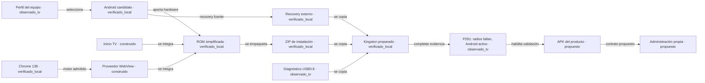

# Mapa de componentes y archivos

Generado por `herramientas/generar-mapa.py` desde [proyecto.json](proyecto.json). [Grafo visual](index.html) · [Árbol](ARBOL-ARCHIVOS.txt) · [Inventario completo](inventario.json).

La flecha expresa la relación indicada, no que se haya completado la prueba de destino. Los componentes propuestos aún no tienen archivos de implementación.

## Archivos por componente

### C-PERFIL · Perfil del equipo

**observado_tv**. Primer TV P291 identificado por ADB local; segundo P271 solo diagnóstico. Capacidades físicas de la ROM nueva pendientes.

Requisitos: REQ-02, REQ-10.

- [dossier-s905l2.html](../dossier-s905l2.html)
- [diagnostico/primer-tv-20260906-actualizacion-local/HALLAZGOS.md](../diagnostico/primer-tv-20260906-actualizacion-local/HALLAZGOS.md)
- [diagnostico/android-20260905-142854-a8286d9a/PERFIL-SEGUNDO-TV.md](../diagnostico/android-20260905-142854-a8286d9a/PERFIL-SEGUNDO-TV.md)
- [diagnostico/primer-tv-reportes-20260906-233826/HALLAZGOS.md](../diagnostico/primer-tv-reportes-20260906-233826/HALLAZGOS.md)
- [diagnostico/primer-tv-reportes-20260906-233826/resumen-saneado.json](../diagnostico/primer-tv-reportes-20260906-233826/resumen-saneado.json)
- [diagnostico/primer-tv-evidencia-20260907-000948/HALLAZGOS.md](../diagnostico/primer-tv-evidencia-20260907-000948/HALLAZGOS.md)
- [diagnostico/primer-tv-evidencia-20260907-000948/resumen-saneado.json](../diagnostico/primer-tv-evidencia-20260907-000948/resumen-saneado.json)
- [diagnostico/primer-tv-complemento-20260907-003114/HALLAZGOS.md](../diagnostico/primer-tv-complemento-20260907-003114/HALLAZGOS.md)
- [diagnostico/primer-tv-complemento-20260907-003114/resumen-saneado.json](../diagnostico/primer-tv-complemento-20260907-003114/resumen-saneado.json)

### C-BASE · Android candidato

**verificado_local**. Base community Android9 P291 inspeccionada; compatibilidad física no confirmada.

Requisitos: REQ-02, REQ-05.

- [analisis-rom/manifiesto.json](../analisis-rom/manifiesto.json)
- [analisis-rom/RESULTADO.md](../analisis-rom/RESULTADO.md)
- [analisis-rom/candidato-android9.img](../analisis-rom/candidato-android9.img)
- [analisis-rom/inspeccionar-rom.py](../analisis-rom/inspeccionar-rom.py)
- [analisis-rom/verificar-integridad-interna.py](../analisis-rom/verificar-integridad-interna.py)
- [analisis-rom/integridad-interna.json](../analisis-rom/integridad-interna.json)
- [rom-simplificada/inspeccion/inventariar-ext4.py](../rom-simplificada/inspeccion/inventariar-ext4.py)

### C-CHROME · Chrome 138

**verificado_local**. APK Google Monochrome ARM32. Integra navegador/motor; no demuestra proveedor efectivo en el TV.

Requisitos: REQ-04.

- [actualizacion-chrome/chrome-138.0.7204.179-arm32.apk](../actualizacion-chrome/chrome-138.0.7204.179-arm32.apk)
- [actualizacion-chrome/verificacion/LEEME.md](../actualizacion-chrome/verificacion/LEEME.md)

### C-INICIO · Inicio TV

**construido**. Launcher propio y ajustes; recorrido físico con control pendiente.

Requisitos: REQ-03, REQ-10.

- [rom-simplificada/componentes/inicio/Inicio.java](../rom-simplificada/componentes/inicio/Inicio.java)
- [rom-simplificada/componentes/inicio/AndroidManifest.xml](../rom-simplificada/componentes/inicio/AndroidManifest.xml)
- [rom-simplificada/compilar-componentes.py](../rom-simplificada/compilar-componentes.py)

### C-ROM · ROM simplificada

**verificado_local**. Limpieza del integrador y revisión0.1.1 que neutraliza reemplazo heredado de recovery. Conserva APIs y hardware del candidato.

Requisitos: REQ-01, REQ-03.

- [rom-simplificada/LEEME.md](../rom-simplificada/LEEME.md)
- [rom-simplificada/preparar-copias.py](../rom-simplificada/preparar-copias.py)
- [rom-simplificada/simplificar.py](../rom-simplificada/simplificar.py)
- [rom-simplificada/verificar-y-empaquetar.py](../rom-simplificada/verificar-y-empaquetar.py)
- [rom-simplificada/trabajo/cambios.json](../rom-simplificada/trabajo/cambios.json)
- [rom-simplificada/instalador/corregir-recovery-0.1.1.py](../rom-simplificada/instalador/corregir-recovery-0.1.1.py)
- [rom-simplificada/trabajo/revision-0.1.1/revision.json](../rom-simplificada/trabajo/revision-0.1.1/revision.json)
- [rom-simplificada/trabajo/revision-0.1.1/system.raw.img](../rom-simplificada/trabajo/revision-0.1.1/system.raw.img)

### C-WEB · Proveedor WebView

**construido**. Overlay permite Chrome como proveedor; WebView66 queda de respaldo. Motor efectivo y composición por comprobar.

Requisitos: REQ-04, REQ-05, REQ-06.

- [rom-simplificada/componentes/webview-overlay/AndroidManifest.xml](../rom-simplificada/componentes/webview-overlay/AndroidManifest.xml)
- [rom-simplificada/componentes/webview-overlay/res/xml/config_webview_packages.xml](../rom-simplificada/componentes/webview-overlay/res/xml/config_webview_packages.xml)
- [rom-simplificada/INTEGRACION-WEBVIEW.md](../rom-simplificada/INTEGRACION-WEBVIEW.md)
- [rom-simplificada/fuentes-webview/fuentes.json](../rom-simplificada/fuentes-webview/fuentes.json)

### C-ZIP · ZIP de instalación

**verificado_local**. Cinco particiones, controles, respaldo completo previo y hashes de lectura. No A/B ni rollback automático. Firma integral válida contra otacerts capturado del P291; claves internas de recovery desconocidas.

Requisitos: REQ-01, REQ-09, REQ-11.

- [rom-simplificada/instalador/README.md](../rom-simplificada/instalador/README.md)
- [rom-simplificada/instalador/main_linux.go](../rom-simplificada/instalador/main_linux.go)
- [rom-simplificada/instalador/package.go](../rom-simplificada/instalador/package.go)
- [rom-simplificada/instalador/package_test.go](../rom-simplificada/instalador/package_test.go)
- [rom-simplificada/instalador/main_windows.go](../rom-simplificada/instalador/main_windows.go)
- [rom-simplificada/instalador/empaquetar.py](../rom-simplificada/instalador/empaquetar.py)
- [rom-simplificada/instalador/manifest-0.1.1.json](../rom-simplificada/instalador/manifest-0.1.1.json)
- [rom-simplificada/salida/TVBASE-P291-A9-0.1.1-RECOVERY.zip](../rom-simplificada/salida/TVBASE-P291-A9-0.1.1-RECOVERY.zip)
- [rom-simplificada/salida/RECOVERY-VERIFICACION-0.1.1.json](../rom-simplificada/salida/RECOVERY-VERIFICACION-0.1.1.json)
- [rom-simplificada/salida/RECOVERY-COMPROBACION-0.1.1.json](../rom-simplificada/salida/RECOVERY-COMPROBACION-0.1.1.json)

### C-REC · Recovery externo

**verificado_local**. Archivo para RAM preparado del candidato. Clave del ZIP agregada con verificación activa; bootloader real sin probar. La vía OEM pide recovery interno, no acredita carga de este archivo.

Requisitos: REQ-11.

- [rom-simplificada/instalador/preparar-recovery-externo.py](../rom-simplificada/instalador/preparar-recovery-externo.py)
- [rom-simplificada/instalador/inspeccionar-recovery-externo.py](../rom-simplificada/instalador/inspeccionar-recovery-externo.py)
- [rom-simplificada/inspeccion/recovery-original.img](../rom-simplificada/inspeccion/recovery-original.img)
- [rom-simplificada/instalador/recovery-externo/recovery.img](../rom-simplificada/instalador/recovery-externo/recovery.img)
- [rom-simplificada/instalador/recovery-externo/PREPARADO.json](../rom-simplificada/instalador/recovery-externo/PREPARADO.json)
- [rom-simplificada/instalador/gxl_p271_v1-referencia.h](../rom-simplificada/instalador/gxl_p271_v1-referencia.h)

### C-ENTRY · Diagnóstico USB0.8

**observado_tv**. 0.8 ejecutada:25sellos de datos válidos; cierre vacío pese al aviso de fin. Corrección de persistencia pendiente, no repetir captura.

Requisitos: REQ-11.

- [rom-simplificada/componentes/acceso-usb-0.8/Acceso.java](../rom-simplificada/componentes/acceso-usb-0.8/Acceso.java)
- [rom-simplificada/componentes/acceso-usb-0.8/AdbLocal.java](../rom-simplificada/componentes/acceso-usb-0.8/AdbLocal.java)
- [rom-simplificada/componentes/acceso-usb-0.8/AndroidManifest.xml](../rom-simplificada/componentes/acceso-usb-0.8/AndroidManifest.xml)
- [rom-simplificada/componentes/acceso-usb-0.8/Evidencia.java](../rom-simplificada/componentes/acceso-usb-0.8/Evidencia.java)
- [rom-simplificada/componentes/acceso-usb-0.8/EvidenciaScripts.java](../rom-simplificada/componentes/acceso-usb-0.8/EvidenciaScripts.java)
- [rom-simplificada/componentes/acceso-usb-0.8/generar-scripts.py](../rom-simplificada/componentes/acceso-usb-0.8/generar-scripts.py)
- [rom-simplificada/componentes/acceso-usb-0.8/scripts/etapa-0.sh](../rom-simplificada/componentes/acceso-usb-0.8/scripts/etapa-0.sh)
- [rom-simplificada/componentes/acceso-usb-0.8/scripts/etapa-1.sh](../rom-simplificada/componentes/acceso-usb-0.8/scripts/etapa-1.sh)
- [rom-simplificada/componentes/acceso-usb-0.8/scripts/etapa-10.sh](../rom-simplificada/componentes/acceso-usb-0.8/scripts/etapa-10.sh)
- [rom-simplificada/componentes/acceso-usb-0.8/scripts/etapa-2.sh](../rom-simplificada/componentes/acceso-usb-0.8/scripts/etapa-2.sh)
- [rom-simplificada/componentes/acceso-usb-0.8/scripts/etapa-3.sh](../rom-simplificada/componentes/acceso-usb-0.8/scripts/etapa-3.sh)
- [rom-simplificada/componentes/acceso-usb-0.8/scripts/etapa-4.sh](../rom-simplificada/componentes/acceso-usb-0.8/scripts/etapa-4.sh)
- [rom-simplificada/componentes/acceso-usb-0.8/scripts/etapa-5.sh](../rom-simplificada/componentes/acceso-usb-0.8/scripts/etapa-5.sh)
- [rom-simplificada/componentes/acceso-usb-0.8/scripts/etapa-6.sh](../rom-simplificada/componentes/acceso-usb-0.8/scripts/etapa-6.sh)
- [rom-simplificada/componentes/acceso-usb-0.8/scripts/etapa-7.sh](../rom-simplificada/componentes/acceso-usb-0.8/scripts/etapa-7.sh)
- [rom-simplificada/componentes/acceso-usb-0.8/scripts/etapa-8.sh](../rom-simplificada/componentes/acceso-usb-0.8/scripts/etapa-8.sh)
- [rom-simplificada/componentes/acceso-usb-0.8/scripts/etapa-9.sh](../rom-simplificada/componentes/acceso-usb-0.8/scripts/etapa-9.sh)
- [rom-simplificada/compilacion/acceso-usb-0.8/componente.json](../rom-simplificada/compilacion/acceso-usb-0.8/componente.json)
- [rom-simplificada/instalador/compilar-evidencia08.py](../rom-simplificada/instalador/compilar-evidencia08.py)
- [rom-simplificada/instalador/test_evidencia08.py](../rom-simplificada/instalador/test_evidencia08.py)
- [rom-simplificada/instalador/EvidenciaHarness08.java](../rom-simplificada/instalador/EvidenciaHarness08.java)
- [rom-simplificada/instalador/EVIDENCIA-TESTS-0.8.json](../rom-simplificada/instalador/EVIDENCIA-TESTS-0.8.json)

### C-USB · Kingston preparado

**verificado_local**. Entrega0.8 PC verificada; captura recibida63archivos,3finales vacíos. USB preservado durante adquisición.

Requisitos: REQ-01.

- [preparacion-usb/preparar-postintento-08.ps1](../preparacion-usb/preparar-postintento-08.ps1)
- [preparacion-usb/postintento-08-estado.json](../preparacion-usb/postintento-08-estado.json)
- [rom-simplificada/instalador/LEEME-POSTINTENTO-0.8.txt](../rom-simplificada/instalador/LEEME-POSTINTENTO-0.8.txt)
- [rom-simplificada/INSTALACION-USB.md](../rom-simplificada/INSTALACION-USB.md)

### C-TV · P291: radios fallan, Android activo

**observado_tv**. 6ANRBT, WiFi/BatteryStats timeout5s; sigue build original/Chrome70. Causa2% no confirmada; LAN ofrecida, IPpendiente.

Requisitos: .

- [docs/ESTADO.md](../docs/ESTADO.md)
- [diagnostico/primer-tv-evidencia-20260907-000948/HALLAZGOS.md](../diagnostico/primer-tv-evidencia-20260907-000948/HALLAZGOS.md)
- [diagnostico/primer-tv-evidencia-20260907-000948/resumen-saneado.json](../diagnostico/primer-tv-evidencia-20260907-000948/resumen-saneado.json)
- [diagnostico/primer-tv-complemento-20260907-003114/HALLAZGOS.md](../diagnostico/primer-tv-complemento-20260907-003114/HALLAZGOS.md)
- [diagnostico/primer-tv-complemento-20260907-003114/resumen-saneado.json](../diagnostico/primer-tv-complemento-20260907-003114/resumen-saneado.json)
- [diagnostico/primer-tv-complemento-20260907-003114/certificados-ota.json](../diagnostico/primer-tv-complemento-20260907-003114/certificados-ota.json)
- [diagnostico/primer-tv-complemento-20260907-003114/analisis-actualizador/ANALISIS.md](../diagnostico/primer-tv-complemento-20260907-003114/analisis-actualizador/ANALISIS.md)
- [rom-simplificada/instalador/EVIDENCIA-TESTS-0.6.json](../rom-simplificada/instalador/EVIDENCIA-TESTS-0.6.json)
- [diagnostico/primer-tv-update-20260907-1326/HALLAZGOS.md](../diagnostico/primer-tv-update-20260907-1326/HALLAZGOS.md)
- [diagnostico/primer-tv-update-20260907-1326/resumen-saneado.json](../diagnostico/primer-tv-update-20260907-1326/resumen-saneado.json)
- [docs/COLABORACION.md](../docs/COLABORACION.md)
- [docs/ENTREGA-FABLE.md](../docs/ENTREGA-FABLE.md)
- [docs/hipotesis/H1-CIERRE-ANDROID.md](../docs/hipotesis/H1-CIERRE-ANDROID.md)
- [docs/hipotesis/H2-PREPARACION-RECOVERY.md](../docs/hipotesis/H2-PREPARACION-RECOVERY.md)
- [docs/hipotesis/H1-RESULTADO-CODEX.md](../docs/hipotesis/H1-RESULTADO-CODEX.md)
- [diagnostico/h1-cierre-android/resumen-saneado.json](../diagnostico/h1-cierre-android/resumen-saneado.json)
- [diagnostico/h1-cierre-android/analizar-registro.py](../diagnostico/h1-cierre-android/analizar-registro.py)
- [diagnostico/h1-cierre-android/test_analizar_registro.py](../diagnostico/h1-cierre-android/test_analizar_registro.py)
- [docs/hipotesis/REVISION-CONJUNTA-FABLE.md](../docs/hipotesis/REVISION-CONJUNTA-FABLE.md)
- [diagnostico/fable-20260907/resumen-saneado.json](../diagnostico/fable-20260907/resumen-saneado.json)
- [diagnostico/primer-tv-postintento-20260907-183025/HALLAZGOS.md](../diagnostico/primer-tv-postintento-20260907-183025/HALLAZGOS.md)
- [diagnostico/primer-tv-postintento-20260907-183025/resumen-saneado.json](../diagnostico/primer-tv-postintento-20260907-183025/resumen-saneado.json)
- [diagnostico/revision-postintento/analizar-captura08.py](../diagnostico/revision-postintento/analizar-captura08.py)
- [diagnostico/revision-postintento/test_captura08.py](../diagnostico/revision-postintento/test_captura08.py)

### C-APP · APK del producto

**propuesto**. Flutter más sistema web, videos persistentes y detección de capacidades. La app final no bloquea la plataforma.

Requisitos: REQ-07, REQ-08, REQ-12.

Implementación pendiente; especificación en [ESPECIFICACION](ESPECIFICACION.md) y propuestas en [ROADMAP](ROADMAP.md).

### C-GESTION · Administración propia

**propuesto**. Actualizaciones independientes, catálogo, limpieza selectiva y despliegues por grupos. Aún sin implementación.

Requisitos: REQ-07, REQ-09.

- [docs/hipotesis/REVISION-CONJUNTA-FABLE.md](../docs/hipotesis/REVISION-CONJUNTA-FABLE.md)

## Directorios y cuidado

| Ruta | Función | Regla |
| --- | --- | --- |
| `analisis-rom/` | Fuente community e inspección | Conservar original y manifiesto |
| `rom-simplificada/componentes/` | Fuente de APK propias | Versionar cambios y conservar firma |
| `rom-simplificada/trabajo/` | RAW activos y recetas aplicadas | No son respaldo original del TV |
| `rom-simplificada/instalador/` | ZIP, recovery externo y pruebas | Revisar versión antes de reconstruir |
| `rom-simplificada/salida/` | Releases y evidencias | 0.1 retirada; 0.1.1 vigente |
| `preparacion-usb/` | Preparadores y recibos de operaciones | Usar identidad estable; no repetir por rutina |
| `diagnostico/` | Evidencia de ambos equipos | No mezclar perfiles P291 y P271 |
| `actualizacion-chrome/` | Chrome fuente y firmas | Conservar APK integrado y evidencia |
| `images/` | Armbian histórico comprimido | No es ROM Android ni ruta activa |
| `tools/` | Compiladores e inspección locales | Dependencias; no están instaladas en USB |
| `docs/` | Especificación, estado, grafo y roadmap | Regenerar mapa al cambiar relaciones |
| `rom-simplificada/claves-desarrollo/` | Firma local de APK | Privado; no mostrar contenidos |

## Inventario de tamaño

| Grupo | Archivos | GB decimales |
| --- | ---: | ---: |
| .gitattributes | 1 | 0.000 |
| .gitignore | 1 | 0.000 |
| AGENTS.md | 1 | 0.000 |
| ARQUITECTURA-ANDROID-TV.md | 1 | 0.000 |
| PRUEBA-USB.md | 1 | 0.000 |
| README.md | 1 | 0.000 |
| actualizacion-chrome | 51 | 0.417 |
| analisis-rom | 15 | 1.822 |
| diagnostico | 161 | 0.018 |
| docs | 31 | 0.000 |
| dossier-s905l2.html | 1 | 0.000 |
| images | 1 | 1.352 |
| platform-tools-latest-windows.zip | 1 | 0.008 |
| preparacion-usb | 81 | 3.688 |
| rom-simplificada | 2210 | 7.095 |
| tools | 18081 | 1.141 |

El inventario excluye derivados documentales y contenido de claves; los tamaños son de archivos, no bloques físicos ocupados. Los temporales retirados se detallan en [LIMPIEZA](LIMPIEZA.md).
