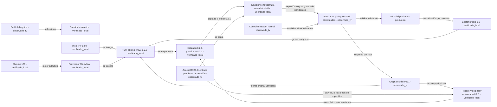

# Mapa de componentes y archivos

Generado por `herramientas/generar-mapa.py` desde [proyecto.json](proyecto.json). [Grafo visual](index.html) · [Árbol](ARBOL-ARCHIVOS.txt) · [Inventario completo](inventario.json).

La flecha expresa la relación indicada, no que se haya completado la prueba de destino. Los componentes propuestos aún no tienen archivos de implementación.

## Archivos por componente

### C-PERFIL · Perfil del equipo

**observado_tv**. Primer TV P291 identificado por ADB local; segundo P271 solo diagnóstico. Capacidades físicas de la ROM nueva pendientes.

Requisitos: REQ-02, REQ-10.

- [dossier-s905l2.html](../dossier-s905l2.html)
- [diagnostico/primer-tv-20260906-actualizacion-local/HALLAZGOS.md](../diagnostico/primer-tv-20260906-actualizacion-local/HALLAZGOS.md)
- [diagnostico/android-20260905-142854-a8286d9a/PERFIL-SEGUNDO-TV.md](../diagnostico/android-20260905-142854-a8286d9a/PERFIL-SEGUNDO-TV.md)
- [diagnostico/primer-tv-reportes-20260906-233826/HALLAZGOS.md](../diagnostico/primer-tv-reportes-20260906-233826/HALLAZGOS.md)
- [diagnostico/primer-tv-reportes-20260906-233826/resumen-saneado.json](../diagnostico/primer-tv-reportes-20260906-233826/resumen-saneado.json)
- [diagnostico/primer-tv-evidencia-20260907-000948/HALLAZGOS.md](../diagnostico/primer-tv-evidencia-20260907-000948/HALLAZGOS.md)
- [diagnostico/primer-tv-evidencia-20260907-000948/resumen-saneado.json](../diagnostico/primer-tv-evidencia-20260907-000948/resumen-saneado.json)
- [diagnostico/primer-tv-complemento-20260907-003114/HALLAZGOS.md](../diagnostico/primer-tv-complemento-20260907-003114/HALLAZGOS.md)
- [diagnostico/primer-tv-complemento-20260907-003114/resumen-saneado.json](../diagnostico/primer-tv-complemento-20260907-003114/resumen-saneado.json)

### C-BASE · Candidato anterior

**verificado_local**. Fuente comunitaria histórica. Sus diferencias con los originales P291 impiden usarla como base de la revisión 0.2.0; se conserva para análisis.

Requisitos: REQ-02, REQ-05.

- [analisis-rom/manifiesto.json](../analisis-rom/manifiesto.json)
- [analisis-rom/RESULTADO.md](../analisis-rom/RESULTADO.md)
- [analisis-rom/candidato-android9.img](../analisis-rom/candidato-android9.img)
- [analisis-rom/inspeccionar-rom.py](../analisis-rom/inspeccionar-rom.py)
- [analisis-rom/verificar-integridad-interna.py](../analisis-rom/verificar-integridad-interna.py)
- [analisis-rom/integridad-interna.json](../analisis-rom/integridad-interna.json)
- [rom-simplificada/inspeccion/inventariar-ext4.py](../rom-simplificada/inspeccion/inventariar-ext4.py)
- [diagnostico/primer-tv-lan-20260907-184926/COMPARACION-RADIOS.md](../diagnostico/primer-tv-lan-20260907-184926/COMPARACION-RADIOS.md)

### C-CHROME · Chrome 138

**verificado_local**. APK Google Monochrome ARM32. Integra navegador/motor; no demuestra proveedor efectivo en el TV.

Requisitos: REQ-04.

- [actualizacion-chrome/chrome-138.0.7204.179-arm32.apk](../actualizacion-chrome/chrome-138.0.7204.179-arm32.apk)
- [actualizacion-chrome/verificacion/LEEME.md](../actualizacion-chrome/verificacion/LEEME.md)

### C-INICIO · Inicio TV 0.2.0

**verificado_local**. Inicio propio con Ajustes TV y selección de APK por documentos/USB. Firma API28 comprobada; recorrido con mando pendiente.

Requisitos: REQ-03, REQ-10.

- [rom-simplificada/original-p291/componentes/inicio/Inicio.java](../rom-simplificada/original-p291/componentes/inicio/Inicio.java)
- [rom-simplificada/original-p291/componentes/inicio/AndroidManifest.xml](../rom-simplificada/original-p291/componentes/inicio/AndroidManifest.xml)
- [rom-simplificada/original-p291/compilar-componentes.py](../rom-simplificada/original-p291/compilar-componentes.py)
- [rom-simplificada/original-p291/COMPONENTES.json](../rom-simplificada/original-p291/COMPONENTES.json)

### C-ROM · ROM original P291 0.2.0

**verificado_local**. Cinco imágenes derivadas del P291 real: 34 APK conservadas, 51 retiradas y 5 agregadas. Kernel/DTB y drivers ajenos al recorte preservados. Android original depurado, no AOSP reconstruido.

Requisitos: REQ-01, REQ-03, REQ-13, REQ-14.

- [rom-simplificada/original-p291/README.md](../rom-simplificada/original-p291/README.md)
- [rom-simplificada/original-p291/construir.py](../rom-simplificada/original-p291/construir.py)
- [rom-simplificada/original-p291/product_ea.py](../rom-simplificada/original-p291/product_ea.py)
- [rom-simplificada/original-p291/boot.py](../rom-simplificada/original-p291/boot.py)
- [rom-simplificada/original-p291/inventariar-originales.py](../rom-simplificada/original-p291/inventariar-originales.py)
- [rom-simplificada/original-p291/politica-paquetes.json](../rom-simplificada/original-p291/politica-paquetes.json)
- [rom-simplificada/original-p291/AUDITORIA-SERVICIOS.md](../rom-simplificada/original-p291/AUDITORIA-SERVICIOS.md)
- [rom-simplificada/original-p291/seleccion-servicios.json](../rom-simplificada/original-p291/seleccion-servicios.json)
- [rom-simplificada/original-p291/IMAGENES-0.2.0.json](../rom-simplificada/original-p291/IMAGENES-0.2.0.json)
- [docs/evidencia/ROM-ORIGINAL-P291-020.md](../docs/evidencia/ROM-ORIGINAL-P291-020.md)
- [rom-simplificada/original-p291/verificar-composicion.py](../rom-simplificada/original-p291/verificar-composicion.py)
- [rom-simplificada/original-p291/COMPOSICION-VERIFICADA.json](../rom-simplificada/original-p291/COMPOSICION-VERIFICADA.json)
- [rom-simplificada/original-p291/INCIDENTES-CONSTRUCCION.md](../rom-simplificada/original-p291/INCIDENTES-CONSTRUCCION.md)

### C-WEB · Proveedor WebView

**verificado_local**. Chrome138 declarado como único proveedor; WebView66 retirado. Overlays compilados y presentes en imagen; proveedor efectivo, dos VP9/alfa/canvas y rendimiento pendientes.

Requisitos: REQ-04, REQ-05, REQ-06.

- [rom-simplificada/original-p291/componentes/webview-overlay/AndroidManifest.xml](../rom-simplificada/original-p291/componentes/webview-overlay/AndroidManifest.xml)
- [rom-simplificada/original-p291/componentes/webview-overlay/res/xml/config_webview_packages.xml](../rom-simplificada/original-p291/componentes/webview-overlay/res/xml/config_webview_packages.xml)
- [rom-simplificada/original-p291/componentes/defaults/AndroidManifest.xml](../rom-simplificada/original-p291/componentes/defaults/AndroidManifest.xml)
- [rom-simplificada/original-p291/componentes/defaults/res/values/defaults.xml](../rom-simplificada/original-p291/componentes/defaults/res/values/defaults.xml)
- [rom-simplificada/original-p291/COMPONENTES.json](../rom-simplificada/original-p291/COMPONENTES.json)

### C-ZIP · Instalador0.2.1, plataforma0.2.0

**verificado_local**. Cinco payloads0.2.0 inmutables y seis respaldos previos incluido userdata antes de preparar ext4 y flashear. Firma SHA1/Python/OpenJDK, SHA/CRC y pruebas PC correctos; no instalado.

Requisitos: REQ-01, REQ-09, REQ-11.

- [rom-simplificada/original-p291/instalacion-021/CONTRATO-MIGRACION.md](../rom-simplificada/original-p291/instalacion-021/CONTRATO-MIGRACION.md)
- [rom-simplificada/original-p291/instalacion-021/main_linux.go](../rom-simplificada/original-p291/instalacion-021/main_linux.go)
- [rom-simplificada/original-p291/instalacion-021/package.go](../rom-simplificada/original-p291/instalacion-021/package.go)
- [rom-simplificada/original-p291/instalacion-021/backup_verified.go](../rom-simplificada/original-p291/instalacion-021/backup_verified.go)
- [rom-simplificada/original-p291/instalacion-021/transaction_linux.go](../rom-simplificada/original-p291/instalacion-021/transaction_linux.go)
- [rom-simplificada/original-p291/instalacion-021/userdata_linux.go](../rom-simplificada/original-p291/instalacion-021/userdata_linux.go)
- [rom-simplificada/original-p291/instalacion-021/env_guard.go](../rom-simplificada/original-p291/instalacion-021/env_guard.go)
- [rom-simplificada/original-p291/instalacion-021/block_abi.go](../rom-simplificada/original-p291/instalacion-021/block_abi.go)
- [rom-simplificada/original-p291/instalacion-021/empaquetar_original.py](../rom-simplificada/original-p291/instalacion-021/empaquetar_original.py)
- [rom-simplificada/original-p291/instalacion-021/EVIDENCIA-TESTS.json](../rom-simplificada/original-p291/instalacion-021/EVIDENCIA-TESTS.json)
- [rom-simplificada/original-p291/instalacion-021/FORMATEADOR-PRUEBA-TV.json](../rom-simplificada/original-p291/instalacion-021/FORMATEADOR-PRUEBA-TV.json)
- [rom-simplificada/original-p291/instalacion-021/salida/TVBASE-P291-A9-0.2.1-VERIFICACION.json](../rom-simplificada/original-p291/instalacion-021/salida/TVBASE-P291-A9-0.2.1-VERIFICACION.json)

### C-REC · Recovery original y restaurador0.2.1

**verificado_local**. Restaurador separado de cinco imágenes OEM, ABI ARM32 corregido y ENV normal exigida. Conserva userdata; no restaura data.img. Recovery físico, reentrada desde Android nuevo y restore sin ensayo.

Requisitos: REQ-11.

- [diagnostico/primer-tv-lan-20260907-184926/RECOVERY-ORIGINAL.md](../diagnostico/primer-tv-lan-20260907-184926/RECOVERY-ORIGINAL.md)
- [rom-simplificada/original-p291/restauracion-021/REVISION-INDEPENDIENTE.json](../rom-simplificada/original-p291/restauracion-021/REVISION-INDEPENDIENTE.json)
- [rom-simplificada/original-p291/restauracion-021/main_linux.go](../rom-simplificada/original-p291/restauracion-021/main_linux.go)
- [rom-simplificada/original-p291/restauracion-021/package.go](../rom-simplificada/original-p291/restauracion-021/package.go)
- [rom-simplificada/original-p291/restauracion-021/env_read_linux.go](../rom-simplificada/original-p291/restauracion-021/env_read_linux.go)
- [rom-simplificada/original-p291/restauracion-021/empaquetar_original.py](../rom-simplificada/original-p291/restauracion-021/empaquetar_original.py)
- [rom-simplificada/original-p291/instalacion-021/RESTAURACION.md](../rom-simplificada/original-p291/instalacion-021/RESTAURACION.md)
- [rom-simplificada/original-p291/restauracion-021/salida/TVBASE-P291-A9-ORIGINAL-RESTORE-0.2.1-VERIFICACION.json](../rom-simplificada/original-p291/restauracion-021/salida/TVBASE-P291-A9-ORIGINAL-RESTORE-0.2.1-VERIFICACION.json)

### C-ENTRY · AccesoUSB0.9: entrada pendiente de decisión

**observado_tv**. APK0.9 liberada/instalada por LAN; captura confirma diálogo2% superpuesto y acceso no visible. Preparación ENV/BCB no ejecutada ni autorizada específicamente; no indicar botones ocultos o corte para abrirla. Cliente LAN preparado para operar la misma APK sin pulsaciones ocultas; 53 pruebas PC y revisión independiente; sin ejecución TV del cliente.

Requisitos: REQ-11.

- [rom-simplificada/original-p291/entrada-apk/README.md](../rom-simplificada/original-p291/entrada-apk/README.md)
- [rom-simplificada/original-p291/entrada-apk/ESTADO-ENTRADA-09.md](../rom-simplificada/original-p291/entrada-apk/ESTADO-ENTRADA-09.md)
- [rom-simplificada/original-p291/entrada-apk/COMPILACION-09.json](../rom-simplificada/original-p291/entrada-apk/COMPILACION-09.json)
- [rom-simplificada/original-p291/entrada-apk/PROBE-FISICO.json](../rom-simplificada/original-p291/entrada-apk/PROBE-FISICO.json)
- [rom-simplificada/original-p291/entrada-apk/src/Acceso.java](../rom-simplificada/original-p291/entrada-apk/src/Acceso.java)
- [rom-simplificada/original-p291/entrada-apk/src/AdbLocal.java](../rom-simplificada/original-p291/entrada-apk/src/AdbLocal.java)
- [rom-simplificada/original-p291/entrada-apk/src/AndroidManifest.xml](../rom-simplificada/original-p291/entrada-apk/src/AndroidManifest.xml)
- [rom-simplificada/original-p291/entrada-apk/src/EntryCodec.java](../rom-simplificada/original-p291/entrada-apk/src/EntryCodec.java)
- [rom-simplificada/original-p291/entrada-apk/src/EntryContract.java](../rom-simplificada/original-p291/entrada-apk/src/EntryContract.java)
- [rom-simplificada/original-p291/entrada-apk/src/EntryIO.java](../rom-simplificada/original-p291/entrada-apk/src/EntryIO.java)
- [rom-simplificada/original-p291/entrada-apk/src/PreparationHelper.java](../rom-simplificada/original-p291/entrada-apk/src/PreparationHelper.java)
- [rom-simplificada/original-p291/entrada-apk/compilar-entrada09.py](../rom-simplificada/original-p291/entrada-apk/compilar-entrada09.py)
- [docs/evidencia/ENTRADA-ORIGINAL-P291-021.md](../docs/evidencia/ENTRADA-ORIGINAL-P291-021.md)
- [rom-simplificada/original-p291/entrada-apk/LIBERACION-09.json](../rom-simplificada/original-p291/entrada-apk/LIBERACION-09.json)
- [rom-simplificada/original-p291/entrada-apk/INSTALACION-TV-09.json](../rom-simplificada/original-p291/entrada-apk/INSTALACION-TV-09.json)
- [rom-simplificada/original-p291/entrada-apk/entrada-lan09.py](../rom-simplificada/original-p291/entrada-apk/entrada-lan09.py)
- [rom-simplificada/original-p291/entrada-apk/test_entrada_lan09.py](../rom-simplificada/original-p291/entrada-apk/test_entrada_lan09.py)
- [rom-simplificada/original-p291/entrada-apk/OPERACION-LAN-09.md](../rom-simplificada/original-p291/entrada-apk/OPERACION-LAN-09.md)
- [rom-simplificada/original-p291/entrada-apk/PRUEBAS-LAN09.json](../rom-simplificada/original-p291/entrada-apk/PRUEBAS-LAN09.json)
- [rom-simplificada/original-p291/entrada-apk/REVISION-LAN09.json](../rom-simplificada/original-p291/entrada-apk/REVISION-LAN09.json)

### C-USB · Kingston: entrega0.2.1 copiada/releída

**verificado_local**. Cuatro archivos copiados y releídos con SHA/código0; cuatro viejos archivados/verificados antes de retirarlos. Sin formato ni reparación. Expulsión segura Windows y traslado alTV pendientes; flush final del volumen no acreditado.

Requisitos: REQ-01.

- [rom-simplificada/INSTALACION-USB.md](../rom-simplificada/INSTALACION-USB.md)
- [preparacion-usb/rom-012-estado.json](../preparacion-usb/rom-012-estado.json)
- [rom-simplificada/original-p291/LEEME-USB-021.txt](../rom-simplificada/original-p291/LEEME-USB-021.txt)
- [preparacion-usb/original-021-estado.json](../preparacion-usb/original-021-estado.json)
- [preparacion-usb/preparar-original-021.ps1](../preparacion-usb/preparar-original-021.ps1)

### C-TV · P291: root y bloqueo WiFi confirmados

**observado_tv**. Primer P291 original al2% y accesible por LAN; captura confirma diálogo encima de Acceso0.9. ENV/misc originales releídos sin cambios. Probes limitados aprobados; no preparación ENV/BCB ni ROM instalada.

Requisitos: REQ-13.

- [docs/ESTADO.md](../docs/ESTADO.md)
- [diagnostico/primer-tv-evidencia-20260907-000948/HALLAZGOS.md](../diagnostico/primer-tv-evidencia-20260907-000948/HALLAZGOS.md)
- [diagnostico/primer-tv-evidencia-20260907-000948/resumen-saneado.json](../diagnostico/primer-tv-evidencia-20260907-000948/resumen-saneado.json)
- [diagnostico/primer-tv-complemento-20260907-003114/HALLAZGOS.md](../diagnostico/primer-tv-complemento-20260907-003114/HALLAZGOS.md)
- [diagnostico/primer-tv-complemento-20260907-003114/resumen-saneado.json](../diagnostico/primer-tv-complemento-20260907-003114/resumen-saneado.json)
- [diagnostico/primer-tv-complemento-20260907-003114/certificados-ota.json](../diagnostico/primer-tv-complemento-20260907-003114/certificados-ota.json)
- [diagnostico/primer-tv-complemento-20260907-003114/analisis-actualizador/ANALISIS.md](../diagnostico/primer-tv-complemento-20260907-003114/analisis-actualizador/ANALISIS.md)
- [rom-simplificada/instalador/EVIDENCIA-TESTS-0.6.json](../rom-simplificada/instalador/EVIDENCIA-TESTS-0.6.json)
- [diagnostico/primer-tv-update-20260907-1326/HALLAZGOS.md](../diagnostico/primer-tv-update-20260907-1326/HALLAZGOS.md)
- [diagnostico/primer-tv-update-20260907-1326/resumen-saneado.json](../diagnostico/primer-tv-update-20260907-1326/resumen-saneado.json)
- [docs/COLABORACION.md](../docs/COLABORACION.md)
- [docs/ENTREGA-FABLE.md](../docs/ENTREGA-FABLE.md)
- [docs/hipotesis/H1-CIERRE-ANDROID.md](../docs/hipotesis/H1-CIERRE-ANDROID.md)
- [docs/hipotesis/H2-PREPARACION-RECOVERY.md](../docs/hipotesis/H2-PREPARACION-RECOVERY.md)
- [docs/hipotesis/H1-RESULTADO-CODEX.md](../docs/hipotesis/H1-RESULTADO-CODEX.md)
- [diagnostico/h1-cierre-android/resumen-saneado.json](../diagnostico/h1-cierre-android/resumen-saneado.json)
- [diagnostico/h1-cierre-android/analizar-registro.py](../diagnostico/h1-cierre-android/analizar-registro.py)
- [diagnostico/h1-cierre-android/test_analizar_registro.py](../diagnostico/h1-cierre-android/test_analizar_registro.py)
- [docs/hipotesis/REVISION-CONJUNTA-FABLE.md](../docs/hipotesis/REVISION-CONJUNTA-FABLE.md)
- [diagnostico/fable-20260907/resumen-saneado.json](../diagnostico/fable-20260907/resumen-saneado.json)
- [diagnostico/primer-tv-postintento-20260907-183025/HALLAZGOS.md](../diagnostico/primer-tv-postintento-20260907-183025/HALLAZGOS.md)
- [diagnostico/primer-tv-postintento-20260907-183025/resumen-saneado.json](../diagnostico/primer-tv-postintento-20260907-183025/resumen-saneado.json)
- [diagnostico/revision-postintento/analizar-captura08.py](../diagnostico/revision-postintento/analizar-captura08.py)
- [diagnostico/revision-postintento/test_captura08.py](../diagnostico/revision-postintento/test_captura08.py)
- [diagnostico/primer-tv-lan-20260907-184926/HALLAZGOS.md](../diagnostico/primer-tv-lan-20260907-184926/HALLAZGOS.md)
- [diagnostico/primer-tv-lan-20260907-184926/resumen-saneado.json](../diagnostico/primer-tv-lan-20260907-184926/resumen-saneado.json)
- [diagnostico/primer-tv-lan-20260907-184926/COMPARACION-RADIOS.md](../diagnostico/primer-tv-lan-20260907-184926/COMPARACION-RADIOS.md)
- [diagnostico/observacion-lan/capturar-log.py](../diagnostico/observacion-lan/capturar-log.py)
- [diagnostico/primer-tv-lan-20260907-184926/ROOT-RESULTADO.md](../diagnostico/primer-tv-lan-20260907-184926/ROOT-RESULTADO.md)
- [diagnostico/primer-tv-lan-20260907-184926/ANALISIS-UPDATE-012.md](../diagnostico/primer-tv-lan-20260907-184926/ANALISIS-UPDATE-012.md)
- [diagnostico/respaldar-p291-lan.py](../diagnostico/respaldar-p291-lan.py)
- [diagnostico/primer-tv-lan-20260907-184926/RESPALDO-resumen-saneado.json](../diagnostico/primer-tv-lan-20260907-184926/RESPALDO-resumen-saneado.json)
- [diagnostico/primer-tv-lan-20260907-184926/OPCIONES-INSTALACION-ROOT.md](../diagnostico/primer-tv-lan-20260907-184926/OPCIONES-INSTALACION-ROOT.md)
- [docs/evidencia/ENTRADA-ORIGINAL-P291-021.md](../docs/evidencia/ENTRADA-ORIGINAL-P291-021.md)
- [rom-simplificada/original-p291/instalacion-021/FORMATEADOR-PRUEBA-TV.json](../rom-simplificada/original-p291/instalacion-021/FORMATEADOR-PRUEBA-TV.json)

### C-APP · APK del producto

**propuesto**. Flutter más sistema web, videos persistentes y detección de capacidades. La app final no bloquea la plataforma.

Requisitos: REQ-07, REQ-08, REQ-12.

Implementación pendiente; especificación en [ESPECIFICACION](ESPECIFICACION.md) y propuestas en [ROADMAP](ROADMAP.md).

### C-GESTION · Gestor propio 0.1

**verificado_local**. APK para actualizaciones de aplicaciones y Chrome, 38 pruebas host y revisión independiente. Integrado como priv-app con permiso acotado. Desactivado, sin endpoint; no hay prueba Android ni OTA completa.

Requisitos: REQ-07, REQ-09, REQ-14.

- [rom-simplificada/componentes/gestion-tvbase/README.md](../rom-simplificada/componentes/gestion-tvbase/README.md)
- [rom-simplificada/componentes/gestion-tvbase/AndroidManifest.xml](../rom-simplificada/componentes/gestion-tvbase/AndroidManifest.xml)
- [rom-simplificada/componentes/gestion-tvbase/ManagerEngine.java](../rom-simplificada/componentes/gestion-tvbase/ManagerEngine.java)
- [rom-simplificada/componentes/gestion-tvbase/UpdateCore.java](../rom-simplificada/componentes/gestion-tvbase/UpdateCore.java)
- [rom-simplificada/componentes/gestion-tvbase/UpdateJob.java](../rom-simplificada/componentes/gestion-tvbase/UpdateJob.java)
- [rom-simplificada/componentes/gestion-tvbase/MainActivity.java](../rom-simplificada/componentes/gestion-tvbase/MainActivity.java)
- [rom-simplificada/original-p291/gestion/README.md](../rom-simplificada/original-p291/gestion/README.md)
- [rom-simplificada/original-p291/gestion/manifest_tool.py](../rom-simplificada/original-p291/gestion/manifest_tool.py)
- [rom-simplificada/original-p291/gestion/LIBERACION.json](../rom-simplificada/original-p291/gestion/LIBERACION.json)
- [rom-simplificada/original-p291/gestion/pruebas-resultado.json](../rom-simplificada/original-p291/gestion/pruebas-resultado.json)
- [rom-simplificada/original-p291/REVISION-GESTOR.md](../rom-simplificada/original-p291/REVISION-GESTOR.md)

### C-BTCTRL · Control Bluetooth normal

**observado_tv**. API normal guardaOFF; paquete de fábrica inhabilitado por operador y ajuste persistente tras apagado. No es instaladorROM.

Requisitos: REQ-13.

- [rom-simplificada/componentes/control-bluetooth-0.1/README.md](../rom-simplificada/componentes/control-bluetooth-0.1/README.md)
- [rom-simplificada/componentes/control-bluetooth-0.1/AndroidManifest.xml](../rom-simplificada/componentes/control-bluetooth-0.1/AndroidManifest.xml)
- [rom-simplificada/componentes/control-bluetooth-0.1/ControlActivity.java](../rom-simplificada/componentes/control-bluetooth-0.1/ControlActivity.java)
- [rom-simplificada/instalador/compilar-control-bluetooth.py](../rom-simplificada/instalador/compilar-control-bluetooth.py)
- [rom-simplificada/compilacion/control-bluetooth-0.1/componente.json](../rom-simplificada/compilacion/control-bluetooth-0.1/componente.json)

### C-ORIG · Originales del P291

**observado_tv**. Doce particiones seleccionadas (2538 MiB) verificadas; fuente de la ROM y ZIP de restauración. No incluye userdata/cache ni toda eMMC; restauración física pendiente.

Requisitos: REQ-02, REQ-09, REQ-11.

- [diagnostico/primer-tv-lan-20260907-184926/RESPALDO-resumen-saneado.json](../diagnostico/primer-tv-lan-20260907-184926/RESPALDO-resumen-saneado.json)
- [diagnostico/primer-tv-lan-20260907-184926/RECOVERY-ORIGINAL.md](../diagnostico/primer-tv-lan-20260907-184926/RECOVERY-ORIGINAL.md)
- [diagnostico/respaldar-p291-lan.py](../diagnostico/respaldar-p291-lan.py)
- [diagnostico/test_respaldo_p291_lan.py](../diagnostico/test_respaldo_p291_lan.py)
- [diagnostico/respaldo-p291-lan/EVIDENCIA-SANEADA.json](../diagnostico/respaldo-p291-lan/EVIDENCIA-SANEADA.json)

## Directorios y cuidado

| Ruta | Función | Regla |
| --- | --- | --- |
| `analisis-rom/` | Fuente community e inspección | Conservar original y manifiesto |
| `rom-simplificada/componentes/` | Fuente de APK propias | Versionar cambios y conservar firma |
| `rom-simplificada/trabajo/` | RAW activos y recetas aplicadas | No son respaldo original del TV |
| `rom-simplificada/instalador/` | ZIP, recovery externo y pruebas | Revisar versión antes de reconstruir |
| `rom-simplificada/salida/` | Releases históricas 0.1.x | Conservar; no repetir su instalación |
| `rom-simplificada/original-p291/` | Plataforma0.2.0 inmutable, selección y gestor | Fuentes y recibos versionados; privados excluidos |
| `rom-simplificada/original-p291/instalacion-021/` | Instalador0.2.1: seis respaldos y migración de datos | Release inmutable; preparación PC no acredita instalación |
| `rom-simplificada/original-p291/restauracion-021/` | Restaurador0.2.1 de cinco imágenes OEM | Conserva userdata; no restaura su respaldo ni ofrece rollback |
| `rom-simplificada/original-p291/entrada-apk/` | AccesoUSB0.9 y contrato ENV/BCB | Uso del método específico pendiente de decisión; no reset automático |
| `rom-simplificada/original-p291/empaquetado/salida/` | Releases0.2.0 históricas | Conservar; ioctl ARM32 corregido en0.2.1 |
| `privado/TVBASE-respaldo-*/` | Adquisiciones originales P291 | Inmutables; no publicar ni confundir con userdata |
| `preparacion-usb/` | Preparadores y recibos de operaciones | Usar identidad estable; no repetir por rutina |
| `diagnostico/` | Evidencia de ambos equipos | No mezclar perfiles P291 y P271 |
| `actualizacion-chrome/` | Chrome fuente y firmas | Conservar APK integrado y evidencia |
| `images/` | Armbian histórico comprimido | No es ROM Android ni ruta activa |
| `tools/` | Compiladores e inspección locales | Dependencias; no están instaladas en USB |
| `docs/` | Especificación, estado, grafo y roadmap | Regenerar mapa al cambiar relaciones |
| `rom-simplificada/claves-desarrollo/` | Firma local de APK | Privado; no mostrar contenidos |

## Inventario de tamaño

| Grupo | Archivos | GB decimales |
| --- | ---: | ---: |
| .gitattributes | 1 | 0.000 |
| .gitignore | 1 | 0.000 |
| AGENTS.md | 1 | 0.000 |
| ARQUITECTURA-ANDROID-TV.md | 1 | 0.000 |
| PRUEBA-USB.md | 1 | 0.000 |
| README.md | 1 | 0.000 |
| actualizacion-chrome | 51 | 0.417 |
| analisis-rom | 15 | 1.822 |
| diagnostico | 173 | 0.018 |
| docs | 33 | 0.000 |
| dossier-s905l2.html | 1 | 0.000 |
| images | 1 | 1.352 |
| platform-tools-latest-windows.zip | 1 | 0.008 |
| preparacion-usb | 87 | 3.688 |
| rom-simplificada | 4564 | 13.055 |
| tools | 18081 | 1.141 |

El inventario excluye derivados documentales y contenido de claves; los tamaños son de archivos, no bloques físicos ocupados. Los temporales retirados se detallan en [LIMPIEZA](LIMPIEZA.md).
