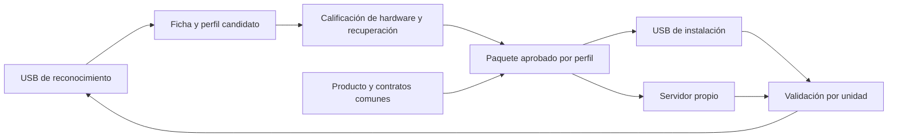

# Próxima etapa: reconocimiento, producto común e instalación por perfil

**PROP-17 / ADR-29 · diseño para revisar, 8/9/2026.** Reordena PROP-16 según el último pedido del usuario. El primer entregable propuesto es reconocimiento desde USB; la capa común y las actualizaciones se diseñan desde el comienzo. No se construyeron nuevas APK, no se prepararon pendrives y no se modificó el TV ni el servidor en esta revisión.

El usuario confirma varios reinicios correctos del P291 sin pendrive. Se registra como [observación del usuario](evidencia/REINICIOS-P291-SIN-USB.md), separada de los recibos del instalador. Home sigue pendiente; el proveedor WebView efectivo, el rendimiento y el tráfico todavía requieren medición.

## Dos pendrives con tareas distintas

| Medio propuesto | Qué hace | Resultado |
| --- | --- | --- |
| Reconocimiento | Una aplicación que se instala y abre desde Android, con módulos de lectura según familia y permisos disponibles. Guarda informes en USB. | Ficha comparable, evidencia y diferencias frente a perfiles conocidos. Puede concluir «información insuficiente» o «sin instalador compatible». |
| Instalación | Paquetes firmados y recetas para perfiles ya calificados. Comprueba cada unidad antes de escribir y registra el resultado. | Instalación repetible, con respaldo individual ajustado a una política aprobada y comprobación funcional breve. |

Son dos funciones y pueden materializarse en dos pendrives físicos. No se presume disponer de un segundo dispositivo ni se cambia ahora el Kingston conservado. El reconocimiento general no lleva un botón que ejecute automáticamente una receta experimental de instalación.

**Compatibilidad amplia de diagnóstico no significa arranque USB universal.** La primera versión necesita Android funcionando y posibilidad de instalar/abrir una APK desde USB. No se promete ejecución automática al conectarlo ni acceso a todas las particiones en cualquier equipo. Si Android no inicia, habrá que identificar una vía de recuperación específica. Rockchip utiliza, entre otras herramientas, su protocolo rockusb y loaders propios; eso requiere otra integración, no reutilizar offsets o preparación ENV de Amlogic. [Referencia oficial de Rockchip](https://github.com/rockchip-linux/rkdeveloptool).

## Paso 0: reconocimiento con evidencia y profundidad explícita

La herramienta comparte interfaz y formato de informe; separa recopilación de datos, comparación con perfiles y pruebas activas. Debe funcionar sin Internet para inventariar y exportar. La escritura de informes y la instalación de la APK son cambios normales de archivos; la captura básica no cambia radios, arranque, seguridad ni particiones.

| Nivel | Información y acceso | Límite que debe mostrar |
| --- | --- | --- |
| APK normal | Android/API/ABI, memoria y almacenamiento accesibles, pantalla, capacidades multimedia anunciadas, dispositivos de entrada y proveedor WebView de su proceso. | Lo que Android declara puede ser incompleto o incorrecto. Una aplicación normal no acredita chips físicos ni extrae todos los drivers o datos protegidos. |
| Shell autorizado | Propiedades y archivos legibles, kernel/DT accesible, módulos, HAL, paquetes, mapas de entrada y particiones visibles; lecturas con límites. | Requiere un acceso existente y autorizado. No supone ADB abierto, root ni los mismos permisos en todos los TV. |
| Adaptador por perfil con acceso privilegiado | Geometría y respaldos exactos de particiones, firmware/DTB y dependencias protegidas cuando sean legibles. | Requiere una ruta previamente comprobada para ese hardware. No incluye exploits, reinicios, desmontajes ni escrituras como parte de la captura general. Un respaldo consistente puede necesitar otro procedimiento de mantenimiento. |

Cada dato tendrá valor, fuente, nivel de acceso y estado: observado, declarado, inferido, no disponible, denegado, agotado o fallido. Cada etapa guardará duración monotónica, código real, límites de tamaño y huellas de sus archivos. El cierre debe comprobar persistencia de archivos y directorio cuando el transporte lo permita; si no puede acreditarla, lo informa. Un código cero con texto de timeout no es una lectura correcta. No se repetirán automáticamente consultas bloqueadas.

La ficha relacionará placa/SoC y revisión, API/ABI, kernel, DTB, memoria, mapa de particiones, GPU, codecs/HAL, WiFi, Ethernet, audio, HDMI y control remoto. Debe distinguir información anunciada, componentes realmente cargados y funciones probadas. Un driver presente no demuestra que esté activo; un nombre comercial o una cadena de CPU no determina un perfil instalable.

La identificación de la radio y las dependencias de video puede necesitar varias fuentes, incluso revisión de placa si el software no las expone. Calibración, direcciones, identificadores y claves quedan asociados a su unidad, fuera de imágenes comunes y del repositorio público. No se extraen datos personales para completar una ficha de hardware.

**Aceptación del primer entregable:** un informe en P291 y otro en P271, comparación que los distinga correctamente, ejecución sin ADB/root con resultado parcial honesto y salida controlada ante acceso denegado o USB retirado. Un Rockchip podrá incorporarse inicialmente como perfil desconocido: reconocerlo no habilita instalación. Solo después de probar un ejemplar se declara soporte para su perfil. REQ-18 define esta salida; no exige inventar datos para llenar casillas.

### Código reutilizable, sin volver a distribuir capturas antiguas

La revisión local encontró un catálogo de lecturas en [recoger-android-adb.ps1](../diagnostico/recoger-android-adb.ps1), lectura de buses y enlaces de drivers en [recoger-hardware-linux.sh](../diagnostico/recoger-hardware-linux.sh) y un [parser de integridad/timeout](../diagnostico/revision-postintento/analizar-captura08.py). Los dos recolectores requieren respectivamente shell autorizado o Linux ya iniciado; no son una APK universal. Sus límites de ejecución y dependencias deben revisarse al extraer piezas.

Los patrones de persistencia de [EntryIO.java](../rom-simplificada/original-p291/entrada-apk/src/EntryIO.java) pueden orientar informes nuevos, separados por completo de la preparación ENV/BCB. AccesoUSB0.8 está fijado al P291 y su cierre físico tuvo una persistencia incompleta; 0.9 prepara arranque y no es diagnóstico general. No reutilizar sus botones, radios/BatteryStats bloqueantes ni suponer ADB loopback disponible en la base simplificada. No existe todavía un adaptador Rockchip.

## Paso 1: calificar el P291 instalado y medir las mejoras

Se utiliza la ficha para comprobar Home, ajustes y controles; proveedor y versión realmente usados dentro del WebView; instalación/actualización de APK y almacenamiento de video local. La aplicación de diagnóstico acredita su propio proceso. Para acreditar la APK Flutter del usuario, habrá que obtener el mismo dato en esa APK o evidencia de su ejecución; el resultado de Chrome abierto por separado no alcanza. Android expone `WebView.getCurrentWebViewPackage()` desde API26: se registra después de cargar realmente un WebView para identificar el proveedor usado; antes se informa como proveedor previsto. [API oficial](https://developer.android.com/reference/android/webkit/WebView#getCurrentWebViewPackage()).

La carga principal será la composición real: dos videos VP9, uno con transparencia, y canvas. Se fijarán archivos/hash, resolución, frecuencia, duración y condiciones de red. Se medirá fluidez, cuadros perdidos cuando sean observables, CPU, memoria, temperatura y ruta de decodificación/composición, con los límites del acceso disponible. Las pruebas de rendimiento serán un modo separado de la captura básica.

Se toma primero una línea de base del TV Base actual y se compara después de cada cambio bajo las mismas condiciones. La experiencia favorable del usuario con el Android anterior es un antecedente, no una medición comparable; no se propone reinstalar el OEM solo para obtenerla.

No se deduce mayor velocidad de haber eliminado aplicaciones. Tampoco se supone aceleración completa del video con alfa por ver «VP9 compatible». En API28 no existe el indicador público `MediaCodecInfo.isHardwareAccelerated()` agregado en API29; se combinarán capacidades, implementación seleccionada y reproducción real. [Documentación de codecs](https://developer.android.com/media/optimize/performance/codec?hl=en). Cualquier ajuste debe mantener o mejorar esa carga y la estabilidad; no se proponen overclock ni cambios de drivers antes de medir.

### Revisión de software y conexiones

REQ-14 exige estudiar el software retenido y su comportamiento. La base conserva framework y código del fabricante; todavía no puede calificarse como sistema libre de malware. La [auditoría de servicios existente](../rom-simplificada/original-p291/AUDITORIA-SERVICIOS.md) es un punto de partida, no una certificación.

Se propone contrastar APK, firmas, permisos, servicios de arranque, binarios nativos, tareas y actualizadores con la composición construida; después observar arranque, reposo, reproducción y actualización durante intervalos definidos. Se registrarán destinos, volumen, horarios y procesos/UID cuando el acceso permita atribuirlos. Una captura externa en router o red de prueba complementa la observación del propio Android: la primera no identifica sola el proceso y la segunda puede omitir actividad privilegiada. No hace falta capturar contraseñas ni descifrar contenido personal para este objetivo.

Un destino geográfico, por sí solo, no prueba malware. Se investigarán conexiones sin función explicada, actividad persistente y consumo injustificado. Los informes públicos serán saneados. La conclusión debe expresar cobertura y límites: «sin actividad inexplicada observada en estas condiciones», o hallazgos concretos por resolver. Si una pieza retenida resulta sospechosa, se revisa su retirada o sustitución y se repiten las funciones dependientes antes de aprobarla. SELinux permisivo y firma heredada quedan como trabajo de seguridad de producción; no se corrigen a ciegas durante la medición.

## Capa común de producto desde el comienzo

El diagnóstico informa qué puede hacer cada base; la experiencia y la APK comparten contratos. Se definen desde el paso 0 el formato de capacidades, identidad de versión, configuración y resultados de actualización. El diseño visible incluye logo del usuario, inicio sencillo, Home predecible, red, archivos, reproducción y estado de mantenimiento. El archivo de logo aún no está identificado; no se elige uno de los recursos OEM por semejanza.

La APK Flutter/web y el almacenamiento local seguirán una interfaz común. Los privilegios de instalación y administración residirán en un componente del sistema acotado en TV Base, con funciones degradadas explícitas en Android TV comercial. Cambiar kernel/DTB/HAL o framework requiere adaptar y validar la base por perfil; no se presenta la capa común como una ROM binaria intercambiable entre P291, P271 y Rockchip.

## Paso 2: una política de versiones para USB e Internet

El catálogo de versiones, las firmas, la compatibilidad de perfil y los recibos deben compartirse entre ambos transportes. Un paquete podrá llegar por pendrive o desde el servidor propio, pero declarar si provisiona una unidad nueva o actualiza una instalación existente. La fuente de descarga no decide si se borran datos.

| Tipo | Plan y estado real |
| --- | --- |
| APK y motor WebView | Existe gestor integrado, desactivado y probado en PC. Falta servidor/configuración y ensayo Android, incluido reinicio de consumidores del motor y comprobación de versión efectiva. |
| Contenido | Descarga y borrado selectivos, catálogo persistente y recuperación de descarga parcial por implementar. No usar una reinstalación de ROM para cambiar videos. |
| ROM | Procedimiento por perfil, conservación/migración de datos y entrada a recovery desde TV Base por resolver y probar. El instalador de conversión 0.2.2 borra userdata y no sirve sin cambios como actualizador habitual. |

El manifiesto propuesto vincula perfil, operación, origen/destino, componentes, firmas, hashes, requisitos de espacio, esquema de datos y resultado esperado. La gestión remota debe consultar nuestro servidor con intervalos y esperas acotadas, sin abrir ADB o root a Internet. Hace falta resolver configuración segura, estado persistente, reanudación, caducidad/repetición con reloj incorrecto, claves de producción y rotación. El servidor propio existe según el usuario, pero su dirección y clave pública no se proporcionaron: no se inventan ni se activa el gestor.

El [formato y gestor actuales](../rom-simplificada/original-p291/gestion/README.md) solo admiten roles de aplicación/navegador y compatibilidad API/ABI; su manifiesto `TVBASE-UPDATES-1` exige HTTPS y rechaza campos desconocidos. La unificación requiere una versión nueva explícita, no relajar esas comprobaciones. Ya existen consultas programadas y ventanas de mantenimiento; faltan perfiles, importación USB, reporte remoto y coordinación con la reproducción. La firma del catálogo, el certificado de cada APK y las claves de confianza del recovery cumplen funciones distintas. Conectar un pendrive no autoriza a importar una clave nueva; el catálogo no debe contener comandos arbitrarios.

La actualización de ROM no se reduce a descargar un ZIP. En el esquema sin A/B intervienen la verificación del paquete, el arranque de recovery y la escritura; cada perfil debe demostrar esa ruta. [Arquitectura AOSP](https://source.android.com/docs/core/ota/nonab). El P291 no tiene rollback automático acreditado. Se prueban primero rechazo de paquete incorrecto, descarga interrumpida, conservación de datos y recuperación disponible antes de ampliar de un piloto a un lote. No se propone cortar energía durante una escritura como primera prueba.

## Paso 3: instalación rápida y expansión

Con un perfil calificado, el segundo pendrive reutiliza investigación y paquetes; verifica individualmente identidad, geometría, compatibilidad y contenido antes de escribir. La optimización de respaldos seguirá la [política propuesta en PROP-16](PROPUESTA-LOTES-Y-ACTUALIZACIONES.md): conservar datos únicos y críticos; deduplicar únicamente imágenes demostradas genéricas; acordar qué userdata necesita preservarse en una provisión. Las actualizaciones normales deben conservar configuración y contenido compatibles.

No se garantiza velocidad solo por reducir respaldos: también se medirán verificación, almacenamiento y escritura. El contrato existente de seis respaldos no cambia retroactivamente. El instalador rápido se habilita después de validar una segunda unidad coincidente y su resultado; toda diferencia relevante vuelve a calificación.

Orden de expansión: **terminar de calificar P291 → preparar y calificar P271 → inventariar y adaptar cada Rockchip concreto**. El trabajo visual y los contratos comunes pueden avanzar junto con la calificación del P291. La prioridad de recuperación/actualización remota forma parte del diseño de cada base antes de distribuirla en cantidad.

**Próximo entregable para implementar tras el OK:** reconocimiento inicial con informe comparable y pruebas de permisos/errores, acompañado del contrato de perfiles. Continúan pendientes Home, auditoría de consumo/tráfico y validación WebView; se hacen sobre el P291 con autorización de pruebas, no repitiendo preparación 0.9 ni el actualizador OEM atascado. Este plan no modifica los respaldos o releases ya conservados.
