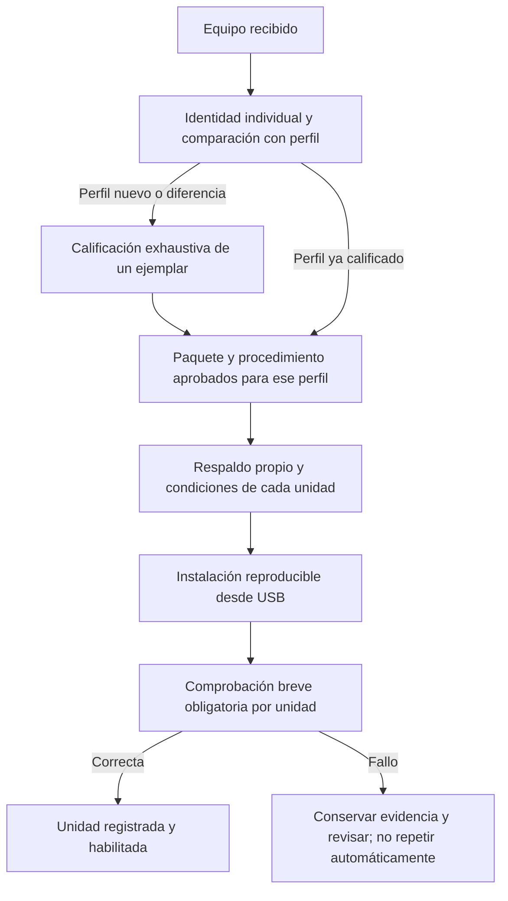

# Propuesta: lotes de equipos y actualizaciones

**Estado: pendiente de aprobación del usuario.** Este documento propone el siguiente trabajo; no modifica el TV, el pendrive, el instalador ni el servidor. ADR-28, PROP-16 y REQ-15/16/17 están integrados en la documentación y el grafo como propuestas, sin implementación ni aceptación.

**Actualización del 8/9/2026:** [PROP-17](PLAN-RECONOCIMIENTO-Y-PRODUCTO.md) fija reconocimiento sobre Android como paso 0, integra logo/capa común, consumo/tráfico/WebView y catálogo firmado para USB e Internet. El usuario informó varios reinicios sin pendrive correctos. La política de respaldo y separación de operaciones de este documento se mantiene; el orden operativo actualizado prevalece sobre la tabla de trabajo inicial de abajo.

El usuario confirmó que TV Base arrancó, aportó una foto del launcher e indicó que puede conectarse por WiFi. Se adquirieron del USB y verificaron en PC seis imágenes de respaldo, los recibos de formato y el cierre `installed_verified`; el alcance se documenta en [estado](ESTADO.md). La casita del control no vuelve al inicio: [ISSUE-HOME-01](INCIDENCIAS.md), pendiente de revisar después del OK. Este avance no demuestra todavía rendimiento de WebView/video, estabilidad prolongada o restauración. Las fuentes de esta propuesta son la [especificación](ESPECIFICACION.md), la [arquitectura](../ARQUITECTURA-ANDROID-TV.md), el [contrato de instalación 0.2.2](../rom-simplificada/original-p291/instalacion-022/CONTRATO-MIGRACION.md) y el [gestor existente](../rom-simplificada/original-p291/gestion/README.md).

## Una capa común de producto, bases por perfil

Proponemos mantener la APK de producto, su interfaz de archivos y las reglas de actualización separadas de la adaptación del hardware. La misma APK debe detectar capacidades y funcionar tanto sobre TV Base como sobre Android TV comercial. Las facultades adicionales de nuestra ROM no se presuponen en un Android TV ajeno.

| Capa | Qué se comparte | Qué se mantiene por perfil o unidad |
| --- | --- | --- |
| Producto | APK Flutter/web, reproducción, catálogo, descargas, limpieza selectiva e interfaz de administración versionada | Configuración de cada equipo, credenciales propias y capacidades disponibles |
| Motor web | Política de versiones y pruebas de compatibilidad | Proveedor WebView admitido, firma, API/ABI y versión realmente usada por las APK |
| Plataforma | Contratos Android y criterios comunes de aceptación | Kernel, DTB, HAL, firmware, partes del framework ligadas al fabricante, particiones y arranque |
| Identidad | Formato del inventario y de los recibos | Identidad individual, calibración, direcciones de red y claves del equipo |

No se propone intercambiar controladores entre ROM sin revisar sus dependencias. El nombre comercial, la carcasa o la etiqueta de un lote no acreditan la misma placa, memoria, radio o firmware. En este proyecto ya se distinguieron P291 y P271; una variante inesperada requiere su propio perfil.

El perfil aprobado debe fijar qué elementos son compatibles y cuáles pueden variar. Los datos individuales quedan fuera de una imagen común. Antes de generalizar una imagen del primer equipo se debe revisar que sus componentes distribuibles no contengan identificadores o secretos propios de esa unidad.

## Dos recorridos de preparación

**Recorrido A: calificación exhaustiva del primer ejemplar de cada variante del lote.** Su objetivo es resolver una vez la investigación que después se reutiliza: identificar placa y revisiones, geometría real, arranque/recovery, firmware y dependencias de video/red/controles; preparar una base; instalarla; comprobar el resultado y establecer cómo recuperarla. Un ejemplar favorable no garantiza que todos los demás sean iguales.

La calificación debe cubrir arranque desde memoria interna sin USB, apagado/encendido, Ethernet y WiFi, mandos, audio/HDMI, instalación y actualización de APK, proveedor WebView efectivo, video local y la composición de referencia: dos VP9, uno con transparencia, más canvas. También debe revisar almacenamiento, memoria y tráfico atribuible a procesos. Los tiempos y las condiciones de prueba se registran; los resultados no se deducen de que aparezca el launcher. La APK de producto puede seguir evolucionando mientras se prueban estas capacidades.

La salida es un perfil con criterios de coincidencia y rechazo, artefactos firmados con hashes, receta de instalación, matriz de capacidades y límites de recuperación. Un cambio de radio, eMMC, mapa, arranque o firmware relevante devuelve el equipo a calificación, aunque provenga del mismo proveedor.

**Recorrido B: instalación repetible del resto del lote.** Reutiliza el paquete y las conclusiones del perfil aprobado. Evita repetir investigación y construcción, pero conserva los controles y respaldos de cada unidad:

1. Asignar un identificador interno y vincularlo al inventario individual. Comparar placa, memoria, geometría, dispositivos, firmware de origen y acceso de instalación con las condiciones aprobadas. No identificar una unidad solo por su dirección IP, MAC o etiqueta comercial.
2. Crear el respaldo correspondiente a esa unidad y verificar su integridad antes de cualquier cambio irreversible. Registrar qué se conservará de sus datos y qué operación se aplicará.
3. Instalar exclusivamente el paquete admitido, con verificación del destino y de cada escritura, registro de resultado y detención ante diferencias. Una transacción parcial no permite un nuevo intento automático.
4. Comprobar en cada unidad arranque e identificación, almacenamiento, proveedor/motor esperado, reproducción local de una muestra y las funciones de red/control requeridas. Registrar cualquier desviación y retirarla de la entrega hasta revisarla.

El instalador0.2.2 está fijado al primer P291 y a sus originales. No es todavía un instalador de lotes: un firmware distinto puede ser rechazado correctamente. Convertirlo en una receta por perfil, con identidad individual, requiere una modificación posterior aprobada y revisada; no se resuelve sustituyendo hashes por comodines.

## Respaldos individuales y reutilización segura

Cada unidad necesita sus propios respaldos críticos: arranque, recovery, metadatos y las áreas identificadas como portadoras de calibración, identidad o claves. La lista exacta depende del perfil y de lo que se vaya a escribir; no se presupone que las doce particiones copiadas del primer P291 cubran todos los datos de otro equipo. Los registros deben distinguir respaldo del TV y respaldo del pendrive.

**Nunca copiar calibración, MAC, claves, ENV completo ni datos privados de un TV a otro como forma de clonarlo.** Que dos archivos tengan el mismo tamaño no permite intercambiarlos. Los respaldos se vinculan a la unidad, versión, partición, tamaño y hash; sus originales y secretos permanecen privados, fuera de GitHub. La eventual restauración debe rechazar una copia perteneciente a otra unidad.

Una optimización posible, todavía no implementada, es conservar una sola copia de las particiones demostradas genéricas e idénticas y registrar qué unidad coincide con ella. Eso exige comparar el contenido completo por hash, acreditar la procedencia y excluir cualquier dato individual. Ahorra duplicación de archivos; no elimina la lectura necesaria para verificar coincidencia ni demuestra por sí sola ahorro de tiempo. Arranque y metadatos específicos siguen respaldándose por unidad.

El tratamiento de userdata depende de la operación. El instalador0.2.2 actual exige sus seis respaldos completos antes del borrado y esa obligación no cambia con esta propuesta. Una futura política aprobada de provisión de unidades nuevas podría definir expresamente qué datos no necesitan conservarse; no basta decir que el TV es nuevo ni asumir que está vacío. Si hay datos que conservar, se requiere su copia individual y una migración o restauración validada. No se sustituye esa copia por la del ejemplar de referencia.

Disponer de archivos verificados no equivale a disponer de rollback. Antes de ofrecer recuperación repetible hay que probar una entrada disponible cuando Android no arranca, restaurar los componentes previstos y verificar arranque y datos. El [restaurador0.2.2](../rom-simplificada/original-p291/restauracion-022/README.md) repone cinco imágenes OEM y conserva userdata; no restaura su copia cruda. La base actual no tiene A/B ni rollback automático acreditado, y la reentrada desde Android simplificado sigue pendiente de prueba.

## Actualizar sin reinstalar innecesariamente

| Operación propuesta | Alcance | Política de datos y condición de aceptación |
| --- | --- | --- |
| Contenido | Videos y catálogo | Publicar descargas completas y verificadas; borrar selectivamente sin tocar credenciales. Probar reproducción y búsqueda sin red. |
| APK de producto | Lógica e interfaz del producto | Actualización del mismo paquete con continuidad de firma y migración de datos compatible. No desinstalar para actualizar. Comprobar archivos, configuración y versión efectiva después. |
| Navegador/proveedor WebView | Motor usado por la APK y navegador cuando corresponda | Paquete/firma admitidos, API/ABI compatibles y proveedor real comprobado. Ventana de mantenimiento, persistencia de trabajo y recuperación de la reproducción; no prometer continuidad mientras cambia el motor. |
| ROM o base de hardware | Framework, servicios privilegiados, kernel, HAL o drivers | Paquete por perfil y versión de origen, vía de instalación/reentrada demostrada y política explícita de userdata. Verificar escritura, arranque y capacidades antes de ampliar el despliegue. |

La conversión inicial desde el Android OEM borra userdata después de respaldarla. Las futuras actualizaciones de TV Base deberían conservar configuración y contenido cuando su compatibilidad esté demostrada: no deberían reutilizar automáticamente el instalador de conversión. Deben declarar versión/esquema de origen y destino, qué cambia, qué se migra y cómo se recupera un fallo. Cambiar el navegador no incorpora APIs nuevas del sistema Android; el límite de Chrome138 en la base Android9 está documentado en la [integración WebView](../rom-simplificada/INTEGRACION-WEBVIEW.md).

El gestor existente es un punto de partida para APK y navegador: está integrado con permisos acotados y se distribuyó desactivado, sin servidor configurado. La configuración actual se prepara en PC; todavía no hay importación por pendrive, actualización completa de ROM, rollback ni reporte remoto de resultados implementados. Activarlo y probarlo exige un trabajo posterior aprobado con la URL/política del dueño; este documento no lo activa. La ausencia de su/ADB TCP y de REBOOT/RECOVERY en el gestor impide prometer hoy que una APK pueda instalar la siguiente ROM.

Para desplegar actualizaciones se propone empezar por una unidad de prueba del perfil, comprobar el resultado real y ampliar después a un grupo reducido y al resto. Ante fallos se detiene la ampliación; no se fuerza un downgrade ni se supone que una versión anterior pueda leer datos ya migrados. Los estados mínimos a registrar serían descargado, verificado, instalado y validado en funcionamiento, separados de fallido o pendiente.

## Medir antes de prometer una instalación más rápida

Los registros adquiridos de 0.2.2 sitúan `00-backup-verified` a las 01:11:00, `INICIO system` a las 01:24:54 e `INICIO boot` a las 01:41:16. Las diferencias declaradas son 13 min 54 s hasta empezar system y 16 min 22 s desde ese inicio hasta empezar boot. El reloj del TV indica una fecha incorrecta y esos intervalos mezclan guardas, lecturas, sincronización y otras operaciones: no son tiempos puros de escritura ni duración total. La [revisión independiente](../diagnostico/primer-tv-instalado-20260908/HALLAZGOS.md) conserva los registros y delimita su alcance.

Proponemos medir por separado verificación del ZIP, copia de cada respaldo, sincronización, relecturas USB/origen, preparación de datos, escritura de cada imagen y comprobación final. Usar duración monotónica y bytes procesados permitiría distinguir espera de almacenamiento, verificación y trabajo del instalador. No se implementa esa instrumentación ahora.

La primera simplificación para el lote consiste en reutilizar investigación, paquetes y pruebas de calificación. Después se evaluaría evitar escrituras innecesarias: por ejemplo, actualizar solo la APK cuando cambia la lógica, o estudiar una futura receta que no reescriba una partición cuyo contenido completo ya coincide con el destino. Esa receta debe conservar sus dependencias y la política de recuperación; no consiste en saltar hashes, fsync, relecturas o respaldos críticos. No se fija una reducción porcentual ni un tiempo por equipo sin medirlo.

## Trabajo propuesto y criterios de salida

| Orden | Entregable para revisar | Criterio de salida |
| --- | --- | --- |
| 1 | Evidencia de instalación/arranque del primer P291 y desglose del log | Copias y recibos cotejados; observado, medido y pendiente separados. Esta documentación no requiere modificar el TV. |
| 2 | Calificación del perfil y plan de recuperación | Capacidades críticas probadas y restauración/reentrada ensayadas, con límites explícitos. Las pruebas físicas requieren el OK posterior solicitado por el usuario. |
| 3 | Receta de lote y respaldo individual | Identidad equivocada, variante desconocida, copia cruzada y respaldo incompleto rechazados; una segunda unidad validada sin reutilizar sus datos individuales. |
| 4 | Actualización de APK y motor con conservación de datos | Una actualización válida, una rechazada y una interrupción probadas; versión/proveedor y contenido comprobados después. |
| 5 | Actualización de ROM y mejoras de duración | Migración/preservación y recuperación demostradas por perfil; comparación de tiempos con la misma carga y sin retirar controles de integridad. |

**Trazabilidad integrada como propuesta, pendiente de OK:** ADR-28 y PROP-16 describen la separación producto/perfil/unidad y los dos recorridos. REQ-15 cubre capa común y perfiles calificados; REQ-16, instalación por lote con identidad y respaldo propios; REQ-17, actualizaciones por componente con política de datos y recuperación comprobada. Extienden REQ-02/08/09/11/14 y M3/M4/M6; no los declaran implementados ni aceptados.

La decisión solicitada para después de leer esta propuesta es el alcance del siguiente trabajo. Hasta ese OK, se conserva el equipo funcionando y la evidencia; no se implementan el modo de lote, la instrumentación, el servidor ni nuevas actualizaciones.
