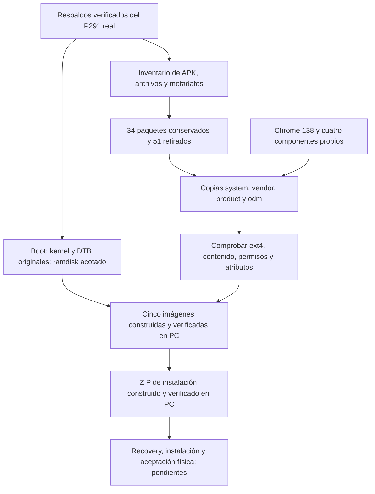

# ROM original P291 · revisión 0.2.0

**Estado al 7/9/2026 ART: cinco imágenes y los ZIP de instalación/restauración construidos y verificados en PC.** El tercer intento completo finalizó con código 0 y generó [IMAGENES-0.2.0.json](../../rom-simplificada/original-p291/IMAGENES-0.2.0.json). La comprobación adicional independiente terminó también con código 0: [39 APK exactas y todos los bloques libres comprobados](../../rom-simplificada/original-p291/COMPOSICION-VERIFICADA.json). Nada de esto acredita instalación, entrega USB ni restauración física.

El perfil es exclusivamente el **primer P291, `gxlx2_p291_1g`, Android 9/API28**. La base son sus particiones originales adquiridas y verificadas, no las del segundo P271 ni las de la candidata comunitaria 0.1.2. La identificación prevista es `TVBASE-P291-A9-0.2.0-experimental`. [Fuentes de construcción](../../rom-simplificada/original-p291/README.md).

## Objetivo y composición

Android simplificado en la memoria interna, conservando los controladores que ya utiliza este P291, con inicio propio, instalación de APK desde USB, Chrome/WebView mejorado y un gestor propio de actualizaciones. Bluetooth se excluye por autorización del usuario; WiFi y Ethernet se mantienen como capacidades que deberán probarse. La aplicación de negocio puede seguir evolucionando sin formar parte de esta compilación de plataforma.

El recuento se obtuvo cruzando el inventario original con [politica-paquetes.json](../../rom-simplificada/original-p291/politica-paquetes.json): **85 APK originales, 34 conservadas, 51 retiradas y 5 agregadas**. El constructor comprobó archivos retirados, editados y conservados; una segunda lectura de las imágenes confirmó **39 APK exactas**, contando framework y overlays, con las rutas y hashes esperados y sin APK adicionales.

| Parte | Tratamiento de la receta y razón |
| --- | --- |
| Framework, proveedores y APIs | Conservar instalación de paquetes, ajustes, interfaz del sistema, almacenamiento/documentos, multimedia, certificados, teclado y servicios de Android necesarios. |
| Bibliotecas y servicios de hardware | Conservar video/VP9, composición, audio, red, almacenamiento, IR y CEC desde el original real. No se sustituyen drivers por los del candidato previo. |
| Paquetes prescindibles | Retirar Play/GMS, aplicaciones de Google ajenas al objetivo, entretenimiento/tiendas precargados, duplicación de pantalla, entrada remota por red, pruebas de fábrica, launcher, actualizador OEM y WebView antiguo. La lista exacta deriva del complemento de la política respecto del inventario. |
| Preinstalación OEM | Retirar `/vendor/preinstall`, su script y servicio, para que no vuelvan a instalar APK al iniciar. |
| Navegador | Integrar Chrome Monochrome 138.0.7204.179 ARM32 con su firma original y un overlay que lo declara como proveedor WebView. |
| Inicio y archivos | Incorporar inicio propio con Ajustes e instalación de APK mediante el selector de documentos de Android. Conservar también FileBrowser y PackageInstaller reales del P291. |
| Valores iniciales | Desactivar Bluetooth, WiFi, WiFi Display, WiFi wakeup y backup de inicio; marcar el dispositivo provisionado. Ethernet no se desactiva. |
| Gestión propia | Agregar `local.tvbase.gestion` fuera del proceso WebView. Se entrega desactivado y sin servidor configurado. |

El punto de partida observado tenía Chrome 70; la imagen original también incluye WebView 66, que se retira. Integrar Chrome 138 no demuestra que Android lo elija realmente como proveedor ni que mejore el rendimiento. La prueba de dos VP9, uno con alfa, más canvas sigue pendiente en esta ROM; también video 1080p sin DRM, almacenamiento local y controles.

## Entradas reales y conservación del hardware

Los inventarios privados registran estos tamaños de imagen originales, conservados por las salidas finales: system **1.342.177.280 bytes**, vendor **943.718.400**, product **134.217.728**, odm **134.217.728** y boot **16.777.216**. La geometría se mantiene; la tabla siguiente separa las huellas originales de las nuevas imágenes.

El transformador [boot.py](../../rom-simplificada/original-p291/boot.py) exige la huella del boot original y mantiene el kernel, el multi-DTB y la línea de arranque. Cambia entradas auditadas del ramdisk para retirar consola y el contexto root de ADB. La reposición heredada de recovery se neutraliza por separado en **system**, sustituyendo `install-recovery.sh` por una salida sin acción y retirando su payload. Por eso **el boot completo cambia aunque kernel y DTB se conserven**.

| Entrada o componente original | SHA256 comprobado |
| --- | --- |
| Boot original del P291 | `13e027a3aae1af232d1d700421486f32b7958a9fa0a157d8cbd3c47243ab697d` |
| Kernel original | `9968c75f691f67dcb805ef8105e1ca534f73430bcf8b3920a066580e326b791a` |
| Multi-DTB original | `13e54b5f1bba959e398da74b9d0859d08ba1747840ed3866eca1f3461c550d01` |

Una revisión independiente previa ejecutó la transformación de boot **solo en memoria** y comprobó con otro lector CPIO que únicamente cambiaban `init.rc` e `init.usb.rc`, manteniendo metadatos de las demás entradas, kernel, DTB, línea de arranque y relleno esperado. También verificó rechazo de una entrada alterada. La construcción final guardó después un boot con la misma huella del resultado revisado, documentado en la siguiente tabla. [Auditoría de servicios y arranque](../../rom-simplificada/original-p291/AUDITORIA-SERVICIOS.md).

Conservar estos elementos elimina los cambios de geometría/IRQ encontrados en la candidata anterior; no prueba que los controladores originales estén sanos. La captura Java del P291 ya localizó una espera de cierre en la ruta WiFi HAL, y conservar ese código no equivale a repararlo. El inicio con WiFi apagado evita activarlo automáticamente; volver a habilitarlo requiere observar el resultado. [Análisis del atasco](../../diagnostico/primer-tv-lan-20260907-184926/ANALISIS-UPDATE-012.md).

## Imágenes finales verificadas

El recibo final sitúa las salidas bajo `rom-simplificada/original-p291/privado/construccion-0.2.0-intento03/`. Identifica además las fuentes exactas del constructor, transformador boot y corrección acotada de product. Las cuatro imágenes ext4 pasaron `e2fsck` con código 0; boot pasó la comprobación de cabecera Android v1 y conservación de kernel/DTB.

| Imagen | Bytes | SHA256 final | Comprobación local |
| --- | ---: | --- | --- |
| system | 1.342.177.280 | `e602d62182400f2b785b9044dd28b767791bcafb411146f988b719c6e722dc7b` | 2.160 archivos conservados y 15 editados verificados; 2.304 nodos conservan sus atributos. |
| vendor | 943.718.400 | `57c1f319e1c1f7df6918b2ffd513b1b0a63611e498fa6000826ee34206ef9fee` | 1.001 archivos conservados y 7 editados verificados; 1.069 nodos conservan sus atributos. |
| product | 134.217.728 | `c8550c937cb85257e58d8d70414b9162141d9e20cf199406d4ca3cfacf8ab00e` | 6 archivos y 14 nodos restantes verificados; corrección de ocho bloques de atributos documentada. |
| odm | 134.217.728 | `97836d5a1b016b64d3875c82cb5f3b4daee0f56d8eea3675b4231086429cbe67` | Idéntica al original; 4 archivos y 7 nodos verificados. |
| boot | 16.777.216 | `c1a71479498bdfd8368fb1ade42ae293cb97f6087c43c3a8f8f31535725113fc` | Kernel/DTB originales, 43 entradas CPIO intactas y 2 modificadas; cabecera verificada. |

Son **3.171 archivos conservados** y **3.394 nodos con atributos extendidos comprobados**, además de los archivos editados y cinco directorios nuevos con su contexto verificado. Estos recuentos son del constructor; no equivalen a ejecutar los drivers en Android. [Recibo completo de imágenes](../../rom-simplificada/original-p291/IMAGENES-0.2.0.json).

Los intentos anteriores se detuvieron ante dos problemas locales: una etiqueta SELinux de 41 bytes que la salida textual de debugfs no mostraba completa, y ocho bloques de atributos externos de product que la herramienta dejó asignados después de retirar sus propietarios. Se corrigió la lectura binaria de atributos y se liberó únicamente el rango demostrado, con guardas de fuente, propietarios, geometría y contadores. Los originales e intentos anteriores se conservaron. No fue un error del pendrive ni una reparación del TV. [Incidencias y correcciones](../../rom-simplificada/original-p291/INCIDENTES-CONSTRUCCION.md).

La receta final pasó once casos negativos de contenido/metadatos y seis entradas malformadas del parser de atributos. La corrección específica de product pasó ocho rechazos antes de escritura ante entradas o condiciones distintas. Estas pruebas están separadas de las imágenes reales, que luego volvieron a construirse y comprobarse. [Prueba de receta final](../../rom-simplificada/original-p291/empaquetado/EVIDENCIA-PLAN-FINAL.json), [prueba de product](../../rom-simplificada/original-p291/empaquetado/EVIDENCIA-PRODUCT-EA.json).

## Cinco APK agregadas, ya disponibles en PC

| Componente | Paquete | Tamaño | SHA256 |
| --- | --- | ---: | --- |
| Chrome 138.0.7204.179 ARM32 | `com.android.chrome` | 160.143.409 B | `3d9414001b3e2555831cd014df2c9ae5a6eab10190c4cffce7ecaad3c0f53f23` |
| Inicio 0.2.0 | `local.tvbase.inicio` | 16.787 B | `7ede3e34862d238754e9294f7d1a9b8e0fb940e1d491142d0244cfbe2ddf2d4a` |
| Selección WebView | `local.tvbase.webview` | 8.619 B | `593bf666a48fef1dae910294ffef59598aa8039dd02fbc6864e307e74abc9dc9` |
| Valores iniciales | `local.tvbase.defaults` | 8.538 B | `39c173ca93fe49fbaff1c2ec2806478db4d02898c162bcbdae5ff056cdd03c32` |
| Gestor 0.1 experimental | `local.tvbase.gestion` | 57.810 B | `73f0a2e73857cc83484caa3034bf69b8aa88422945153d71499f81c8ab81d320` |

Los tres componentes auxiliares tienen firma comprobada para API28 en [COMPONENTES.json](../../rom-simplificada/original-p291/COMPONENTES.json). El constructor verificó el hash de Chrome antes de integrarlo. El gestor tiene un [recibo de liberación offline](../../rom-simplificada/original-p291/gestion/LIBERACION.json), ligado a sus nueve fuentes exactas y a 38 pruebas host, más una [revisión independiente](../../rom-simplificada/original-p291/REVISION-GESTOR.md) de firma, identidad, estado y concurrencia. Estos hashes identifican APK individuales **en PC**; la liberación local no acredita entrega al pendrive ni al TV. Las huellas de los ZIP completos se registran por separado más abajo.

El gestor comprueba manifiestos firmados, paquete/certificado, versión creciente, API/ABI, tamaño y hash; verifica nuevamente los bytes enviados al instalador. Su automatización exige política del dueño, permiso efectivo y ventana horaria. `owner.conf` dentro del APK contiene exactamente `enabled=false`, sin destino HTTPS. Configurarlo más adelante requiere preparar y distribuir otra versión con la política del dueño; no hay importación USB de configuración implementada. No actualiza particiones ni sustituye al futuro instalador de ROM.

Chrome 138 es el último Chrome compatible con Android 9 según el anuncio del proyecto; versiones oficiales posteriores requieren otra base. Mantener el gestor no elimina este límite del motor. [Anuncio de Chromium](https://groups.google.com/a/chromium.org/g/chromium-dev/c/vEZz0721rUY).

## Dependencias revisadas y límites de la limpieza

La lectura de los manifests de las 34 APK conservadas encontró cuatro bibliotecas declaradas: `org.apache.http.legacy`, `com.android.location.provider`, `droidlogic.software.core` y `droidlogic.tv.software.core`. Sus XML y archivos JAR están en los originales y quedan fuera de las rutas retiradas. Los dos JAR de plataforma de 200 bytes conservan además sus archivos ODEX/VDEX originales; no se deben tratar como bibliotecas vacías prescindibles. No apareció una biblioteca requerida declarada de GMS o Play en este conjunto.

FileBrowser, DroidTvSettings y el componente `com.droidlogic` dependen de las bibliotecas Droidlogic conservadas. El nuevo Inicio resuelve Ajustes y usa `ACTION_OPEN_DOCUMENT` y `ACTION_VIEW` para elegir e instalar APK: se mantienen DocumentsUI, los proveedores de archivos y `com.android.packageinstaller`. Esto evita depender del AppInstaller OEM retirado, aunque el flujo real del mando/USB sigue pendiente.

Una inspección acotada de literales DEX encontró referencias a `com.android.htmlviewer` en Ajustes/TVSettings y a `com.droidlogic.mboxlauncher` en DroidTvSettings, ambos retirados. Una cadena no prueba que se ejecute esa ruta ni un fallo de arranque. Es un riesgo de funciones secundarias que deberá revisarse al probar Ajustes; no se declara resuelto por compilar. Esta revisión no descompiló ni ejecutó todas las rutas del framework o sus bibliotecas.

PacProcessor, ProxyHandler y VpnDialogs son funciones de plataforma conservadas; su presencia no demuestra una VPN o un proxy configurado. Tampoco la retirada de una APK prueba ausencia de tráfico OEM: queda código nativo y framework original. No se atribuye malware ni origen de conexiones sin evidencia. La observación y atribución del tráfico posterior al arranque permanece pendiente.

## Acceso, persistencia y recuperación

La receta desactiva TCP ADB por defecto, exige autenticación, deja USB sin depuración inicial y retira `su`, `procmem` elevado, consola y arranque de depuración del kernel. La retirada de una sola bandera no bastaba: también se modifican propiedades de system/vendor e instrucciones de init. Se conservan los drivers y controles IR/CEC.

Este prototipo mantiene **SELinux permisivo y claves/framework de plataforma heredados**. Es una reducción del software y de los accesos abiertos; no una reconstrucción completa de AOSP ni una certificación de seguridad de producción.

La instalación necesita una migración revisada a userdata limpia: cambiar system/vendor no elimina por sí solo APK, preferencias o servicios OEM instalados previamente en datos. El instalador exige comprobar la userdata real montada en solo lectura y vacía, admitiendo únicamente `lost+found` vacío; no acepta un marcador como sustituto. Rechaza datos existentes antes de escribir la ROM. No borra ni migra userdata, y no se presenta esa operación separada como ejecutada. La restauración física y el arranque de recovery también requieren evidencia propia; un respaldo verificado no demuestra que su restauración ya haya funcionado.

## ZIP de instalación y restauración

Los dos paquetes existen en `rom-simplificada/original-p291/empaquetado/salida/`, solo en PC. Tienen IDs y políticas de datos distintos; el restaurador no instala la ROM simplificada.

| Paquete | Bytes | SHA256 | Política |
| --- | ---: | --- | --- |
| `TVBASE-P291-A9-0.2.0-RECOVERY.zip` | 573.492.264 | `bd4a8dd7df8d61580c5b450867bda2ef2b214b400b4cafcce5a26baa5c48a614` | Instala las cinco imágenes nuevas; exige userdata limpia preparada por separado. |
| `TVBASE-P291-A9-ORIGINAL-RESTORE-0.2.0-RECOVERY.zip` | 913.228.907 | `a10aee68042ef9f945a4160fd897d0db1943e28dd58e0a03918d138e9f1a8e3f` | Restaura cinco particiones OEM; conserva userdata sin sanearla. |

Los recibos acreditan CRC, hashes de los cinco payloads, comprobación del validador Windows y firma integral RSA/SHA1, contrastada también con OpenJDK. El instalador nuevo vincula exactamente el recibo de imágenes SHA256 `11927b01a773a6b4dc7e762fb85e86bf7bc15782f34d035a3aa202bc917c7a12`. [Recibo de instalación](../../rom-simplificada/original-p291/empaquetado/salida/TVBASE-P291-A9-0.2.0-VERIFICACION.json), [recibo de restauración](../../rom-simplificada/original-p291/empaquetado/salida/TVBASE-P291-A9-ORIGINAL-RESTORE-0.2.0-VERIFICACION.json).

La firma heredada corresponde a la política v1 de la clave extraída del recovery. Esa compatibilización local no ejecutó el recovery OEM ni acredita su aceptación real. La clave de prueba y SHA1 son medidas de compatibilidad de este experimento, no el esquema de seguridad de producción para futuras actualizaciones. Los paquetes no ofrecen rollback automático ni una restauración física ya ensayada; falta preparar la entrada de recovery/ruta del archivo y, para instalar, la migración separada de userdata.

## Comprobaciones finales y aceptación física pendiente

| Etapa | Evidencia actual |
| --- | --- |
| Originales e inventario | Entradas respaldadas y verificadas; inventario de APK/archivos/metadatos disponible localmente. |
| Política y dependencias | Recuento 34/51/5 y revisión estática descritos arriba. |
| Componentes auxiliares | APK construidas y firmas API28 comprobadas; recibos enlazados. |
| Gestor | 38 pruebas host, revisión de fuentes y firma/identidad/configuración independiente; ninguna ejecución Android acreditada. |
| Transformación boot | Prueba previa en memoria y boot final guardado con el mismo SHA; kernel/DTB y CPIO verificados. |
| Cinco imágenes finales | **Construidas y verificadas en PC.** Cuatro ext4 con código 0; hashes, contenido, permisos/atributos y conservación de originales comprobados. |
| Composición final independiente | **Superada en PC, código 0.** 39 APK exactas, gestor desactivado dentro de su APK, ausencia de su/procmem elevados y preinstall, kernel/DTB originales y todos los bloques libres en cero. |
| ZIP de instalación 0.2.0 | **Construido y verificado en PC.** Vincula las cinco imágenes finales y su recibo; aceptación de recovery pendiente. |
| ZIP de restauración original | **Construido y verificado en PC.** Cinco payloads originales, sin restauración física acreditada. |
| Instalación y hardware | **Pendientes.** Arranque interno sin USB, proveedor WebView, video, WiFi/Ethernet, controles, almacenamiento, tráfico y recuperación. |

El constructor trabajó en copias y comprobó también los archivos conservados y sus atributos extendidos. Copió solo bloques asignados a imágenes nuevas. El control adicional interpretó correctamente los grupos de vendor con `BLOCK_UNINIT`, separando los **58 bloques de metadatos reservados del grupo 5** de los verdaderamente libres. La primera clasificación no era evidencia de corrupción de la imagen; el lector corregido contrastó los mapas efectivos con los contadores antes de completar la verificación.

La lectura final comprobó en cero **111.845 bloques libres de system, 178.848 de vendor, 31.584 de product y 31.613 de odm**: 353.890 bloques de 4.096 bytes, en total 1.449.533.440 bytes. No afirma haber examinado la holgura que pueda quedar dentro de bloques asignados, ni constituye una auditoría completa del código. El recibo [COMPOSICION-VERIFICADA.json](../../rom-simplificada/original-p291/COMPOSICION-VERIFICADA.json), SHA256 `69850195fefbacda9c6b1d3ca57f0c2e0677c993078bb85adbda68a7c150238e`, vincula el recibo de imágenes y el verificador SHA256 `2cb06308f28fe2bc9682a444d0c7e29f0937ab5f684133f70f13708a18f7113f`.

El cierre local queda documentado para las cinco imágenes, composición y ambos paquetes. Permanecen pendientes la migración de userdata, la entrada efectiva a recovery, la instalación y la aceptación física del hardware, WebView y recuperación. Ninguna marca de revisión local equivale a haber instalado la nueva ROM.
