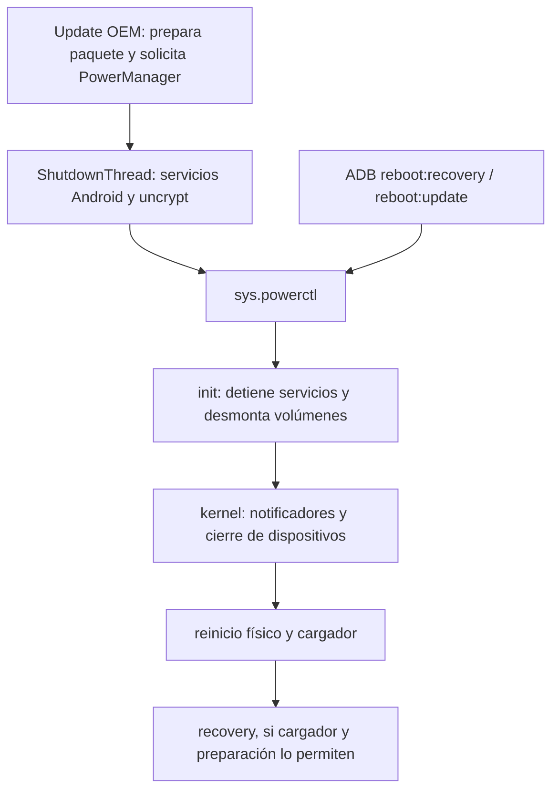

# Revisión H1 por Codex · 7/9/2026

**Resultado: hay que separar el atasco del framework Android del atasco posterior del kernel.** El reinicio ADB usado en 0.3/0.4 evita la secuencia Java de ShutdownThread en la referencia Android9. Por tanto, el pstore previo no demuestra un bloqueo de ActivityManager: alcanzó una etapa posterior. El 2 % del intento OEM nuevo sigue siendo compatible con un bloqueo temprano, pero carece de un registro del mismo intento. Una sola explicación para ambos síntomas no está demostrada.

Revisión del commit público `1530b6184a79a5582230c83d208bd0ab2ef9b291`. Se analizaron las fuentes primarias y los archivos locales ya adquiridos. El usuario informó que Fable está trabajando desde la otra PC; todavía no recibimos sus conclusiones. [Recibo, hashes, referencias y resultados reproducibles](../../diagnostico/h1-cierre-android/resumen-saneado.json).

## 1. Qué se comprobó en el pendrive

Kingston autorizado, USB, 30.943.995.904 bytes, volumen TVBASE/FAT32 y marcador esperado. Se leyeron los 75 archivos de sus tres carpetas de evidencia y los dos informes sueltos: todos coinciden con las copias anteriores en PC. No apareció otra carpeta de informe ni un respaldo del TV. Los hashes de ROM0.1.1, APK0.7, recovery y guía también coinciden con la entrega. Esto acredita sus bytes actuales, no que la copia interna del actualizador haya sido íntegra.

Windows informó Warning y una marca de volumen sucio. CHKDSK **sin /F, /R ni /X** terminó con código0 y declaró el recorrido de archivos/carpetas sin problemas; también emitió una línea inicial «Acceso denegado», que se conserva como limitación. No se solicitó reparación, formato ni escritura de archivos. La marca de volumen y este recorrido no determinan la causa del 2 % ni prueban la superficie completa del medio.

## 2. Las dos rutas no son equivalentes

El diagrama describe código de referencia; las flechas no acreditan ejecución en el P291.

- **ADB:** `reboot_service_impl`, líneas123–160, sincroniza y solicita la propiedad de reinicio directamente. No llama a `ActivityManager.shutdown()` ni prepara block.map por el camino Java. [AOSP9 adb/services.cpp](https://github.com/aosp-mirror/platform_system_core/blob/android-9.0.0_r1/adb/services.cpp#L123).
- **OEM:** el APK exacto obtenido solicita PowerManager; este despacha ShutdownThread mediante el hilo de interfaz. [PowerManagerService, líneas2720–2763](https://github.com/aosp-mirror/platform_frameworks_base/blob/android-9.0.0_r1/services/core/java/com/android/server/power/PowerManagerService.java#L2720), [análisis del APK real](../../diagnostico/primer-tv-complemento-20260907-003114/analisis-actualizador/ANALISIS.md).
- Ambas rutas pueden acabar pasando por init y el kernel. Que fallen ambas no identifica en qué punto falla cada una. Cambiar otra vez el texto del modo de reinicio no es una solución sustentada.

## 3. Qué significa realmente el 2 %

ShutdownThread solicita2% después del broadcast y4% cuando regresa `am.shutdown()`. Sin embargo, `setRebootProgress()` **publica una tarea en otro hilo**: una imagen inmóvil muestra el último progreso dibujado, no una traza del hilo de cierre. [Secuencia, líneas477–530](https://github.com/aosp-mirror/platform_frameworks_base/blob/android-9.0.0_r1/services/core/java/com/android/server/power/ShutdownThread.java#L477), [actualización asíncrona, líneas563–575](https://github.com/aosp-mirror/platform_frameworks_base/blob/android-9.0.0_r1/services/core/java/com/android/server/power/ShutdownThread.java#L563).

El argumento de diez segundos de `am.shutdown()` tampoco impone un plazo máximo a toda la llamada. `ActivityManagerService.shutdown()` toma bloqueos, espera las actividades y después cierra AppOps, UsageStats, BatteryStats, ProcessStats y solicita persistencia de tareas. Solo el bucle de espera de actividades tiene ese plazo explícito; adquirir un bloqueo y las demás llamadas no quedan envueltos en un límite global. No hay evidencia para elegir uno de esos servicios como culpable. [AMS, líneas13367–13393](https://github.com/aosp-mirror/platform_frameworks_base/blob/android-9.0.0_r1/services/core/java/com/android/server/am/ActivityManagerService.java#L13367), [ActivityStackSupervisor, líneas3506–3532](https://github.com/aosp-mirror/platform_frameworks_base/blob/android-9.0.0_r1/services/core/java/com/android/server/am/ActivityStackSupervisor.java#L3506).

El log de entrada en uncrypt sería una evidencia de haber avanzado más allá de esa llamada, aunque la imagen siguiera mostrando2%. Tampoco sería prueba de que uncrypt terminó correctamente: el código registra errores y timeouts por separado. Su plazo de quince minutos pertenece a esa etapa posterior. [uncrypt, líneas712–769](https://github.com/aosp-mirror/platform_frameworks_base/blob/android-9.0.0_r1/services/core/java/com/android/server/power/ShutdownThread.java#L712).

## 4. Qué demuestra el pstore anterior

El parser nuevo reproduce el resultado del archivo cuyo SHA comienza `708cae63`: una marca del notificador de reinicio en13404,839586s y mensajes hasta13922,076499s. Diferencia exacta: **517,236913 segundos**. No detecta retroceso temporal, segunda marca de notificador ni cabecera de nuevo kernel dentro de ese fragmento. Eso no convierte el fragmento en un registro completo.

En el kernel de referencia, `kernel_restart_prepare()` llama la cadena de notificadores antes de `device_shutdown()`. El mensaje del watchdog ocurre dentro de esa cadena; quedan posibles operaciones del propio callback y otros callbacks, cierre de dispositivos, migración de CPU, syscore y reinicio de máquina. La referencia no permite identificar cuál no regresó. La marca `Restarting system` también precede al reset físico: encontrarla no demostraría que se ejecutó correctamente. [Kernel fijado en bd946072, líneas68–74 y214–224](https://github.com/khadas/linux/blob/bd9460728746cc080acbaa084e53460437f43211/kernel/reboot.c#L68), [callback watchdog, líneas280–295](https://github.com/khadas/linux/blob/bd9460728746cc080acbaa084e53460437f43211/drivers/amlogic/watchdog/meson_wdt.c#L280).

**Revisión de H1:** H1a (cierre Java temprano del intento OEM) queda abierta. H1b (cierre tardío previo al reset en el intento anterior) está favorecida por el pstore. La versión «todos los intentos se quedan dentro de ActivityManager» no está sustentada. Los errores SDIO siguen siendo una pista sin causalidad demostrada; no se propone desactivar drivers ni investigar la actualización WiFi.

## 5. Observación mínima diseñada, todavía sin desplegar

Primero conviene aprovechar el intento ya ocurrido. Si Android volvió a iniciar, una futura captura **sin otro Update ni reinicio** debe obtener únicamente: identificación de arranque/uptime, pstore actual con digest válido y comparación con el anterior, y registros de cierre legibles. Un pstore idéntico al anterior se clasifica como evidencia antigua, no como explicación nueva. Un dato denegado se registra y no se intenta eludir.

| Dato concreto | Qué permitiría distinguir | Límite |
| --- | --- | --- |
| Pstore actual, tamaño y SHA | Si quedó un tramo diferente del cierre OEM | Puede ser viejo, truncado o haber perdido marcas por rotación |
| Tags ShutdownThread/ActivityManager/PowerManagerService | Entrada y avance entre fases Java | Un logcat obtenido después de arrancar puede haber perdido el intento anterior |
| `sys.shutdown.requested`, `init.svc.uncrypt`, `init.svc.adbd`, `init.svc.logd` | Estado contemporáneo de una captura | Después de arrancar no reconstruyen por sí solos el estado anterior; algunas propiedades pueden ser transitorias |
| Framework instalado: inventario y después solo JAR/OAT/VDEX imprescindible | Comprobar si el fabricante conserva el flujo/progreso AOSP | Copiar el candidato o el segundo TV no sustituye esa lectura; no descargar todo por rutina |
| Una consulta `dumpsys` con plazo acotado, si procede | Estado del servicio cuando aún responde | La consulta también puede quedar esperando el bloqueo investigado; no repetirla en bucle |

Si el material conservado no distingue fases, el diseño de captura en vivo debe activarse **antes** de cualquier futuro Update y empezar con una comprobación de autonomía sin reiniciar. El recolector no debe depender de que la actividad siga visible; cerrar la APK no debe detener el registro. `nohup` por sí solo no lo demuestra ni lo convierte en servicio protegido durante el apagado.

Incluso un recolector independiente como shell tiene un límite: init conserva temporalmente adbd/logd, después cierra vold, detiene esas herramientas y desmonta. No puede prometerse escritura al pendrive durante el cierre del kernel. Para ese tramo, la evidencia posterior de pstore es una vía ya observada, con sus límites; no se habilita root ni se altera init para mantener un observador vivo. [init Android9, líneas365–468](https://github.com/aosp-mirror/platform_system_core/blob/android-9.0.0_r1/init/reboot.cpp#L365).

Contrato propuesto para la captura en vivo: una sesión identificada, filtros de log concretos, salida privada limitada a8MiB, ventana máxima120s y sin reinicio/Update automático. Pérdida del USB, error de escritura, límite de tamaño, fin de plazo o pérdida del proceso cierran la observación como **incompleta**; ninguna condición provoca otro intento. Su implementación y prueba en el equipo siguen pendientes de contrastar H2. No se entregó otra APK ni se sustituyó la ROM por este análisis.

## 6. Resultado que se entrega a Fable

H2 debe revisar su cadena persistente sin dar por supuesto que ADB y PowerManager atraviesan el mismo cierre. Si obtiene evidencia de mapa/BCB correctos, eso no resuelve H1b; si identifica un defecto de copia/mapa, eso tampoco demuestra por qué el intento anterior permaneció dentro del kernel. La prueba siguiente se decide al comparar ambos análisis.

El [analizador local](../../diagnostico/h1-cierre-android/analizar-registro.py) reconoce marcas y conserva líneas/tiempos sin exportar los mensajes crudos. Pasó [diez pruebas](../../diagnostico/h1-cierre-android/test_analizar_registro.py) que cubren mezcla de arranques, entradas corruptas, ausencia de marcas y falsos positivos de éxito. No contacta el TV ni solicita reinicio. Su resultado puede adjuntarse a la revisión junto con la atribución del intento; el parser no autentica esa atribución.
