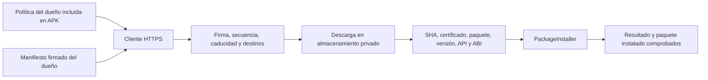

# Actualizaciones TV Base · componente 0.1

Gestor independiente de WebView para Android 9/API 28. Busca un manifiesto firmado en el servidor HTTPS del dueño, descarga una APK independiente y entrega al instalador de Android únicamente el archivo cuya identidad e integridad comprobó. Tiene una pantalla utilizable con flechas y Aceptar, conserva acceso a Ajustes y admite mantenimiento remoto programado para aplicaciones y navegador.

**La entrega viene desactivada y sin servidor:** [owner.conf](assets/owner.conf) contiene solamente `enabled=false`. No se inventó una URL ni se activaron conexiones. Configurar el servidor después requiere preparar otro APK con la política del dueño desde la PC; esta versión no implementa importación de configuración por pendrive. Esa provisión posterior debe integrarse en la entrega USB o en una actualización del propio gestor firmada con su misma clave.

El componente está compilado y comprobado en PC. No acredita instalación en una imagen, concesión de permisos, funcionamiento del instalador real, recepción HTTPS en el TV ni actualización efectiva de Chrome. [Construcción, configuración y recibos](../../original-p291/gestion/README.md).

## Flujo y responsabilidades

| Archivo | Responsabilidad |
| --- | --- |
| [UpdateCore.java](UpdateCore.java) | Verificador sin Android ni red; formato estricto, RSA, política, versiones de manifiesto, reloj, API/ABI y lectura acotada de AXML/ZIP. |
| [ManagerEngine.java](ManagerEngine.java) | HTTPS, archivos privados, persistencia, preparación y sesiones PackageInstaller; programación de consultas. |
| [MainActivity.java](MainActivity.java) | Buscar/preparar, instalar localmente, retirar la descarga propia y abrir Ajustes. |
| [UpdateJob.java](UpdateJob.java) | Trabajo de mantenimiento con red disponible, cancelación y reprogramación. |
| [InstallReceiver.java](InstallReceiver.java) | Recibe el resultado privado de su sesión; comprueba versión y certificado instalados. |
| [BootReceiver.java](BootReceiver.java) | Restaura la programación al arrancar o actualizar el gestor, únicamente si está configurado. |
| [AndroidManifest.xml](AndroidManifest.xml) | Permisos y superficies Android; no hay receiver público para ordenar instalaciones. |

No hay listener LAN, ejecución de shell, root, comandos arbitrarios del manifiesto, control de particiones, borrado de datos de otras aplicaciones ni cambio del proveedor WebView. El botón de limpieza solo elimina archivos preparados del almacenamiento privado del gestor. Las actualizaciones de APK usan la identidad existente del paquete y no solicitan borrar sus datos; una migración de datos propia de la APK sigue siendo responsabilidad de su autor.

## Política local del dueño

La política fija la URL HTTPS del manifiesto, una clave pública RSA de 2048–8192 bits, hosts permitidos, paquetes y huellas SHA256 de sus certificados APK. La clave del manifiesto y la clave que firma el gestor son identidades diferentes. El servidor no puede agregar un paquete, cambiar su certificado ni ampliar hosts mediante el manifiesto. La clave privada del dueño nunca se incluye en la ROM.

`autoApps` y `autoBrowser` son opciones independientes. Cada paquete tiene rol `app` o `browser`. Ambas automatizaciones necesitan una ventana UTC con inicio y duración de 15–240 minutos, además del permiso real `INSTALL_PACKAGES`. Se consulta periódicamente y se programa otra consulta al inicio de la ventana. JobScheduler puede diferir su ejecución; si termina fuera de la ventana, el gestor conserva la descarga y no instala automáticamente. La fecha del TV debe ser correcta para verificar caducidad y horario. [JobScheduler](https://developer.android.com/reference/android/app/job/JobScheduler).

La alternativa local prepara el paquete y permite pulsar Instalar. Si falta el permiso privilegiado, requiere la autorización de origen desconocido y la confirmación del instalador de Android. Un resultado que exige presencia local durante una operación automática se registra como pendiente/fallido; no se abre una pantalla de confirmación por sorpresa.

## Validación antes de instalar

- Firma RSA/SHA256 del manifiesto sobre los bytes exactos del payload, antes de interpretar sus campos. Campos duplicados, desconocidos, UTF-8 inválido y tamaños excesivos se rechazan.
- Secuencia creciente y caducidad máxima de 31 días. Reintentar la misma secuencia solo admite exactamente el mismo payload. El estado se guarda de forma síncrona antes de descargar.
- HTTPS con verificación TLS del sistema, puerto 443, sin credenciales en URL ni redirecciones. Cada descarga debe estar en un host permitido por la política local.
- Una APK de hasta 512 MiB; tamaño y SHA256 al descargar, otra lectura antes de instalar y nuevamente durante la transferencia a PackageInstaller. Se sincronizan archivo y directorio al conservar la preparación.
- Paquete y certificado permitidos, un firmante, versión estrictamente mayor que la instalada, minSDK real, rango de API firmado y bibliotecas ABI reales compatibles. Se coteja la información de AXML con PackageManager. Los APK split o que requieren splits se rechazan.
- Confirmación del sistema y comprobación de la versión/certificado instalados. Un callback por sí solo no acredita éxito. El receiver no está exportado y exige el identificador y token aleatorio de la sesión registrada.

Las sesiones se envían de a una; las actualizaciones de distintos paquetes no son una transacción conjunta. No hay rollback automático. El control de secuencia no es resistente a borrar los datos del gestor, restaurar un estado anterior o modificar el equipo con root. No implementa rotación dinámica de claves/certificados ni linajes APK: esos cambios exigen revisar y distribuir una nueva política.

## Navegador y WebView

El rol `browser` admite actualización remota cuando el dueño activa `autoBrowser` y define la ventana. El gestor corre fuera de WebView, así que no utiliza el motor que está reemplazando. Conserva la firma original de Chrome y no necesita firmarlo con la clave del gestor o de plataforma.

Actualizar el navegador puede terminar las aplicaciones que lo utilizan como WebView. Este componente registra el resultado; no mata ni relanza hosts y no garantiza reanudación de videos, automatizaciones o canvas. La aplicación anfitriona debe tolerar recreación de procesos. Android 9 conserva el límite oficial de Chrome 138; instalar este gestor no elimina ese límite ni acredita el proveedor efectivo. [Integración y validación de WebView del proyecto](../../INTEGRACION-WEBVIEW.md).

## Integración de privilegios

El APK debe ubicarse en `/system/priv-app/TVBaseGestion/TVBaseGestion.apk`, con UID/GID de archivo root:root, modo 0644 y directorios 0755; conservar los contextos SELinux correctos de la imagen base. Su [allowlist](../../original-p291/gestion/privapp-permissions-tvbase-gestion.xml) va en `/system/etc/permissions/privapp-permissions-tvbase-gestion.xml`, misma partición. Solo concede `INSTALL_PACKAGES`. No usa shared UID system ni requiere modificar las claves existentes.

En AOSP 9, `INSTALL_PACKAGES` tiene protección `signature|privileged`: la integración en priv-app y la allowlist permiten solicitarlo sin firmar con la clave de plataforma. Debe comprobarse la concesión efectiva en la ROM real, sin cambiar SELinux a permissive como solución. Si falta, el gestor impide el modo remoto y conserva la alternativa local. [Permiso en Android 9](https://android.googlesource.com/platform/frameworks/base/+/android-9.0.0_r1/core/res/AndroidManifest.xml), [allowlist por partición](https://source.android.com/docs/core/permissions/perms-allowlist).

PackageInstaller sigue aplicando sus propias verificaciones y puede rechazar la APK por firma, espacio, compatibilidad u otra restricción de la plataforma. Sus callbacks y las confirmaciones requeridas se procesan sin tratar una solicitud enviada como instalación concluida. [API de sesiones](https://developer.android.com/reference/android/content/pm/PackageInstaller.Session).
