# Instalador experimental P291

**Vigente:** ROM0.1.1 preparada pero sin instalar. Acceso USB0.4 volvió a dejar el TV sin señal y no apareció recovery; se retira como instrucción a repetir. **Acceso USB0.5 solo recopila evidencia**, sin reiniciar ni abrir el actualizador. Su [copia al USB quedó verificada](../../preparacion-usb/evidencia-05-estado.json) el7/9 a las00:00; la captura física sigue pendiente. [Pasos para el usuario](../INSTALACION-USB.md) · [Estado](../../docs/ESTADO.md) · [Mapa](../../docs/MAPA-ARCHIVOS.md).

## Cadena de ejecución

```mermaid
flowchart LR
 A[Acceso USB 0.5 en Android actual] --> B[Evidencia binaria y textual en USB]
 B --> C[Analizar en PC sin otro reinicio]
 C -. acceso por resolver .-> D[Recovery visible e identificado]
 D --> E[Seleccionar ZIP y verificar firma]
 E --> F[Controles y respaldo de originales]
 F --> G[system vendor product odm boot]
 G --> H[Lectura de hashes y resultado]
```

`componentes/acceso-usb/` vive un nivel por encima de este directorio. En0.5 `Acceso.java` presenta la captura; `Evidencia.java` controla perfil, carpeta, secuencia y finalización; `AdbLocal.java` usa exclusivamente127.0.0.1:5555; `generar-scripts.py` genera los siete scripts fijos y `EvidenciaScripts.java`. INTERNET es necesario para el socket local, no para conectarse a una red externa. No habilita ADB, pide root, cambia autenticación ni solicita reiniciar.

Se crea una carpeta única `TVBASE-evidencia-*` y no se reutiliza ni se busca otro destino durante la secuencia. Se copian registros pstore como bytes y el actualizador/certificados públicos del P291 cuando son legibles y cumplen los límites. Los scripts fijan qué fuentes se consultan y los límites de tamaño/cantidad; cada etapa ADB tiene un plazo máximo de90segundos. Tamaño, hash antes/después de origen, lectura de copia y resultado de `sync` se verifican; ausencias/denegaciones se registran. La fase final exige cierre de informes y etapas. Una captura parcial se conserva para análisis. Esta recopilación no es un respaldo original de las particiones del TV.

Las fuentes de0.4, incluidos `Diagnostico.java` y `EntradaAmlogic.java`, están archivadas en `../compilacion/acceso-usb-0.4-archivado/fuentes/`. No forman parte de0.5. Los informes de0.4 recuperados preceden a `reboot:update`, por lo que no muestran el fallo posterior; confirman recovery de24MiB, pero la lectura de su contenido fue denegada. [Resultado físico y límites](../../diagnostico/primer-tv-reportes-20260906-233826/HALLAZGOS.md).

## Recovery externo

`preparar-recovery-externo.py` produce `recovery-externo/recovery.img` desde `../inspeccion/recovery-original.img` del candidato. Conserva kernel, contenido secundario DTB, DTBO, ejecutable del recovery y 102 entradas CPIO. Modifica exactamente `res/keys` y `prop.default`; recompone tamaño/offset/headerSHA1 de Android boot v1. Mantiene longitud de 24MiB.

La clave original del recovery candidato es distinta de la AOSP usada para nuestro ZIP. Se conserva y agrega la clave v3 RSA2048/e3/SHA256 del ZIP. No se desactiva verificación de firmas. Las propiedades identifican el recovery como TVBASE y el dispositivo ampere. [PREPARADO.json](recovery-externo/PREPARADO.json) acredita los hashes y comprobaciones. La prueba0.4 no mostró que el cargador ejecutara este archivo. Se conserva como artefacto preparado; no se modifica la partición recovery para resolver esa incertidumbre.

El kernel y DTB secundario coinciden con el boot candidato. Este boot heredado declara versión1 con campos de extensión cero; no se normalizó ni se interpretó esa particularidad como prueba de arranque. No confundirlo con la cabecera del recovery externo que sí se verificó al reconstruir.

## ZIP y particiones

`empaquetar.py` contiene el empaquetado y la firma completa; `manifest-0.1.1.json` enumera las cinco imágenes. `main_linux.go` es la ejecución en recovery, `package.go` valida paquete y hashes, `main_windows.go` permite validar payload en PC. El ID permitido de versión debe fijarse al compilar una revisión; el valor por defecto del código corresponde al artefacto histórico0.1. Ver [desarrollo](../../docs/DESARROLLO.md).

Antes de escribir, el ejecutable exige proceso recovery/UID0, DT `gxlx2_p291_1g`, esquema sin A/B/dynamic, aliases de particiones MMC del mismo dispositivo, tamaños suficientes, objetivos desmontados y cabecera vbmeta vacía cuando existe. Lee/verifica íntegramente los cinco payloads.

Busca un USB real mediante sysfs, FAT32/exFAT y marcador exacto. Si está solo lectura intenta remontar exclusivamente ese medio. Exige espacio libre para respaldar **las cinco particiones originales completas**, sincroniza y verifica cada archivo por lectura. Solo entonces instala system, vendor, product, odm y **boot al final**, sincronizando y leyendo los hashes de destino. Registra `respaldo.json` e `instalacion.log` dentro de `TVBASE-respaldo-*`.

No formatea userdata ni escribe bootloader, recovery, partición DTB, dtbo, vbmeta, keys, env o misc como parte de su receta. Boot sí contiene kernel/ramdisk/DTB secundario del candidato. Recovery/cargador pueden escribir sus registros/órdenes o estado habitual. Una interrupción no A/B puede dejar un sistema parcial; no existe rollback automático.

La revisión0.1.1 neutraliza los dos scripts `install-recovery.sh` y detiene `flash_recovery` en ambos eventos de tvbase.rc. 0.1 queda retirada: omitir recovery en la receta no bastaba para conservarla tras arrancar Android.

## Evidencia local y límites

- [RECOVERY-VERIFICACION-0.1.1.json](../salida/RECOVERY-VERIFICACION-0.1.1.json): ext4, 2426 archivos restantes idénticos, metadatos/SELinux y hashes de cinco imágenes, firma completa.
- [RECOVERY-COMPROBACION-0.1.1.json](../salida/RECOVERY-COMPROBACION-0.1.1.json): verificación independiente OpenJDK/Go y rechazo del paquete anterior.
- [ADB-TESTS-0.4.json](ADB-TESTS-0.4.json): 12 casos locales de protocolo; AUTH/checksum/canal desconocido siguen rechazándose.
- [ENTRADA-TESTS-0.4.txt](ENTRADA-TESTS-0.4.txt): siete casos de secuencia, incluidos fallos que impiden reiniciar.
- [EVIDENCIA-TESTS-0.5.json](EVIDENCIA-TESTS-0.5.json): casos ADB, controles de perfil/secuencia/ruta, rechazo de host externo, sintaxis y escenarios sintéticos de copia de la revisión registrada. Prueba física pendiente.
- [Componente0.5](../compilacion/acceso-usb-0.5/componente.json): APK construida con la misma firma y propósito de diagnóstico; no acredita copia USB.
- [Recibo USB0.5](../../preparacion-usb/evidencia-05-estado.json): APK y guía copiadas/leídas; versión0.4 retirada, ROM/recovery conservados. Código nativo0.
- [Recibo USB0.4](../../preparacion-usb/entrada-amlogic-estado.json): lectura SHA coincidente de aquella entrega. Para cualquier APK nueva corresponde un recibo nuevo.

Los tests de protocolo simulan respuestas; no ejecutan el shell real del TV, ni su bootloader, ni la instalación física. Los escenarios shell0.5 usan el shell MinGit con adaptadores Python para tamaño/SHA y `sync` simulado, por lo que no prueban Android toybox ni durabilidad eléctrica del USB. Reproducción y salidas en [DESARROLLO](../../docs/DESARROLLO.md). Aún no existen respaldos originales del TV ni aceptación de firma/arranque/rendimiento demostrados. Las claves AOSP son públicas de prueba, no de producción. La firma de las APK propias utiliza una clave local que debe conservarse.

Fuentes y decisiones: [ADR-05 a ADR-10](../../docs/DECISIONES.md), [formato no A/B](https://source.android.com/docs/core/ota/nonab/inside_packages), [ADB Android9](https://android.googlesource.com/platform/system/core/+/refs/tags/android-9.0.0_r1/adb/services.cpp), [Amlogic P271 de referencia](https://android.googlesource.com/platform/external/u-boot/+/refs/heads/android-tv-s-beta3/board/amlogic/configs/gxl_p271_v1.h).
